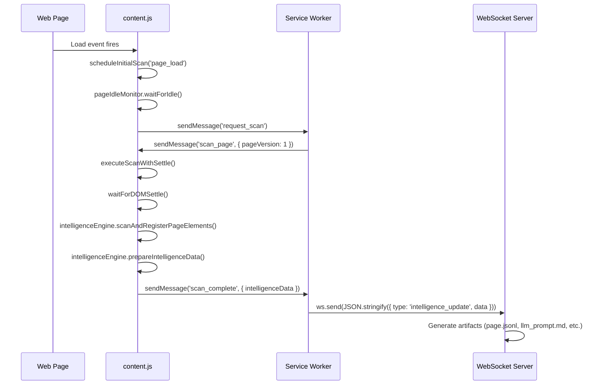
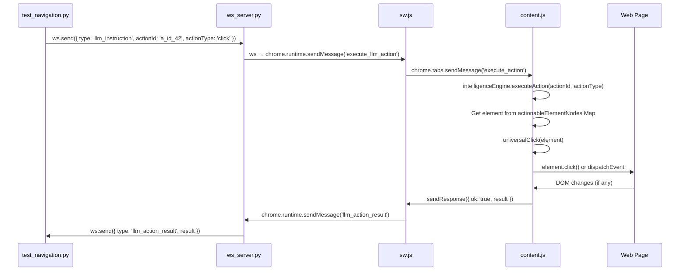
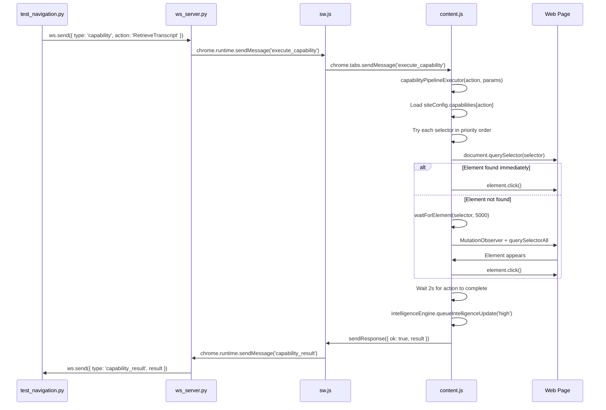
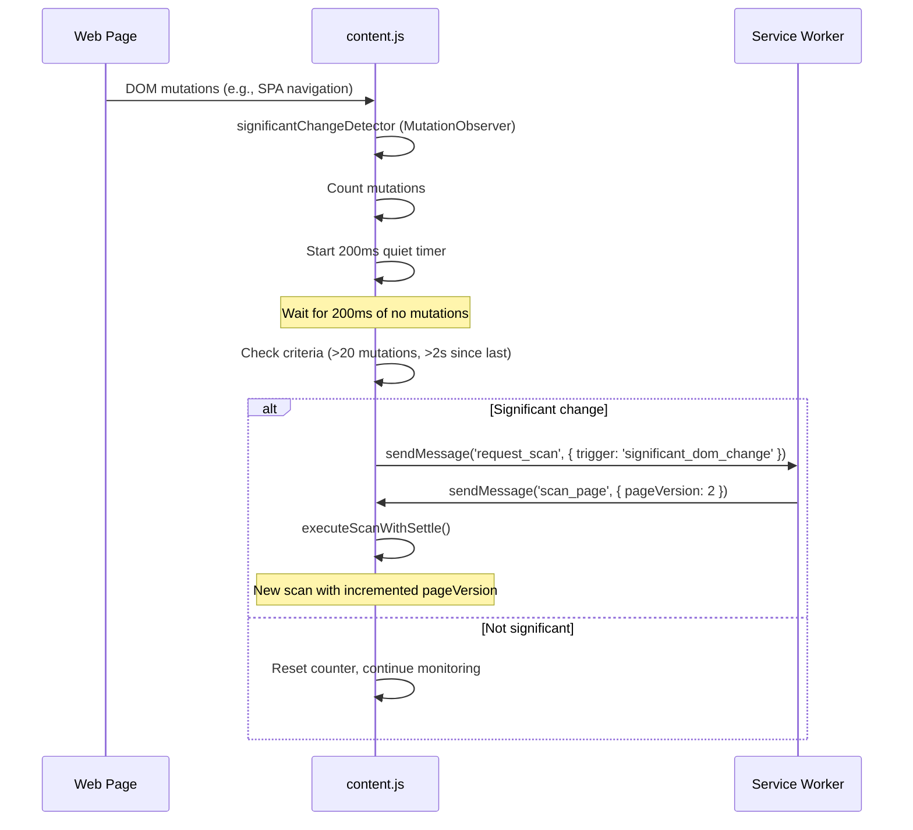

# Content Script Documentation (content.js)

## Overview

**File**: `/Users/andy7string/Projects/Om_E_Web/web_extension/content.js`
**Size**: 10,787 lines
**Type**: Chrome Extension MV3 Content Script
**Execution Context**: Injected into web pages (main frame only)

### Purpose

The content script is the **DOM manipulation engine** and **intelligence gathering system** for the Om_E_Web Chrome Extension. It transforms web pages into LLM-actionable intelligence by:

1. **Scanning** the DOM to identify interactive elements (buttons, links, inputs)
2. **Registering** actionable elements with unique IDs (`a_id_XXX`)
3. **Generating** structured artifacts (JSONL, JSON, Markdown) describing page state
4. **Executing** LLM instructions (clicks, form fills, navigation)
5. **Monitoring** DOM changes to trigger automatic rescans
6. **Communicating** bidirectionally with the service worker and WebSocket server

### Role in the System Architecture

```
┌─────────────────────────────────────────────────────────────────┐
│                         WebSocket Server                        │
│                    (om_e_web_ws/ws_server.py)                   │
└────────────────────────────┬────────────────────────────────────┘
                             │
                             │ WebSocket Messages
                             │
                             ▼
                  ┌──────────────────────┐
                  │   Service Worker     │
                  │      (sw.js)         │
                  └──────────┬───────────┘
                             │
                             │ chrome.runtime.sendMessage()
                             │ chrome.runtime.onMessage
                             │
                             ▼
                  ┌──────────────────────┐
                  │   Content Script     │◄──── DOM Events
                  │   (content.js)       │
                  └──────────┬───────────┘
                             │
                             │ DOM APIs
                             │
                             ▼
                  ┌──────────────────────┐
                  │      Web Page        │
                  │   (Target Website)   │
                  └──────────────────────┘
```

**Communication Flow**:
- **Inbound**: Python Test Client → WebSocket Server → Service Worker → Content Script → DOM
- **Outbound**: DOM → Content Script → Service Worker → WebSocket Server → Python Test Client

---

## Key Responsibilities

### 1. **Intelligence System**
- Scans DOM to identify interactive and content elements
- Generates unique action IDs for each interactive element
- Builds normalized page records (JSONL format)
- Extracts capabilities based on URL patterns
- Monitors page changes and triggers rescans

### 2. **Action Execution**
- Executes LLM commands via two pipelines:
  - **Standard Pipeline**: Uses pre-registered action IDs
  - **Capability Pipeline**: Dynamic on-demand element discovery
- Handles clicks, form fills, navigation
- Simulates user interactions (focus, input events)

### 3. **DOM Monitoring**
- Detects significant DOM changes using MutationObserver
- Waits for DOM to settle before scanning
- Tracks network activity (fetch/XHR) for page idle detection
- Prevents concurrent scans with lock mechanism

### 4. **Site Configuration**
- Loads and applies site-specific configs from `site_configs.json`
- Supports framework-specific selectors (YouTube, Facebook, generic)
- Filters elements based on include/exclude rules
- Activates capabilities based on URL patterns

---

## Core Architecture Components

### Global Variables

```javascript
// Scan orchestration
let scanInProgress = false;              // Scan lock to prevent concurrent scans
let currentPageVersion = null;           // SPA versioning for page state tracking
let significantChangeDetector = null;    // MutationObserver for continuous monitoring
let lastSignificantChangeTime = 0;       // Rate limiting for DOM change triggers

// Focus management
let initialFocusApplied = false;         // Track if default focus has been applied
let focusRetryTimer = null;              // Retry timer for focus application

// Intelligence system
var changeAggregator = null;             // Aggregates DOM changes
var intelligenceEngine = null;           // Main intelligence processing engine
var pageContext = null;                  // Current page context and metadata
var changeHistory = [];                  // History of DOM changes
var lastIntelligenceUpdate = 0;          // Timestamp of last update

// Site configuration
var siteConfig = null;                   // Site-specific configuration
var currentDomain = null;                // Current domain being scanned
var currentFramework = null;             // Framework identifier (youtube, facebook, etc.)
```

---

## Function Reference

### 🚀 Initialization & Lifecycle

#### `ensureKeepAlivePortConnection()`
**Purpose**: Establishes persistent connection to service worker to prevent suspension.

**Flow**:
```javascript
1. Check if port already exists (window.__omeKeepAlivePort)
2. Create port: chrome.runtime.connect({ name: "ome_keep_alive" })
3. Store in window.__omeKeepAlivePort
4. Handle disconnection with retry logic (500ms delay)
```

**Called by**: Immediately on script load (line 68)

**Why it matters**: Chrome suspends service workers after 30 seconds of inactivity. This port keeps the WebSocket bridge alive.

---

### 📊 Scan Orchestration

#### `executeScanWithSettle(pageVersion, url, trigger)`
**Purpose**: Main entry point for all page scans. Orchestrates DOM settling, scanning, and result transmission.

**Parameters**:
- `pageVersion` (number): SPA version number for page state tracking
- `url` (string): URL being scanned
- `trigger` (string): Reason for scan (e.g., "initial_load", "navigation", "dom_mutation")

**Returns**: None (sends results via chrome.runtime.sendMessage)

**Flow**:
```javascript
1. Check scan lock (scanInProgress)
   ├─ If locked: Exit early
   └─ If free: Set lock
2. Store/read pageVersion from DOM (data-ome-page-version)
3. Wait for DOM to settle (waitForDOMSettle)
4. Execute scan (intelligenceEngine.scanAndRegisterPageElements)
5. Prepare intelligence data (intelligenceEngine.prepareIntelligenceData)
6. Send results to service worker (chrome.runtime.sendMessage)
7. Release lock and start change detector
```

**Calls**:
- `waitForDOMSettle()` - Waits for DOM mutations to stop
- `intelligenceEngine.scanAndRegisterPageElements()` - Scans and registers elements
- `intelligenceEngine.prepareIntelligenceData()` - Builds artifact data
- `startSignificantChangeDetector()` - Starts continuous monitoring

**Called by**:
- Service worker message handler (type: 'scan_page')
- `runScanAfterPageLoad()`

---

#### `waitForDOMSettle({ maxWait, quietWindow })`
**Purpose**: Waits for DOM to stop mutating before scanning.

**Parameters**:
- `maxWait` (number): Maximum wait time in ms (default 5000)
- `quietWindow` (number): Duration of no mutations to consider "settled" (default 350ms)

**Returns**: Promise that resolves when DOM is settled

**Flow**:
```javascript
1. Create MutationObserver
2. Start observing document.body (childList + subtree)
3. On each mutation:
   ├─ Record lastMutationTime
   ├─ Clear previous quiet timer
   └─ Start new quiet timer (quietWindow ms)
4. When quiet timer completes: Resolve promise
5. Failsafe: Max wait timer forces resolution after maxWait ms
```

**Key insight**: Uses "quiet window" pattern - waits for a period of NO mutations rather than a fixed delay.

---

#### `startSignificantChangeDetector()`
**Purpose**: Continuous MutationObserver that triggers rescans when significant DOM changes occur.

**Flow**:
```javascript
1. Check if already running (significantChangeDetector exists)
2. Create MutationObserver
3. On mutations:
   ├─ Count mutations
   ├─ Start 200ms quiet timer
   └─ When timer completes:
       ├─ Check criteria: >20 mutations AND >2s since last scan
       └─ If significant: Send request_scan message to service worker
4. Reset mutation counter after check
```

**Criteria for significant change**:
- More than 20 mutations
- At least 2 seconds since last significant change

**Observation scope**: Only direct children of `<body>` (subtree: false) to reduce noise from hover effects and tooltips.

**Called by**: `executeScanWithSettle()` after scan completes

---

#### `scheduleInitialScan(reason, options)`
**Purpose**: Schedules the very first scan when page loads.

**Parameters**:
- `reason` (string): Why scan is being scheduled
- `options` (object): { maxWait: 12000 } - Idle detection budget

**Flow**:
```javascript
1. Check if scan already scheduled (initialScanScheduled flag)
2. Set flag and reason
3. Create async startScan function:
   ├─ Wait for page idle (pageIdleMonitor.waitForIdle)
   └─ Call runScanAfterPageLoad()
4. If document.readyState === 'complete':
   ├─ Start scan immediately
   └─ Else: Wait for 'load' event
```

**Fallback**: 4-second timeout triggers scan if service worker doesn't send trigger (line 551)

**Called by**:
- Service worker message handler
- Fallback timeout

---

#### `runScanAfterPageLoad()`
**Purpose**: Wrapper that triggers the main scan via service worker.

**Flow**:
```javascript
1. Send chrome.runtime.sendMessage:
   ├─ type: 'request_scan'
   ├─ url: window.location.href
   └─ trigger: 'initial_load'
2. Service worker receives request
3. Service worker sends back 'scan_page' message
4. executeScanWithSettle() is called
```

**Why indirect?**: Service worker controls scan versioning and coordination across tabs.

---

### 🎯 Focus Management

#### `applyConfiguredFocus(reason)`
**Purpose**: Applies default focus to the most relevant input field on the page.

**Parameters**:
- `reason` (string): Context for focus (e.g., "post_scan")

**Returns**: Boolean - true if focus applied, false otherwise

**Flow**:
```javascript
1. Check if focus already applied (initialFocusApplied)
2. Build selector pool:
   ├─ Site config focus_targets (priority)
   └─ Fallback selectors (search inputs, text inputs, textareas)
3. Try each selector:
   ├─ Query element
   ├─ Check if focusable (isElementFocusable)
   └─ Attempt focus (focusElement)
4. If successful: Set initialFocusApplied = true
5. If failed: Schedule retry (scheduleFocusRetry)
```

**Selector priority order**:
1. Site config `focus_targets`
2. `input[type='search']`
3. `input[type='text']`
4. `textarea`
5. `[contenteditable='true']`
6. Generic inputs and selects

**Called by**:
- Post-scan callbacks
- Focus retry timer

---

#### `focusElement(element, reason)`
**Purpose**: Attempts to focus an element with proper event simulation.

**Parameters**:
- `element` (HTMLElement): Element to focus
- `reason` (string): Context for logging

**Returns**: Boolean - true if focus succeeded

**Flow**:
```javascript
1. Validate element has .focus() method
2. Try focus with preventScroll: true
3. Fallback to normal focus if preventScroll fails
4. Verify focus (document.activeElement === element)
5. If successful:
   ├─ Set initialFocusApplied = true
   ├─ Clear retry timer
   ├─ Simulate mousemove event
   └─ Call simulateUserInput()
```

**Why mousemove?**: Some sites show autocomplete/suggestions on pointer movement.

---

#### `isElementFocusable(element)`
**Purpose**: Determines if an element can receive focus.

**Parameters**:
- `element` (HTMLElement): Element to check

**Returns**: Boolean

**Checks**:
1. Element exists and is not disabled
2. Not aria-disabled
3. Is visible (isElementVisible)
4. Has tabIndex >= 0 OR is focusable tag OR is contentEditable

**Focusable tags**: input, textarea, select, button

---

#### `simulateUserInput(element)`
**Purpose**: Dispatches input/change events to trigger site JavaScript.

**Flow**:
```javascript
1. Dispatch InputEvent('input') with bubbles: true
2. Dispatch Event('change') with bubbles: true
```

**Why needed?**: Modern web apps use event listeners rather than polling value changes.

---

### 🛠️ Utility Functions

#### `cssEscape(value)`
**Purpose**: Escapes CSS selector special characters.

**Parameters**:
- `value` (string): Value to escape

**Returns**: Escaped string

**Implementation**:
- Uses native `CSS.escape()` if available
- Fallback: Escape quotes and backslashes manually

---

#### `computeCssPath(element, maxDepth)`
**Purpose**: Generates a CSS path from element to document root.

**Parameters**:
- `element` (HTMLElement): Starting element
- `maxDepth` (number): Max ancestors to traverse (default 5)

**Returns**: String - CSS selector path (e.g., "body > div#main > section:nth-of-type(2)")

**Flow**:
```javascript
1. Start with element
2. For each ancestor (up to maxDepth):
   ├─ Get tag name
   ├─ If element has ID: Add #id and STOP
   ├─ Else: Add :nth-of-type(N) based on sibling position
   └─ Move to parent
3. Join path with ' > '
```

---

#### `buildSelectorCandidates(element)`
**Purpose**: Generates multiple selector strategies for an element.

**Parameters**:
- `element` (HTMLElement): Element to generate selectors for

**Returns**: Array of selector strings (ordered by specificity)

**Selector priority**:
1. `#id` (most specific)
2. `[data-testid="..."]`
3. `tag[name="..."]`
4. `tag[aria-label="..."]`
5. `tag[placeholder="..."]`
6. `tag[type="..."]`
7. CSS path (computeCssPath)
8. IntelligenceEngine-generated selectors

**Called by**:
- `buildElementDescriptor()`
- Login discovery functions

---

#### `buildElementDescriptor(element, role)`
**Purpose**: Creates comprehensive metadata object for an element.

**Parameters**:
- `element` (HTMLElement): Element to describe
- `role` (string): Semantic role (e.g., "login_email", "search_input")

**Returns**: Object with structure:
```javascript
{
  role: string,
  tagName: string,
  primarySelector: string,
  selectors: string[],
  attributes: {
    id, name, type, placeholder, ariaLabel, dataTestId, autocomplete, role
  },
  text: string,
  visible: boolean,
  rect: { width, height, top, left }
}
```

**Called by**:
- Login control discovery
- Dynamic element registration

---

### 🔐 Login Discovery

#### `discoverLoginControls(options)`
**Purpose**: Scans page for login form elements using heuristic matching.

**Parameters**:
- `options` (object): { requireVisible: boolean }

**Returns**: Object:
```javascript
{
  login_email: Array<descriptor>,
  login_password: Array<descriptor>,
  login_submit: Array<descriptor>
}
```

**Matching strategies** (applied in order, cumulative):
1. **Exact selectors** (score: 100): `#email`, `input[name="email"]`, etc.
2. **Attribute matching** (score: 80): Checks autocomplete, type attributes
3. **Keyword matching** (score: 60): Scans text/labels for keywords like "email", "password", "log in"

**Scoring**: Elements can match multiple strategies; highest score wins.

**Deduplication**: Uses Map to prevent registering same element multiple times.

---

### ⚙️ Site Configuration

#### `getSiteConfigDirect()`
**Purpose**: Loads site configuration from chrome.storage.local.

**Returns**: Promise<Object> - Site config for current domain

**Flow**:
```javascript
1. Extract domain from window.location.hostname
2. Call chrome.storage.local.get(['site_configs'])
3. Match domain to config (exact or wildcard match)
4. Set global variables:
   ├─ siteConfig
   ├─ currentDomain
   └─ currentFramework
5. Store in window.currentSiteConfig for global access
```

**Fallback**: Returns default config if no domain-specific config found.

**Called by**:
- Initialization code
- Capability pipeline executor (if config missing)

---

### 🔍 Scanning Functions

#### `scanWithFrameworkSelectors()`
**Purpose**: Scans page using framework-specific selectors from site config.

**Flow**:
```javascript
1. Get site config (siteConfig or window.currentSiteConfig)
2. Check if config exists and has selectors
3. For each category in config.selectors:
   ├─ Try each selector in category
   ├─ Query matching elements
   └─ Register interactive elements
4. Apply include/exclude filters
5. Return count of registered elements
```

**Categories**: Defined per-framework (e.g., YouTube has "search", "video_cards", "navigation")

**Called by**: `intelligenceEngine.scanAndRegisterPageElements()`

---

#### `inferForcedElementCategory(element)`
**Purpose**: Guesses semantic category for element without explicit config.

**Parameters**:
- `element` (HTMLElement): Element to categorize

**Returns**: String - category like "search", "navigation", "content"

**Heuristics**:
- Checks role attribute
- Checks tag name
- Checks class names for keywords
- Checks aria-label for hints

**Fallback**: Returns "interactive" if no specific category matches

---

### 🧪 Testing & Validation

#### `testSelectorsAfterScan()`
**Purpose**: Validates that registered action IDs can be re-queried.

**Flow**:
```javascript
1. Get all action IDs from intelligenceEngine
2. For each action ID:
   ├─ Try to re-query element using selectors
   ├─ Log success/failure
   └─ Count failures
3. Report results to console
```

**When it runs**: After full scan completes (if enabled)

**Purpose**: Debug tool to ensure selectors are stable and not ephemeral.

---

### 📡 Network & Page Monitoring

#### `pageIdleMonitor` (IIFE Object)
**Purpose**: Singleton object that tracks page network activity and DOM mutations to determine when page is "idle".

**Key methods**:

##### `waitForIdle({ maxWait, quietWindow })`
**Parameters**:
- `maxWait` (number): Maximum wait time in ms (default 15000)
- `quietWindow` (number): Duration of no activity to consider "idle" (default 200ms)

**Returns**: Promise that resolves when page is idle

**What it tracks**:
1. **Network requests**: Wraps fetch() and XMLHttpRequest
2. **DOM mutations**: MutationObserver on entire document
3. **Resource loading**: PerformanceObserver for resource timing

**Idle criteria**:
- No inflight network requests (inflightRequests === 0)
- No DOM mutations for quietWindow ms
- No resource loads for quietWindow ms

**Implementation details**:
- Uses `requestIdleCallback` if available, else `requestAnimationFrame`
- Wraps native fetch/XHR to track request lifecycle
- Marks fetch start/end and increments/decrements counter
- Sends notifications to server about network activity

---

#### `notifyNetworkActivity(eventType, url, status)`
**Purpose**: Sends network activity events to WebSocket server.

**Parameters**:
- `eventType` (string): "fetch_start", "fetch_end", "xhr_start", "xhr_end"
- `url` (string): URL being requested
- `status` (string): "success", "error", "abort", "complete"

**Flow**:
```javascript
1. Build event object with timestamp, type, url, status
2. Send chrome.runtime.sendMessage (type: 'network_activity')
3. Service worker relays to WebSocket server
```

**Why?**: Helps server understand page loading state and when to expect scan results.

---

### 🤖 IntelligenceEngine Object

The `IntelligenceEngine` is a constructor function (not a class) that manages all DOM scanning, element registration, and intelligence data generation.

#### Constructor: `IntelligenceEngine()`
**Initializes**:
```javascript
{
  pageState: {
    currentView: 'unknown',
    interactiveElements: [],
    contentElements: [],
    navigationState: 'unknown',
    contentSections: [],
    lastUpdate: Date.now(),
    url: window.location.href,
    title: document.title
  },
  eventHistory: [],
  llmInsights: [],
  actionableElements: Map(),        // actionId → metadata
  actionableElementNodes: Map(),    // actionId → DOM node
  contentElements: Map(),
  elementCounter: 0,
  initialScanCompleted: false,
  youtubeRegisteredUrls: Set(),
  lastTranscriptSignature: null,
  _scanInProgress: false,           // Scan lock
  registeredElements: WeakSet(),    // Duplicate prevention
  elementToActionId: WeakMap()      // Reverse lookup
}
```

---

#### `IntelligenceEngine.prototype.scanAndRegisterPageElements()`
**Purpose**: Main scanning entry point - discovers and registers all interactive elements.

**Flow**:
```javascript
1. Set scan lock (_scanInProgress = true)
2. Clear old registrations (actionableElements, contentElements, etc.)
3. Reset element counter
4. Scan with framework selectors (scanWithFrameworkSelectors)
5. Fallback: Scan all common interactive tags (a, button, input, etc.)
6. Scan for content elements (headings, paragraphs, lists, images)
7. Set initialScanCompleted = true
8. Release scan lock
9. Log summary statistics
```

**Calls**:
- `scanWithFrameworkSelectors()` - Framework-specific scanning
- `registerInteractiveSubtree()` - Recursively register elements
- `registerActionableElement()` - Assign action IDs
- `registerContentElement()` - Register non-interactive content

**Called by**: `executeScanWithSettle()`

---

#### `IntelligenceEngine.prototype.registerActionableElement(element, actionType)`
**Purpose**: Assigns unique action ID to element and stores metadata.

**Parameters**:
- `element` (HTMLElement): Element to register
- `actionType` (string): Type of action ("click", "input", "navigate")

**Returns**: String - action ID (e.g., "a_id_42")

**Flow**:
```javascript
1. Check duplicate prevention (registeredElements WeakSet)
2. If already registered: Return existing ID
3. Generate new ID: 'a_id_' + (++elementCounter)
4. Store element in WeakSet and WeakMap
5. Store in actionableElements Map
6. Store in actionableElementNodes Map
7. Set data-ome-action-id attribute on element
8. Generate selectors and metadata
9. Return action ID
```

**Duplicate prevention**: Uses WeakSet to track registered elements across scans.

---

#### `IntelligenceEngine.prototype.registerContentElement(element, contentType)`
**Purpose**: Registers non-interactive content (headings, paragraphs, images).

**Parameters**:
- `element` (HTMLElement): Content element
- `contentType` (string): "heading", "paragraph", "list", "image"

**Returns**: String - content ID (e.g., "c_id_5")

**Similar to registerActionableElement** but:
- Uses `c_id_` prefix instead of `a_id_`
- Stores in contentElements Map
- Extracts text content and semantic info

---

#### `IntelligenceEngine.prototype.isInteractiveElement(element)`
**Purpose**: Determines if element should be registered as actionable.

**Parameters**:
- `element` (HTMLElement): Element to check

**Returns**: Boolean

**Checks (in priority order)**:
1. **ContentEditable** or role="textbox" → true
2. **Has URL** (href attribute) → true
3. **Matches framework selectors** from site config → true
4. **Matches include filters** from site config → true
5. **Excluded by exclude filters** → false
6. **Generic checks**: Interactive tags (A, BUTTON, INPUT, SELECT, TEXTAREA)
7. **Role attribute**: button, link, menuitem, tab, checkbox, radio
8. **Class names**: Contains "btn", "button", "clickable", "interactive", "link"
9. **Event listeners**: Has onclick, onmousedown, onmouseup → true

**Key insight**: Site config takes precedence over generic logic.

---

#### `IntelligenceEngine.prototype.passesBasicQualityFilter(element)`
**Purpose**: Filters out low-quality elements to reduce payload size.

**Parameters**:
- `element` (HTMLElement): Element to check

**Returns**: Boolean

**Filters out**:
1. Hidden elements (hidden attribute or aria-hidden="true")
2. Elements with no meaningful content (no text, aria-label, title, or placeholder)
3. Placeholder links (href="#" or "javascript:")

**Exceptions**: Form inputs (INPUT, SELECT, TEXTAREA) always pass even without content.

---

#### `IntelligenceEngine.prototype.determineActionType(element)`
**Purpose**: Classifies element by interaction type.

**Parameters**:
- `element` (HTMLElement): Element to classify

**Returns**: String - "button", "link", "input", "submit", "form", "nav", "menu", "tab", "select", "textarea", "unknown"

**Logic**:
- Checks tag name and role attribute
- Handles input types (submit → "submit", button → "button", others → "input")

---

#### `IntelligenceEngine.prototype.executeAction(actionId, actionType, params)`
**Purpose**: Executes LLM instruction on registered element.

**Parameters**:
- `actionId` (string): Element ID (e.g., "a_id_42")
- `actionType` (string): "click", "setValue", "navigate", "focus"
- `params` (object): Optional parameters (e.g., { value: "search term" })

**Returns**: Object:
```javascript
{
  success: boolean,
  actionId: string,
  actionType: string,
  error?: string,
  result?: any
}
```

**Flow**:
```javascript
1. Lookup element in actionableElementNodes Map
2. If not found: Return error
3. Switch on actionType:
   ├─ "click": Call universalClick(element)
   ├─ "setValue": Set value and dispatch events
   ├─ "navigate": Change window.location.href
   └─ "focus": Call element.focus()
4. Return success result
```

**Calls**:
- `universalClick()` - Advanced click simulation
- `verifyClickWorked()` - Post-click verification
- `checkForDOMChanges()` - Detect changes after action

---

#### `IntelligenceEngine.prototype.prepareIntelligenceData()`
**Purpose**: Builds complete artifact payload for transmission to server.

**Returns**: Object containing all page intelligence:
```javascript
{
  type: "intelligence_update",
  timestamp: number,
  pageVersion: number,
  pageState: Object,
  recentInsights: Array,
  totalEvents: number,
  recommendations: Array,
  actionableElements: Array,
  actionMapping: Object,
  contentElements: Array,
  pageText: string,
  normalizedRecords: Array,
  transcripts: Array,
  capabilities: Array
}
```

**Calls**:
- `extractCleanPageText()` - Clean text extraction
- `buildNormalizedPageRecords()` - JSONL-ready records
- `collectTranscriptPayloads()` - YouTube transcript data
- `extractCapabilities()` - URL-matched capabilities
- `generateActionMapping()` - ID → selector lookup table
- `getActionableElementsSummary()` - Actionable elements array
- `getContentElementsSummary()` - Content elements array

---

#### `IntelligenceEngine.prototype.buildNormalizedPageRecords(options)`
**Purpose**: Generates structured JSONL-ready records for artifacts.

**Parameters**:
- `options` (object): { snapshot: boolean, pageVersion: number }

**Returns**: Array of record objects

**Record types**:
1. **Meta record**: Page URL, title, timestamp, viewport dimensions, pageVersion
2. **Section records**: Hierarchical page sections (header, main, article, nav)
3. **Text records**: Headings, paragraphs with context trail
4. **Action records**: Interactive elements with selectors, labels, action types

**Structure example**:
```javascript
[
  {
    type: 'meta',
    id: 'meta-page',
    url: 'https://...',
    title: 'Page Title',
    pageVersion: 1,
    timestamp: 1700000000000,
    viewport: { width: 1920, height: 1080 }
  },
  {
    type: 'section',
    id: 'section-0',
    tag: 'header',
    label: 'Page Header',
    selector: 'header.main-header',
    parent: 'section-root'
  },
  {
    type: 'text',
    id: 'text-0',
    section: 'section-0',
    content: 'Welcome to our site',
    category: 'heading',
    level: 1
  },
  {
    type: 'action',
    id: 'a_id_0',
    section: 'section-0',
    selector: 'button#search-btn',
    label: 'Search',
    actionTypes: ['click'],
    visible: true,
    confidence: 95
  }
]
```

**Key features**:
- **Deduplication**: Filters out duplicate text and actions
- **Context trails**: Builds breadcrumb path for each element
- **Sectioning**: Organizes elements into logical page sections
- **Confidence scoring**: Assigns quality score to each action
- **Text indexing**: Cross-references text content with actions

---

#### `IntelligenceEngine.prototype.extractCapabilities()`
**Purpose**: Extracts URL-pattern-matched capabilities from site config.

**Returns**: Array of capability objects:
```javascript
[
  {
    id: 'transcript',
    action: 'RetrieveTranscript',
    label: 'Get video transcript',
    description: 'Retrieves YouTube video transcript',
    handler: 'youtube_transcript',
    framework: 'youtube'
  }
]
```

**Flow**:
```javascript
1. Get window.currentSiteConfig.capabilities
2. Get current URL
3. For each capability:
   ├─ Check if url_pattern exists
   ├─ Check if current URL includes pattern
   └─ If match: Add to results array
4. Return matching capabilities
```

**Why important**: Enables dynamic capability activation based on page context. LLM only sees capabilities relevant to current URL.

---

#### `IntelligenceEngine.prototype.collectTranscriptPayloads()`
**Purpose**: Extracts YouTube transcript data from page.

**Returns**: Array of transcript objects

**YouTube-specific**:
- Looks for transcript panel elements
- Extracts timestamp + text pairs
- Deduplicates based on content signature
- Stores in `lastTranscriptSignature` to prevent re-sending same data

---

### 🔄 DOM Change Detection

#### `initializeDOMChangeDetection()`
**Purpose**: Sets up MutationObserver for continuous DOM monitoring.

**Flow**:
```javascript
1. Create ChangeAggregator instance (batches mutations)
2. Create MutationObserver
3. Observe document.body with:
   ├─ childList: true
   ├─ subtree: true
   ├─ attributes: true
   └─ characterData: true
4. On mutations:
   ├─ Aggregate changes (ChangeAggregator)
   ├─ Classify changes (structure, state, content, transformation)
   └─ Generate semantic summaries
5. Process aggregated events through IntelligenceEngine
```

**Note**: This creates OLD intelligence events, not used for rescans. Rescans are controlled by `startSignificantChangeDetector()`.

---

### 🎯 Capability Pipeline

#### `capabilityPipelineExecutor(capabilityAction, params)`
**Purpose**: Executes dynamic on-demand element discovery and interaction.

**Parameters**:
- `capabilityAction` (string): Action name (e.g., "RetrieveTranscript")
- `params` (object): Optional parameters (e.g., { value: "search term" })

**Returns**: Promise<Object>:
```javascript
{
  success: boolean,
  message: string,
  elementFound: string,  // Matched selector
  matchedBy: 'selector'
}
```

**Flow**:
```javascript
1. Load site config (siteConfig or window.currentSiteConfig)
2. Find capability by action name
3. Get selectors from capability config
4. Try each selector in priority order:
   ├─ document.querySelectorAll(selector)
   └─ If found: Use first match
5. If not found: Wait for element with timeout (5s)
6. Execute action:
   ├─ If input: Set value and submit
   └─ If button/link: Click
7. Wait for action to complete (2s)
8. Trigger intelligence update (queueIntelligenceUpdate)
9. Return result
```

**Why it exists**: Some elements don't exist until user interaction (lazy loading, modals, dropdowns). Standard pipeline can't pre-register these elements.

**Example use case**: YouTube transcript button only appears after clicking "More" button.

---

#### `waitForElement(selector, timeout)`
**Purpose**: Waits for element to appear in DOM.

**Parameters**:
- `selector` (string): CSS selector
- `timeout` (number): Max wait time in ms (default 5000)

**Returns**: Promise<HTMLElement>

**Flow**:
```javascript
1. Try immediate query: document.querySelector(selector)
2. If found: Resolve immediately
3. Else: Create MutationObserver
4. Observe document.body for childList changes
5. On each mutation: Re-query selector
6. If found: Disconnect observer and resolve
7. Timeout: Disconnect observer and reject
```

**Used by**: `capabilityPipelineExecutor()`

---

### 🖱️ Click Simulation

#### `universalClick(element)`
**Purpose**: Advanced click simulation that works across different frameworks.

**Parameters**:
- `element` (HTMLElement): Element to click

**Returns**: Boolean - success

**Strategies (tried in order)**:
```javascript
1. Check viewport position (analyzeViewportPosition)
   ├─ If outside viewport: Try fixViewportPositioning()
2. Check element visibility
   ├─ If hidden: Try forceElementVisibility()
3. Try native click: element.click()
4. Try MouseEvent simulation:
   ├─ Dispatch mousedown
   ├─ Dispatch mouseup
   └─ Dispatch click
5. Try focus + Enter key:
   ├─ element.focus()
   └─ Dispatch keydown (Enter)
6. Verify click worked (verifyClickWorked)
7. Check for DOM changes (checkForDOMChanges)
```

**Fallback chain**: Native → Mouse events → Keyboard events

---

#### `verifyClickWorked(element)`
**Purpose**: Checks if click had any effect.

**Parameters**:
- `element` (HTMLElement): Clicked element

**Returns**: Boolean

**Checks**:
1. Element state changed (class, aria-expanded, aria-selected)
2. New elements appeared in DOM
3. Navigation occurred (URL changed)
4. Modal/popup appeared

---

#### `checkForDOMChanges(element)`
**Purpose**: Detects DOM mutations after action.

**Parameters**:
- `element` (HTMLElement): Element that was interacted with

**Returns**: Object:
```javascript
{
  changed: boolean,
  mutations: number,
  description: string
}
```

**Method**: Creates temporary MutationObserver for 500ms to count mutations.

---

### 📝 Text Extraction

#### `IntelligenceEngine.prototype.extractCleanPageText()`
**Purpose**: Extracts clean, formatted text from page.

**Returns**: String - cleaned page text

**Processing steps**:
```javascript
1. Get document.body.innerText
2. Normalize Unicode (NFKC)
3. Collapse multiple spaces/tabs to single space
4. Trim each line
5. Remove empty lines (except single blank line between sections)
6. Join with newlines
```

**Output quality**: Removes navigation clutter, ads, hidden content while preserving semantic structure.

---

#### `IntelligenceEngine.prototype.extractPageTextToMarkdown()`
**Purpose**: Generates Markdown representation of page content.

**Returns**: String - Markdown document

**Structure**:
```markdown
# Page Text Extraction
**URL:** https://example.com
**Title:** Page Title
**Extracted:** 2024-11-23T10:00:00.000Z

## Page Content
[Clean page text here]
```

---

### 📬 Message Handlers

#### `chrome.runtime.onMessage.addListener((message, sender, sendResponse))`
**Purpose**: Main message receiver from service worker.

**Message types handled**:

##### `type: "scan_page"`
**Triggers**: `executeScanWithSettle(pageVersion, url, trigger)`

**Response**: None (results sent via separate message)

---

##### `type: "execute_action"`
**Purpose**: Execute standard action-ID-based command.

**Message structure**:
```javascript
{
  type: "execute_action",
  data: {
    actionId: "a_id_42",
    actionType: "click",
    params: { /* optional */ }
  }
}
```

**Flow**:
```javascript
1. Normalize actionId (handle a_i_ → a_id_ typo)
2. Get element from intelligenceEngine.actionableElements
3. Execute action via intelligenceEngine.executeAction()
4. Send response: { ok: true/false, result/error }
```

---

##### `type: "execute_capability"`
**Purpose**: Execute capability pipeline command.

**Message structure**:
```javascript
{
  type: "execute_capability",
  action: "RetrieveTranscript",
  params: { /* optional */ }
}
```

**Flow**:
```javascript
1. Route to capabilityPipelineExecutor()
2. Return result: { ok: true/false, result/error }
```

---

##### `type: "youtube_find_transcript_button"`
**Purpose**: Legacy handler for YouTube transcript discovery.

**Flow**:
```javascript
1. Query: button[aria-label="Show transcript"]
2. If not found: Search all buttons for "transcript" in aria-label
3. If found: Register element (or return existing actionId)
4. Trigger intelligence update
5. Return: { ok: true, actionId, alreadyRegistered/newlyRegistered }
```

**Status**: Being replaced by generic capability pipeline.

---

### 🔧 Helper Message Handlers

#### `cmd_waitFor({ selector, timeoutMs })`
**Purpose**: Waits for selector to appear.

**Returns**: Promise<{ ok: boolean, element: Object, error?: string }>

**Used by**: Test scripts that need to wait for lazy-loaded content.

---

#### `cmd_getText({ selector })`
**Purpose**: Gets text content of element.

**Returns**: Promise<{ ok: boolean, text: string, error?: string }>

---

#### `cmd_click({ selector })`
**Purpose**: Clicks element by selector.

**Returns**: Promise<{ ok: boolean, error?: string }>

---

#### `cmd_getPageMarkdown()`
**Purpose**: Gets page content as Markdown.

**Returns**: Promise<{ ok: boolean, markdown: string }>

---

#### `cmd_extractPageText()`
**Purpose**: Gets clean page text.

**Returns**: Promise<{ ok: boolean, text: string }>

---

## Data Flow Diagrams

### Initial Page Load Flow



---

### Action Execution Flow (Standard Pipeline)



---

### Capability Execution Flow (Dynamic Pipeline)



---

### Scan Trigger Flow (DOM Changes)



---

## Integration Points

### 1. Service Worker (sw.js)

**Inbound messages FROM content.js**:
- `scan_complete` - Scan results ready
- `request_scan` - Request new scan
- `network_activity` - Network request lifecycle events
- `llm_action_result` - Action execution result

**Outbound messages TO content.js**:
- `scan_page` - Trigger scan with pageVersion
- `execute_action` - Execute standard action
- `execute_capability` - Execute capability pipeline

**Shared state**:
- `currentPageVersion` - Synchronized via messages
- `window.currentSiteConfig` - Loaded and broadcast by SW

---

### 2. WebSocket Server (ws_server.py)

**Data sent TO server**:
```javascript
{
  type: "intelligence_update",
  pageVersion: number,
  normalizedRecords: Array,  // → page.jsonl
  actionMapping: Object,     // → llm_actions.json
  pageText: string,          // → text.md
  capabilities: Array,       // → llm_prompt.md (capabilities section)
  transcripts: Array         // → transcripts/*.md
}
```

**Commands received FROM server**:
```javascript
{
  type: "llm_instruction",
  data: {
    actionId: "a_id_42",
    actionType: "click",
    params: {}
  }
}
```

```javascript
{
  type: "execute_capability",
  action: "RetrieveTranscript",
  params: {}
}
```

---

### 3. Site Configs (site_configs.json)

**Structure**:
```json
{
  "youtube.com": {
    "framework": "youtube",
    "selectors": {
      "search": ["input#search"],
      "video_cards": ["ytd-video-renderer"],
      "navigation": ["ytd-guide-renderer"]
    },
    "filters": {
      "include": ["button[aria-label]"],
      "exclude": [".yt-spec-button-shape-next--icon-only"]
    },
    "capabilities": {
      "transcript": {
        "action": "RetrieveTranscript",
        "label": "Get video transcript",
        "url_pattern": "/watch?v=",
        "selectors": [
          "button[aria-label='Show transcript']",
          "button[aria-label*='transcript' i]"
        ],
        "handler": "youtube_transcript"
      }
    },
    "focus_targets": [
      "input#search"
    ]
  }
}
```

**How content.js uses it**:
1. Loads config on initialization (`getSiteConfigDirect()`)
2. Applies framework selectors during scan (`scanWithFrameworkSelectors()`)
3. Filters elements with include/exclude rules (`isInteractiveElement()`)
4. Activates capabilities based on URL pattern (`extractCapabilities()`)
5. Applies default focus to focus_targets (`applyConfiguredFocus()`)

---

## Performance & Optimization

### Scan Lock Mechanism
**Problem**: Concurrent scans cause duplicate IDs and race conditions.

**Solution**:
```javascript
if (scanInProgress) {
    console.log('Scan already in progress, ignoring request');
    return;
}
scanInProgress = true;
try {
    // ... scan logic ...
} finally {
    scanInProgress = false;
}
```

**Benefit**: Guarantees single scan at a time.

---

### Duplicate Prevention
**Problem**: DOM mutations during scan could register same element multiple times.

**Solution**:
```javascript
// Track registered elements
registeredElements = new WeakSet();
elementToActionId = new WeakMap();

// Before registering
if (registeredElements.has(element)) {
    const existingId = elementToActionId.get(element);
    return existingId; // Return existing ID instead of creating new
}

// After registering
registeredElements.add(element);
elementToActionId.set(element, actionId);
```

**Benefit**: Same DOM element always gets same action ID.

---

### Memory Management
**Uses WeakMap/WeakSet** for element tracking:
- `actionableElementNodes: WeakMap` - Allows garbage collection when elements removed from DOM
- `registeredElements: WeakSet` - Doesn't prevent GC of dead elements
- `elementToActionId: WeakMap` - Auto-cleaned when element removed

**Benefit**: No memory leaks from dead DOM references.

---

### Idle Detection Optimization
**Problem**: Scanning too early captures incomplete page state.

**Solution**: Multi-layered idle detection:
1. **DOM quiet window**: No mutations for 350ms
2. **Network tracking**: No inflight requests
3. **Resource loading**: No pending resources
4. **Failsafe timeout**: Max wait 5-15 seconds

**Benefit**: Balances accuracy (wait for page) vs speed (don't wait forever).

---

### Debouncing & Rate Limiting
**DOM change detector**:
```javascript
// Only trigger if:
if (mutationCount > 20 && (now - lastSignificantChangeTime) > 2000) {
    // Trigger rescan
}
```

**Intelligence updates**:
```javascript
// Queue updates, process sequentially
updateQueue.push(updateItem);
processUpdateQueue(); // Processes one at a time
```

**Benefit**: Reduces message spam, prevents extension context invalidation.

---

## Key Design Patterns

### 1. Event-Driven Architecture
**No timers, no polling**. All operations triggered by:
- Browser events (load, focus, popstate)
- MutationObserver callbacks
- Message listeners
- Promise resolutions

**Exception**: Strategic timeouts for DOM settling and action completion (with explicit justification).

---

### 2. Two-Pipeline Architecture

**Standard Pipeline** (95% of use cases):
```
Scan → Register elements with IDs → Generate artifacts → LLM reads → LLM sends actionId
```

**Capability Pipeline** (5% - dynamic content):
```
LLM requests action → Scan on-demand → Find element by selector → Execute → Rescan
```

**Why both?**: Standard is fast and stable. Capability handles lazy-loading and modals.

---

### 3. Site Config-Driven Behavior
**Philosophy**: Add new sites/features by editing JSON, not code.

**Example**: Adding YouTube support:
```json
{
  "youtube.com": {
    "framework": "youtube",
    "selectors": { /* ... */ },
    "capabilities": { /* ... */ }
  }
}
```

**No code changes needed**. Runtime reads config and adapts.

---

### 4. Fail-Safe Mechanisms
**Multiple fallbacks at every level**:

**Selector strategies**: Try 7-10 selectors per element (ID → aria-label → CSS path → generated)

**Click strategies**: Try 5 methods (native → mouse events → keyboard → scroll into view → force visibility)

**Config loading**: Local var → window global → chrome.storage → default config

**Scan triggers**: Service worker message → 4-second timeout fallback

**Benefit**: Robust across different websites and frameworks.

---

### 5. Semantic Categorization
**Every element gets multiple metadata layers**:
1. **Action type**: click, input, navigate, submit
2. **Semantic role**: search, navigation, content, video_card
3. **Confidence score**: 0-100 based on matching quality
4. **Context trail**: Breadcrumb path through DOM hierarchy
5. **Selectors**: Multiple strategies for re-querying

**Benefit**: LLM gets rich context for decision-making.

---

## Error Handling & Recovery

### Extension Context Invalidation
**Problem**: Chrome can invalidate extension context during updates.

**Detection**:
```javascript
try {
    chrome.runtime.sendMessage(data);
} catch (error) {
    if (error.message.includes('Extension context invalidated')) {
        // Context lost, stop all operations
        return;
    }
}
```

**Recovery**: None possible. User must reload page.

---

### Element Not Found
**Problem**: Action ID doesn't exist in current scan.

**Causes**:
1. Element was removed from DOM
2. SPA navigation changed page
3. Scan produced different IDs (rare with duplicate prevention)

**Handling**:
```javascript
const element = actionableElementNodes.get(actionId);
if (!element) {
    return { ok: false, error: 'Element not found' };
}
```

**Recovery**: Server can request rescan and retry with new action IDs.

---

### Selector Failures
**Problem**: CSS selector doesn't match expected element.

**Handling**: Try multiple selectors in priority order:
```javascript
for (const selector of selectors) {
    try {
        const element = document.querySelector(selector);
        if (element) return element;
    } catch (error) {
        // Invalid selector, try next
    }
}
```

**Fallback**: Return null and log failure.

---

### Click Failures
**Problem**: Click didn't trigger expected behavior.

**Detection**: `verifyClickWorked()` checks for:
- State changes (class, aria attributes)
- DOM mutations
- URL changes

**Recovery strategies**:
1. Try different click method
2. Scroll element into view
3. Force element visibility
4. Dispatch keyboard Enter instead

---

## Testing & Debugging

### Console Logging
**Extensive logging with emoji prefixes**:
- 🚀 Initialization
- 🔍 Scanning operations
- 🎯 Action execution
- ✅ Success
- ❌ Error
- ⚠️ Warning
- 🔒 Lock operations
- 🛡️ Duplicate prevention

**Benefit**: Easy to filter console by emoji.

---

### Diagnostic Functions
**Exposed on window object**:

```javascript
// Get current site config
window.currentSiteConfig

// Get intelligence engine
window.intelligenceEngine

// Get current framework
window.currentFramework

// Build normalized records manually
window.omEWebBuildNormalizedRecords({ snapshot: true })

// Check registered elements
intelligenceEngine.actionableElements // Map of all actionIds
intelligenceEngine.actionableElementNodes // Map of DOM nodes
```

---

### Testing Commands
**Available via message handlers**:

```javascript
// Wait for element
chrome.runtime.sendMessage({
    type: 'cmd_waitFor',
    selector: 'button#search',
    timeoutMs: 5000
});

// Get text
chrome.runtime.sendMessage({
    type: 'cmd_getText',
    selector: '.main-content'
});

// Click element
chrome.runtime.sendMessage({
    type: 'cmd_click',
    selector: 'button.submit'
});

// Extract page markdown
chrome.runtime.sendMessage({
    type: 'cmd_getPageMarkdown'
});
```

---

## Common Issues & Solutions

### Issue: Action IDs change between scans
**Cause**: Element order in DOM changed, or scan logic changed.

**Solution**: Use `registeredElements` WeakSet to assign consistent IDs to same elements.

**Status**: Fixed as of duplicate prevention implementation.

---

### Issue: Elements not found during capability execution
**Cause**: Element lazy-loaded or inside modal/dropdown.

**Solution**:
1. Use `waitForElement()` with 5-second timeout
2. Configure selectors in priority order (specific → generic)
3. Check if element requires user interaction first (expand menu, etc.)

---

### Issue: Scan triggered too early (incomplete page)
**Cause**: DOM settled detection completed before all content loaded.

**Solution**: Adjust quiet window and maxWait parameters:
```javascript
waitForDOMSettle({
    maxWait: 8000,      // Increase max wait
    quietWindow: 500    // Increase quiet window
});
```

---

### Issue: Service worker suspended during operation
**Cause**: No activity for 30 seconds.

**Solution**: Keep-alive port (already implemented):
```javascript
const port = chrome.runtime.connect({ name: "ome_keep_alive" });
// Keeps service worker alive
```

**Note**: Only works if tab with regular page (not chrome://) is open.

---

## Future Improvements

### Planned Features
1. **Incremental scanning**: Only scan changed subtrees instead of full page
2. **Element caching**: Cache selectors for frequently-used elements
3. **Predictive pre-registration**: Register elements likely to be needed next
4. **Multi-frame support**: Currently only scans main frame, could extend to iframes
5. **Shadow DOM support**: Penetrate shadow roots for web components

### Performance Optimizations
1. **Lazy evaluation**: Defer selector generation until element needed
2. **Viewport-aware scanning**: Prioritize visible elements
3. **Batch updates**: Combine multiple intelligence updates into one message
4. **Compressed payloads**: Gzip artifact data before sending to server

### Capability Enhancements
1. **Multi-step workflows**: Chain multiple capability actions
2. **Conditional execution**: Execute action only if condition met
3. **Retry logic**: Auto-retry failed capabilities with backoff
4. **User confirmation**: Optional confirmation dialogs for destructive actions

---

## Conclusion

The `content.js` file is the **core intelligence engine** of the Om_E_Web system. It bridges the gap between raw DOM and LLM-actionable intelligence through:

1. **Comprehensive scanning** using site-specific configs
2. **Robust element registration** with duplicate prevention
3. **Dual-pipeline architecture** (standard + capability)
4. **Rich metadata generation** for LLM decision-making
5. **Event-driven monitoring** for dynamic page changes

**Key strengths**:
- Config-driven (add sites without code changes)
- Fail-safe (multiple fallbacks at every level)
- Memory-efficient (WeakMap/WeakSet for DOM references)
- Debuggable (extensive logging and diagnostic tools)
- Extensible (capability pipeline for custom workflows)

**Integration points**:
- Service Worker: Message-based bidirectional communication
- WebSocket Server: Artifact transmission and command reception
- Site Configs: JSON-driven behavior customization

This documentation provides a complete reference for understanding, debugging, and extending the content script functionality.
