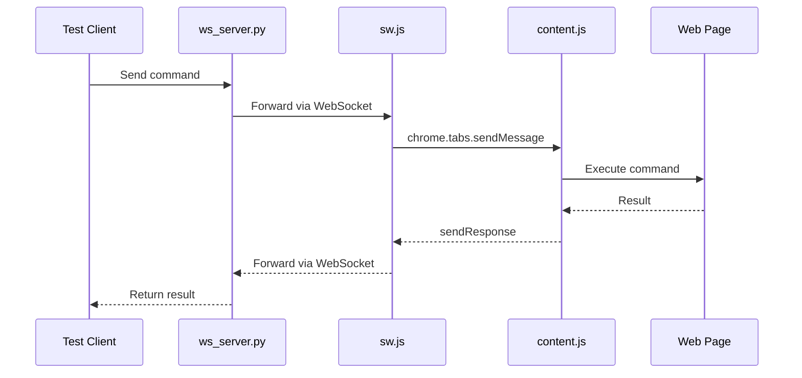
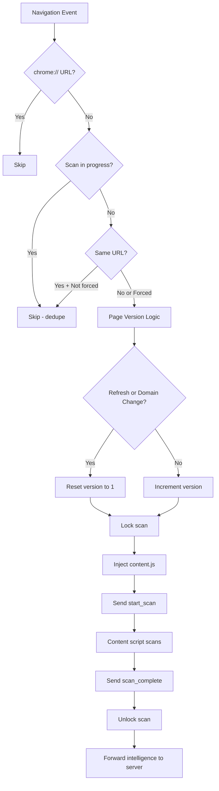
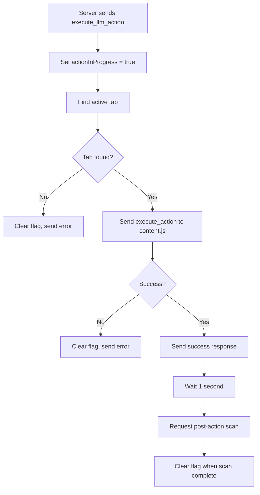
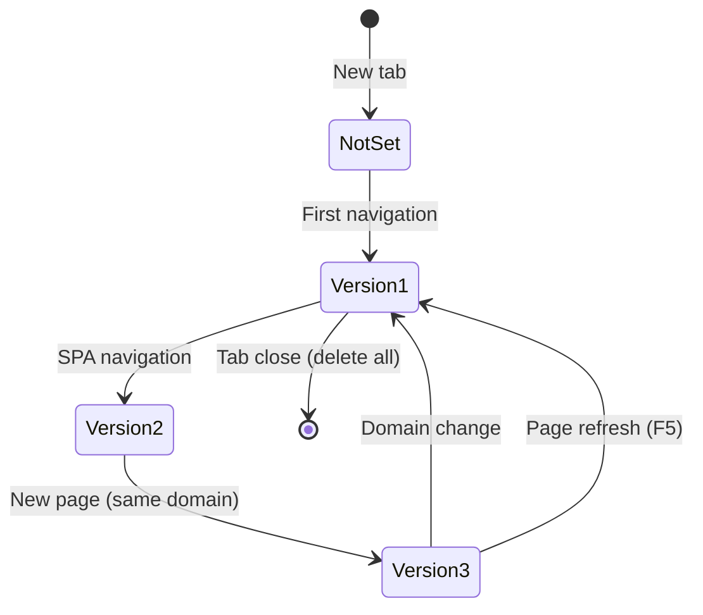
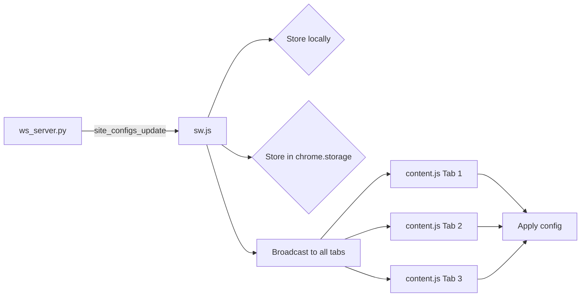
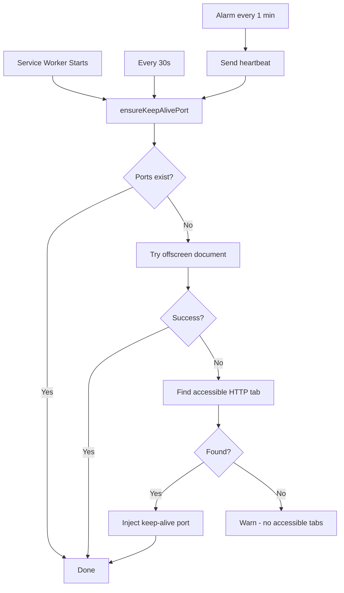

# Service Worker Documentation (sw.js)

## Overview

The **Service Worker** (`sw.js`) is the heart of the Om_E_Web Chrome Extension. It acts as a **persistent bridge** between the WebSocket server (Python) and content scripts (JavaScript) running in web pages. This file orchestrates the entire communication pipeline, manages tab state, handles action execution, and ensures the extension stays alive even when Chrome tries to suspend it.

### Role in the System

The service worker is the **central message router** that:
- Maintains a persistent WebSocket connection to `ws_server.py` (port 17892)
- Routes commands from external clients (like `test_navigation.py`) to content scripts
- Forwards intelligence updates from content scripts to the WebSocket server
- Manages tab lifecycle (activation, navigation, closure)
- Coordinates page scanning with version tracking
- Handles capability execution for site-specific automation
- Implements keep-alive mechanisms to prevent Chrome suspension

### Key Responsibilities

| Responsibility | Implementation |
|----------------|----------------|
| **WebSocket Bridge** | Maintains connection to server, routes messages bidirectionally |
| **Tab State Management** | Tracks scan progress, content script freshness, DOM changes |
| **Page Version Control** | Uses Chrome Storage API for persistent version tracking across navigations |
| **Scan Orchestration** | Prevents scan overlaps, coordinates triggers from navigation/DOM/SPA events |
| **Action Execution** | Routes LLM actions to correct tabs, prevents rescans during execution |
| **Keep-Alive System** | Prevents service worker suspension via ports, alarms, and offscreen documents |
| **Site Config Management** | Stores and distributes site-specific configurations to content scripts |
| **Capability Pipeline** | Handles advanced automation capabilities (transcripts, modals, etc.) |

### Architecture Position

```
┌─────────────────┐
│ Test Client     │ (Python test_navigation.py)
│ (External)      │
└────────┬────────┘
         │ WebSocket (ws://127.0.0.1:17892)
         ▼
┌─────────────────┐
│  ws_server.py   │ (WebSocket Server)
│  (Python)       │
└────────┬────────┘
         │ WebSocket
         ▼
┌─────────────────┐
│     sw.js       │ ◄─── YOU ARE HERE
│ (Service Worker)│
└────────┬────────┘
         │ chrome.tabs.sendMessage
         ▼
┌─────────────────┐
│   content.js    │ (Content Script)
│  (Web Page)     │
└────────┬────────┘
         │ DOM Manipulation
         ▼
┌─────────────────┐
│   Web Page      │ (YouTube, Google, etc.)
│     (DOM)       │
└─────────────────┘
```

---

## Global State Variables

### WebSocket Management
```javascript
let ws = null;                    // WebSocket connection to server
let isConnected = false;          // Connection status flag
let pendingMessages = [];         // Queue for messages when WS isn't ready
```

### Page Version Management (Chrome Storage)
```javascript
// Storage structure in chrome.storage.local:
{
  "pageVersions": {
    "tab_123_youtube.com": 5,
    "tab_456_google.com": 3
  }
}
```

### Tab State Management
```javascript
const tabState = new Map();           // tabId → { scanInProgress, lastUrl }
const tabScanState = new Map();       // DEPRECATED - kept for compatibility
let internalTabState = new Map();     // tabId → enhanced tab info (see structure below)
let lastActiveTabId = null;           // Last active tab ID
let tabCache = new Map();             // tabId → cached scan data
let siteConfigs = {};                 // Domain → site config mapping
```

**Internal Tab State Structure:**
```javascript
{
  id: 123,
  url: "https://youtube.com/watch?v=abc",
  title: "Video Title",
  active: true,
  status: "complete",
  lastUpdate: 1700000000000,
  needsFreshScan: true,
  contentScriptFresh: false,
  cacheCleared: true,
  domChanges: {
    totalChanges: 0,
    lastChangeTime: null,
    changeTypes: new Set(),
    lastMutationCount: 0
  },
  siteConfigSent: false,
  lastConfigSent: null,
  currentDomain: "youtube.com",
  currentFramework: 'youtube',
  siteConfigError: null,
  lastConfigError: null
}
```

### Keep-Alive System
```javascript
const KEEP_ALIVE_PORT_NAME = "ome_keep_alive";
const KEEP_ALIVE_CHECK_INTERVAL_MS = 30 * 1000;  // 30 seconds
const HEARTBEAT_ALARM_NAME = "ome_ws_heartbeat";
const HEARTBEAT_PERIOD_MINUTES = 1;
const keepAlivePorts = new Set();                 // Active keep-alive ports
let lastHeartbeatSent = 0;                        // Last heartbeat timestamp
```

### Scan Coordination
```javascript
let scanRequestCounter = 0;          // Debug counter for scan requests
let actionInProgress = false;        // Prevents rescans during action execution
```

---

## Function Reference

### WebSocket Connection Management

#### `connectWebSocket()`
**Purpose:** Establishes and maintains WebSocket connection to the Python server.

**Signature:**
```javascript
async function connectWebSocket()
```

**High-Level Flow:**
1. Check if WebSocket already exists and is open/connecting
2. Create new WebSocket to `ws://127.0.0.1:17892`
3. Set up event handlers (onopen, onmessage, onclose, onerror)
4. On connection: send bridge status, tabs info, active tab info
5. Flush any pending messages from queue
6. Send immediate heartbeat

**Called By:**
- `chrome.runtime.onStartup` (extension startup)
- `chrome.runtime.onInstalled` (extension install/update)
- Initial service worker load
- `handleSetWsUrl()` (when URL changes)
- Auto-reconnect on connection close

**Calls:**
- `sendToServer()` - Send bridge_status message
- `sendTabsInfo()` - Send current tabs info
- `sendActiveTabInfo()` - Send active tab info
- `flushPendingMessages()` - Send queued messages
- `sendHeartbeat()` - Send initial heartbeat
- `setTimeout()` - Delayed initialization and reconnection

**Event Handlers Set:**
```javascript
ws.onopen = () => { /* Connection established */ }
ws.onmessage = (event) => { handleServerMessage(event.data) }
ws.onclose = (event) => { /* Auto-reconnect after 1s */ }
ws.onerror = (error) => { /* Log error */ }
```

**Example:**
```javascript
// Automatic on service worker startup
connectWebSocket();
// → WebSocket connection established
// → Server receives bridge_status message
// → Tabs info sent to server
```

---

#### `sendToServer(data)`
**Purpose:** Send message to WebSocket server with automatic queuing.

**Signature:**
```javascript
function sendToServer(data: Object)
```

**Parameters:**
- `data` (Object) - Message payload to send

**High-Level Flow:**
1. Check if WebSocket is open
2. If open: stringify and send immediately
3. If not open: add to `pendingMessages` queue
4. Log success or warning

**Called By:**
- `connectWebSocket()` - Send bridge_status
- `sendTabsInfo()` - Send tabs_info
- `sendActiveTabInfo()` - Send active_tab_info
- `sendHeartbeat()` - Send ping
- `handleIntelligenceUpdate()` - Send intelligence_update
- `handleScanComplete()` - Send scan results
- `sendSuccessResponse()` - Send command success
- `sendErrorResponse()` - Send command error

**Calls:**
- `ws.send()` - WebSocket send method
- `JSON.stringify()` - Serialize message

**Example:**
```javascript
sendToServer({
  type: "bridge_status",
  status: "connected"
});
// → Server receives: {"type":"bridge_status","status":"connected"}
```

---

#### `flushPendingMessages()`
**Purpose:** Send all queued messages when WebSocket becomes ready.

**Signature:**
```javascript
function flushPendingMessages()
```

**High-Level Flow:**
1. Check if there are pending messages and WebSocket is open
2. Copy `pendingMessages` array and clear it
3. Iterate through messages and send each one
4. Log success/failure for each message

**Called By:**
- `connectWebSocket()` - After connection opens

**Calls:**
- `ws.send()` - Send each queued message

**Example:**
```javascript
// Messages queued while WebSocket was closed:
pendingMessages = [
  { type: "intelligence_update", data: {...} },
  { type: "scan_complete", data: {...} }
];
// WebSocket opens...
flushPendingMessages();
// → Both messages sent to server
// → pendingMessages = []
```

---

### Keep-Alive System

#### `ensureKeepAlivePort()`
**Purpose:** Prevent Chrome from suspending the service worker by maintaining a port connection.

**Signature:**
```javascript
async function ensureKeepAlivePort()
```

**High-Level Flow:**
1. Check if keep-alive ports already exist
2. If not: try to create offscreen document
3. If offscreen fails: find accessible HTTP(S) tabs
4. Inject keep-alive port creation script into tab
5. Log success or warning

**Called By:**
- `chrome.alarms.onAlarm` - Periodic alarm
- `chrome.tabs.onUpdated` - Tab updates
- `chrome.tabs.onCreated` - New tab
- `chrome.tabs.onRemoved` - Tab closed
- `chrome.runtime.onStartup` - Extension startup
- `chrome.runtime.onInstalled` - Extension install
- `setInterval()` - Periodic check (30s)

**Calls:**
- `ensureOffscreenDocument()` - Try offscreen first
- `chrome.tabs.query()` - Find accessible tabs
- `isTabAccessible()` - Check if tab allows content scripts
- `chrome.scripting.executeScript()` - Inject keep-alive port

**Example:**
```javascript
// Chrome tries to suspend service worker
// Alarm triggers...
ensureKeepAlivePort();
// → Offscreen document created
// → Keep-alive port established
// → Service worker stays alive
```

---

#### `ensureOffscreenDocument()`
**Purpose:** Create an invisible offscreen document to host a keep-alive port.

**Signature:**
```javascript
async function ensureOffscreenDocument()
```

**High-Level Flow:**
1. Check if `chrome.offscreen` API exists
2. Check if offscreen document already exists
3. If not: create offscreen document with `offscreen.html`
4. Log success or warning

**Called By:**
- `ensureKeepAlivePort()` - Primary keep-alive strategy

**Calls:**
- `chrome.offscreen.hasDocument()` - Check existence
- `chrome.offscreen.createDocument()` - Create document

**Example:**
```javascript
ensureOffscreenDocument();
// → Offscreen document created with URL: chrome-extension://.../offscreen.html
// → Reason: TESTING
// → Justification: "Keep OM-E automation bridge alive while tabs are inactive"
```

---

#### `scheduleHeartbeatAlarm()`
**Purpose:** Create a periodic alarm to wake up service worker and send heartbeats.

**Signature:**
```javascript
function scheduleHeartbeatAlarm()
```

**High-Level Flow:**
1. Check if `chrome.alarms` API exists
2. Create alarm with name `"ome_ws_heartbeat"`
3. Set period to 1 minute

**Called By:**
- `chrome.runtime.onStartup` - Extension startup
- `chrome.runtime.onInstalled` - Extension install

**Calls:**
- `chrome.alarms.create()` - Create alarm

**Listener:**
```javascript
chrome.alarms.onAlarm.addListener((alarm) => {
  if (alarm.name === HEARTBEAT_ALARM_NAME) {
    sendHeartbeat("alarm");
    ensureKeepAlivePort();
  }
});
```

---

#### `sendHeartbeat(reason)`
**Purpose:** Send a ping to the server to keep connection alive.

**Signature:**
```javascript
function sendHeartbeat(reason: string = "manual")
```

**Parameters:**
- `reason` (string) - Why heartbeat is being sent (e.g., "onopen", "alarm", "manual")

**High-Level Flow:**
1. Check if WebSocket is open
2. If not: try to reconnect
3. If open: send ping message with metadata
4. Update `lastHeartbeatSent` timestamp

**Called By:**
- `connectWebSocket()` - Initial heartbeat
- `chrome.alarms.onAlarm` - Periodic heartbeat
- Manual calls

**Calls:**
- `sendToServer()` - Send ping message
- `connectWebSocket()` - Reconnect if needed

**Example:**
```javascript
sendHeartbeat("alarm");
// → Server receives:
// {
//   type: "ping",
//   source: "extension",
//   reason: "alarm",
//   keepAlivePorts: 1,
//   timestamp: 1700000000000
// }
```

---

### Page Version Management (Chrome Storage)

#### `normalizeUrl(url)`
**Purpose:** Normalize URL for consistent storage keys by removing fragments and sorting params.

**Signature:**
```javascript
function normalizeUrl(url: string): string
```

**Parameters:**
- `url` (string) - URL to normalize

**Returns:**
- (string) - Normalized URL

**High-Level Flow:**
1. Parse URL into URL object
2. Remove hash fragment
3. Sort query parameters alphabetically
4. Return normalized string
5. On error: return original URL

**Called By:**
- Not directly called in current implementation (available for future use)

**Example:**
```javascript
normalizeUrl("https://youtube.com/watch?v=abc&t=10#comment")
// → "https://youtube.com/watch?t=10&v=abc"
```

---

#### `getPageVersionKey(tabId, url)`
**Purpose:** Generate storage key for tracking page versions per tab + domain.

**Signature:**
```javascript
function getPageVersionKey(tabId: number, url: string): string
```

**Parameters:**
- `tabId` (number) - Tab ID
- `url` (string) - Page URL

**Returns:**
- (string) - Storage key in format `"tab_{tabId}_{domain}"`

**High-Level Flow:**
1. Parse URL to extract hostname
2. Generate key: `tab_{tabId}_{domain}`
3. On error: fallback to `tab_{tabId}`

**Called By:**
- `getPageVersion()` - Read version from storage
- `setPageVersion()` - Write version to storage
- `incrementPageVersion()` - Update version
- `resetPageVersion()` - Reset version

**Example:**
```javascript
getPageVersionKey(123, "https://www.youtube.com/watch?v=abc")
// → "tab_123_www.youtube.com"

getPageVersionKey(456, "https://google.com/search?q=test")
// → "tab_456_google.com"
```

**Business Logic:**
- Same tab + same domain = increment version
- Same tab + different domain = reset to version 1
- Tab close = delete all versions for that tab

---

#### `getPageVersion(tabId, url)`
**Purpose:** Retrieve current page version from Chrome storage.

**Signature:**
```javascript
async function getPageVersion(tabId: number, url: string): Promise<number>
```

**Parameters:**
- `tabId` (number) - Tab ID
- `url` (string) - Page URL

**Returns:**
- (Promise<number>) - Page version (0 if not set)

**High-Level Flow:**
1. Generate storage key via `getPageVersionKey()`
2. Read `pageVersions` object from `chrome.storage.local`
3. Look up version for this key
4. Return version or 0 if not found
5. Log read operation

**Called By:**
- `incrementPageVersion()` - Read current before incrementing
- `requestScan()` - Check current version

**Calls:**
- `getPageVersionKey()` - Generate key
- `chrome.storage.local.get()` - Read from storage

**Example:**
```javascript
await getPageVersion(123, "https://youtube.com/watch?v=abc")
// → 5
// Console: "[SW] 📖 Read pageVersion=5 for tab_123_www.youtube.com"
```

---

#### `setPageVersion(tabId, url, version)`
**Purpose:** Save page version to Chrome storage.

**Signature:**
```javascript
async function setPageVersion(tabId: number, url: string, version: number): Promise<number>
```

**Parameters:**
- `tabId` (number) - Tab ID
- `url` (string) - Page URL
- `version` (number) - Version to save

**Returns:**
- (Promise<number>) - Version that was saved

**High-Level Flow:**
1. Generate storage key
2. Read existing `pageVersions` object
3. Update version for this key
4. Save back to storage
5. Log operation

**Called By:**
- `incrementPageVersion()` - Save new version
- `resetPageVersion()` - Save version 1

**Calls:**
- `getPageVersionKey()` - Generate key
- `chrome.storage.local.get()` - Read current versions
- `chrome.storage.local.set()` - Save updated versions

**Example:**
```javascript
await setPageVersion(123, "https://youtube.com/watch", 6)
// → 6
// Console: "[SW] 💾 Saved pageVersion=6 for tab_123_www.youtube.com"
// Storage: { "pageVersions": { "tab_123_www.youtube.com": 6 } }
```

---

#### `incrementPageVersion(tabId, url)`
**Purpose:** Increment page version for SPA navigation or new page within same domain.

**Signature:**
```javascript
async function incrementPageVersion(tabId: number, url: string): Promise<number>
```

**Parameters:**
- `tabId` (number) - Tab ID
- `url` (string) - Page URL

**Returns:**
- (Promise<number>) - New version number

**High-Level Flow:**
1. Get current version via `getPageVersion()`
2. Increment by 1
3. Save new version via `setPageVersion()`
4. Log operation
5. Return new version

**Called By:**
- `requestScan()` - When navigating within same domain

**Calls:**
- `getPageVersion()` - Read current
- `setPageVersion()` - Save new

**Example:**
```javascript
// Current version: 5
await incrementPageVersion(123, "https://youtube.com/watch?v=xyz")
// → 6
// Console: "[SW] ⬆️  Incremented pageVersion: 5 → 6"
```

---

#### `resetPageVersion(tabId, url)`
**Purpose:** Reset page version to 1 (for page refresh or domain change).

**Signature:**
```javascript
async function resetPageVersion(tabId: number, url: string): Promise<number>
```

**Parameters:**
- `tabId` (number) - Tab ID
- `url` (string) - Page URL

**Returns:**
- (Promise<number>) - Always returns 1

**High-Level Flow:**
1. Call `setPageVersion()` with version 1
2. Log operation
3. Return 1

**Called By:**
- `requestScan()` - On page refresh or domain change

**Calls:**
- `setPageVersion()` - Save version 1

**Example:**
```javascript
await resetPageVersion(123, "https://google.com")
// → 1
// Console: "[SW] 🔄 Reset pageVersion to 1 for tab 123"
```

---

#### `deleteTabPageVersions(tabId)`
**Purpose:** Delete all page versions for a tab when it closes.

**Signature:**
```javascript
async function deleteTabPageVersions(tabId: number)
```

**Parameters:**
- `tabId` (number) - Tab ID to clean up

**High-Level Flow:**
1. Read all `pageVersions` from storage
2. Filter out entries matching this tab ID
3. Save cleaned object back to storage
4. Log count of removed entries

**Called By:**
- `chrome.tabs.onRemoved` - Tab close listener

**Calls:**
- `chrome.storage.local.get()` - Read versions
- `chrome.storage.local.set()` - Save cleaned versions

**Example:**
```javascript
// Storage before:
// { "tab_123_youtube.com": 5, "tab_123_google.com": 2, "tab_456_twitter.com": 1 }

await deleteTabPageVersions(123)
// → Removed 2 entries

// Storage after:
// { "tab_456_twitter.com": 1 }
// Console: "[SW] 🗑️  Deleted 2 pageVersion entries for tab 123"
```

---

### Scan Orchestration

#### `requestScan(tabId, url, trigger)`
**Purpose:** **UNIFIED ENTRY POINT** for all scan requests. Prevents duplicate scans, manages page versions, injects content script, and sends scan command.

**Signature:**
```javascript
async function requestScan(tabId: number, url: string, trigger: string)
```

**Parameters:**
- `tabId` (number) - Tab to scan
- `url` (string) - Page URL
- `trigger` (string) - Reason for scan (e.g., "url_change", "spa_navigation", "post_action")

**High-Level Flow:**
1. **Increment scan counter** for debugging
2. **Skip chrome:// URLs**
3. **Check scan lock** - if scan in progress, skip
4. **Deduplication** - skip if same URL already scanned (unless forced)
5. **Page version logic:**
   - Refresh (F5) → reset to version 1
   - Domain change → reset to version 1
   - Same domain → increment version
6. **Lock scan** - set `scanInProgress = true`
7. **Inject content script** via `chrome.scripting.executeScript`
8. **Send scan command** to content script with `pageVersion`
9. **Release lock on error**

**Called By:**
- `chrome.webNavigation.onCompleted` - URL change (trigger: "url_change")
- `chrome.webNavigation.onHistoryStateUpdated` - SPA navigation (trigger: "spa_navigation")
- `chrome.runtime.onMessage` - Content script request (trigger: "significant_dom_change")
- `handleExecuteLLMAction()` - Post-action rescan (trigger: "post_action")

**Calls:**
- `getPageVersion()` - Read current version
- `incrementPageVersion()` - Increment version
- `resetPageVersion()` - Reset version
- `chrome.scripting.executeScript()` - Inject content script
- `chrome.tabs.sendMessage()` - Send scan command

**Scan Triggers:**
| Trigger | Source | Action |
|---------|--------|--------|
| `url_change` | `chrome.webNavigation.onCompleted` | Full page load |
| `spa_navigation` | `chrome.webNavigation.onHistoryStateUpdated` | History API navigation |
| `post_action` | `handleExecuteLLMAction()` | After action execution |
| `significant_dom_change` | Content script message | Major DOM mutation |

**Example Flow:**
```javascript
// User navigates from YouTube video 1 to video 2
requestScan(123, "https://youtube.com/watch?v=xyz", "spa_navigation")
// → pageVersion incremented: 5 → 6
// → content.js injected
// → Message sent: { type: 'start_scan', pageVersion: 6, url: "...", trigger: "spa_navigation" }
// → Content script scans page with pageVersion=6
```

**Deduplication Logic:**
```javascript
// Forced triggers (always rescan):
const forcedTriggers = ['post_action', 'significant_dom_change', 'spa_navigation'];

// Skip if:
// 1. Same URL as last scan
// 2. No scan in progress
// 3. Trigger is NOT forced
const shouldSkip = state.lastUrl === url && !state.scanInProgress && !forcedTriggers.includes(trigger);
```

---

#### `handleScanComplete(message, sender)`
**Purpose:** Process scan completion notification from content script and forward intelligence to server.

**Signature:**
```javascript
function handleScanComplete(message: Object, sender: Object)
```

**Parameters:**
- `message` (Object) - Scan completion message with intelligence data
- `sender` (Object) - Chrome sender object with tab info

**High-Level Flow:**
1. Extract tab ID from sender
2. Get tab state and mark `scanInProgress = false`
3. Log scan completion
4. Attach `pageVersion` to intelligence data (never null)
5. Forward intelligence update to WebSocket server

**Called By:**
- `chrome.runtime.onMessage` - When content script sends `scan_complete`

**Calls:**
- `ws.send()` - Forward intelligence to server

**Message Structure:**
```javascript
{
  type: 'scan_complete',
  pageVersion: 6,
  intelligenceData: {
    pageState: {...},
    actionableElements: [...],
    recentInsights: [...],
    actionMapping: {...}
  }
}
```

**Example:**
```javascript
// Content script completes scan...
handleScanComplete({
  pageVersion: 6,
  intelligenceData: { /* scan results */ }
}, { tab: { id: 123 } })

// → Tab state updated: scanInProgress = false
// → Server receives:
// {
//   type: 'intelligence_update',
//   data: { pageVersion: 6, ...intelligenceData }
// }
```

---

#### `triggerIntelligenceScan(tabId, url, reason)`
**Purpose:** **DEPRECATED** - Redirects to `requestScan()` for backwards compatibility.

**Signature:**
```javascript
async function triggerIntelligenceScan(tabId: number, url: string, reason: string = "navigation_completed")
```

**Note:** This function is kept for compatibility with older code but simply redirects to the unified `requestScan()` function.

---

### Tab State Management

#### `clearTabCache(tabId)`
**Purpose:** Clear cached scan data for a specific tab and mark it as needing a fresh scan.

**Signature:**
```javascript
function clearTabCache(tabId: number)
```

**Parameters:**
- `tabId` (number) - Tab ID to clear cache for

**High-Level Flow:**
1. Check if tab has cached data
2. If yes: log cached data details and delete from `tabCache`
3. Update `internalTabState` to mark tab as needing fresh scan
4. Set `lastCacheClear` timestamp

**Called By:**
- `updateInternalTabState()` - When tab URL/title changes
- `handleNavigateCommand()` - After navigation
- `handleForceRefresh()` - Force refresh all tabs
- `handleClearAllCache()` - Clear all cache
- `chrome.tabs.onActivated` - When switching tabs
- `handleForceContentScriptReinjection()` - Force re-injection

**Calls:**
- None (direct state manipulation)

**Example:**
```javascript
clearTabCache(123)
// Console: "[SW] Clearing cache for tab: 123"
// Console: "[SW] Cleared cached data: { tabId: 123, cachedElements: 50, cachedSelectors: 10 }"
// Console: "[SW] Tab marked as needing fresh scan: 123"
```

---

#### `ensureContentScriptFresh(tabId)`
**Purpose:** Force re-injection of content script into a tab and send site config proactively.

**Signature:**
```javascript
async function ensureContentScriptFresh(tabId: number)
```

**Parameters:**
- `tabId` (number) - Tab ID to refresh

**High-Level Flow:**
1. **Check action flag** - skip if action in progress
2. **Re-inject content script** via `chrome.scripting.executeScript`
3. **Proactively send site config** via `proactivelySendSiteConfig()`
4. **Update tab state:**
   - Mark `contentScriptFresh = true`
   - Set `lastContentScriptRefresh` timestamp
5. **On error:**
   - Mark `contentScriptRefreshFailed = true`
   - Set `lastRefreshError` timestamp

**Called By:**
- `updateInternalTabState()` - When active tab changes or URL changes
- `handleDOMCommand()` - Before executing DOM commands
- `handleForceRefresh()` - Force refresh all tabs
- `handleForceContentScriptReinjection()` - Force re-injection
- `chrome.tabs.onActivated` - When tab becomes active

**Calls:**
- `chrome.scripting.executeScript()` - Inject content.js
- `chrome.tabs.get()` - Get tab info
- `proactivelySendSiteConfig()` - Send site config to content script

**Example:**
```javascript
await ensureContentScriptFresh(123)
// Console: "[SW] Ensuring content script is fresh for tab: 123"
// Console: "[SW] Content script refreshed for tab: 123"
// Console: "[SW] 🚀 Proactively sending site config after content script refresh for tab 123"
// → Tab state updated with contentScriptFresh = true
```

---

#### `sendTabsInfo(forceRefresh)`
**Purpose:** Query all tabs, update internal state, and send tab information to server.

**Signature:**
```javascript
async function sendTabsInfo(forceRefresh: boolean = false)
```

**Parameters:**
- `forceRefresh` (boolean) - Whether to force clear all internal state

**High-Level Flow:**
1. Query all tabs via `chrome.tabs.query({})`
2. Map tabs to simple info objects (id, url, title, active, status)
3. Call `updateInternalTabState()` to process changes
4. Send `tabs_info` message to server
5. Also send active tab info immediately

**Called By:**
- `connectWebSocket()` - Initial connection
- `chrome.tabs.onActivated` - Tab switch
- `chrome.tabs.onUpdated` - Tab update
- `chrome.tabs.onCreated` - New tab
- `chrome.tabs.onRemoved` - Tab close
- `handleForceRefresh()` - Force refresh

**Calls:**
- `chrome.tabs.query()` - Get all tabs
- `updateInternalTabState()` - Process tab changes
- `sendToServer()` - Send tabs_info
- `sendActiveTabInfo()` - Send active tab

**Example:**
```javascript
await sendTabsInfo()
// → Query all tabs
// → Update internal state for 3 tabs
// → Send to server:
// {
//   type: "tabs_info",
//   tabs: [
//     { id: 123, url: "...", title: "...", active: true, status: "complete" },
//     { id: 124, url: "...", title: "...", active: false, status: "complete" },
//     { id: 125, url: "...", title: "...", active: false, status: "loading" }
//   ]
// }
```

---

#### `sendActiveTabInfo()`
**Purpose:** Send just the current active tab information to server for immediate visibility.

**Signature:**
```javascript
async function sendActiveTabInfo()
```

**High-Level Flow:**
1. Query active tab in current window
2. Extract info (id, url, title, status)
3. Send `active_tab_info` message to server
4. Log active tab details

**Called By:**
- `connectWebSocket()` - Initial connection
- `sendTabsInfo()` - After sending all tabs
- `chrome.tabs.onActivated` - Tab switch
- `chrome.tabs.onUpdated` - Active tab update
- `chrome.tabs.onCreated` - New tab
- `chrome.tabs.onRemoved` - Tab close

**Calls:**
- `chrome.tabs.query()` - Get active tab
- `sendToServer()` - Send active_tab_info

**Example:**
```javascript
await sendActiveTabInfo()
// → Server receives:
// {
//   type: "active_tab_info",
//   activeTab: {
//     id: 123,
//     url: "https://youtube.com/watch?v=abc",
//     title: "Video Title",
//     status: "complete"
//   },
//   timestamp: 1700000000000
// }
// Console: "[SW] 🎯 Active tab info sent: { id: 123, url: ..., title: 'Video Title...' }"
```

---

#### `updateInternalTabState(tabsInfo, forceRefresh)`
**Purpose:** Enhanced internal state management - detect tab changes, clear cache, ensure fresh content scripts.

**Signature:**
```javascript
function updateInternalTabState(tabsInfo: Array, forceRefresh: boolean = false)
```

**Parameters:**
- `tabsInfo` (Array) - Array of tab info objects
- `forceRefresh` (boolean) - Force clear all state

**High-Level Flow:**
1. **Force refresh check:**
   - If `forceRefresh = true`: clear `internalTabState` and `tabCache`
2. **Process each tab:**
   - Compare with old state (URL, title, active status)
   - If changed:
     - Clear tab cache
     - Update internal state with enhanced tracking
     - Add DOM change tracking structure
     - Add site config tracking structure
   - If new active tab: ensure fresh content script
   - If URL changed: force content script refresh
3. **Cleanup:**
   - Remove stale tabs from internal state
4. **Log summary:**
   - Total tabs, active tabs, tabs needing fresh scan

**Called By:**
- `sendTabsInfo()` - After querying tabs

**Calls:**
- `clearTabCache()` - Clear cache for changed tabs
- `ensureContentScriptFresh()` - Refresh content script

**Enhanced State Structure Created:**
```javascript
{
  ...tabInfo,
  lastUpdate: Date.now(),
  needsFreshScan: true,
  contentScriptFresh: false,
  cacheCleared: true,
  domChanges: {
    totalChanges: 0,
    lastChangeTime: null,
    changeTypes: new Set(),
    lastMutationCount: 0
  },
  siteConfigSent: false,
  lastConfigSent: null,
  currentDomain: null,
  currentFramework: 'generic',
  siteConfigError: null,
  lastConfigError: null
}
```

---

### Message Handling (Server → Service Worker)

#### `handleServerMessage(messageData)`
**Purpose:** Parse and route incoming WebSocket messages from server to appropriate handlers.

**Signature:**
```javascript
function handleServerMessage(messageData: string)
```

**Parameters:**
- `messageData` (string) - Raw JSON string from WebSocket

**High-Level Flow:**
1. Parse JSON message
2. Log parsed message
3. Route by `message.type`:
   - `site_configs_update` → Store configs, broadcast to content scripts
   - `execute_llm_action` → `handleExecuteLLMAction()`
   - `execute_capability` → `handleExecuteCapability()`
   - `server_ping` → Send pong response
   - `command` → Route by `message.command`:
     - `navigate` → `handleNavigateCommand()`
     - DOM commands → `handleDOMCommand()`
4. On error: log error

**Called By:**
- `ws.onmessage` - WebSocket message event

**Calls:**
- `handleExecuteLLMAction()` - LLM action execution
- `handleExecuteCapability()` - Capability execution
- `handleNavigateCommand()` - Navigation
- `handleDOMCommand()` - DOM manipulation
- `sendErrorResponse()` - Unknown commands

**Message Types Handled:**

| Type | Handler | Purpose |
|------|---------|---------|
| `site_configs_update` | Inline | Store and broadcast site configs |
| `execute_llm_action` | `handleExecuteLLMAction()` | Execute LLM-directed action |
| `execute_capability` | `handleExecuteCapability()` | Execute capability (transcript, modal, etc.) |
| `server_ping` | Inline | Respond with pong |
| `command` (navigate) | `handleNavigateCommand()` | Change tab URL |
| `command` (DOM) | `handleDOMCommand()` | DOM manipulation commands |

**Example:**
```javascript
// Server sends: {"type":"execute_llm_action","data":{"actionId":"a_id_123","actionType":"click"}}
handleServerMessage('{"type":"execute_llm_action","data":{"actionId":"a_id_123","actionType":"click"}}')
// → Parsed message: { type: "execute_llm_action", data: {...} }
// → Routed to: handleExecuteLLMAction()
```

---

### Message Handling (Extension Internal)

#### `chrome.runtime.onMessage` Listener
**Purpose:** Central listener for internal extension messages from content scripts, popup, and other components.

**Message Types Handled:**

| Type | Handler | Purpose |
|------|---------|---------|
| `setWsUrl` | `handleSetWsUrl()` | Update WebSocket URL |
| `forceRefresh` | `handleForceRefresh()` | Force refresh all tabs |
| `clearAllCache` | `handleClearAllCache()` | Clear all cached data |
| `getStatus` | `handleGetStatus()` | Get extension status |
| `dom_changed` | `handleDOMChanged()` | DOM mutation notification |
| `network_activity` | `handleNetworkActivity()` | Network activity tracking |
| `intelligence_update` | `handleIntelligenceUpdate()` | Intelligence data from content script |
| `scan_complete` | `handleScanComplete()` | Scan completion notification |
| `request_scan` | Inline | Request new scan |
| `get_site_config_for_domain` | `handleGetSiteConfigForDomain()` | Site config lookup |
| `execute_llm_action` | `handleExecuteLLMAction()` | Execute LLM action |
| `ping` | Inline | Simple ping response |
| `force_content_script_reinjection` | `handleForceContentScriptReinjection()` | Force re-inject content script |
| `force_extension_reload` | `handleForceExtensionReload()` | Force extension reload |
| `immediate_scan_results` | `handleImmediateScanResults()` | Immediate scan results after tear away |

**High-Level Flow:**
1. Receive message with type
2. Switch on `message.type`
3. Call appropriate handler with `sendResponse` callback
4. Return `true` to keep channel open for async responses

---

#### `handleSetWsUrl(message, sendResponse)`
**Purpose:** Update WebSocket URL and reconnect.

**Signature:**
```javascript
async function handleSetWsUrl(message: Object, sendResponse: Function)
```

**Parameters:**
- `message` (Object) - Contains `url` field
- `sendResponse` (Function) - Response callback

**High-Level Flow:**
1. Extract URL from message
2. Store in `chrome.storage.local`
3. Close existing WebSocket
4. Reconnect with new URL after 100ms delay
5. Send success response

**Called By:**
- Popup or other extension components

---

#### `handleForceRefresh(message, sendResponse)`
**Purpose:** Force refresh all tab state and content scripts.

**Signature:**
```javascript
async function handleForceRefresh(message: Object, sendResponse: Function)
```

**High-Level Flow:**
1. Force refresh all internal state via `sendTabsInfo(true)`
2. Query all tabs
3. For each tab: call `ensureContentScriptFresh()`
4. Count successful refreshes
5. Send response with count

**Called By:**
- Popup or manual refresh requests

---

#### `handleClearAllCache(message, sendResponse)`
**Purpose:** Clear all tab cache and mark all tabs as needing fresh scan.

**Signature:**
```javascript
async function handleClearAllCache(message: Object, sendResponse: Function)
```

**High-Level Flow:**
1. Iterate through `tabCache` and call `clearTabCache()` for each
2. Mark all tabs in `internalTabState` as needing fresh scan
3. Send response with count of affected tabs

---

#### `handleGetStatus(message, sendResponse)`
**Purpose:** Calculate and return extension status metrics.

**Signature:**
```javascript
async function handleGetStatus(message: Object, sendResponse: Function)
```

**Returns Status Object:**
```javascript
{
  isConnected: true,
  totalTabs: 3,
  tabsWithFreshScripts: 2,
  tabsNeedingFreshScan: 1,
  tabsWithCacheIssues: 0,
  tabsWithDOMChanges: 1,
  totalDOMChanges: 15,
  recentDOMChanges: 1,
  tabsWithSiteConfigs: 2,
  totalSiteConfigs: 5,
  lastActiveTabId: 123,
  websocketState: 1,  // WebSocket.OPEN
  timestamp: 1700000000000
}
```

---

#### `handleDOMChanged(message, sendResponse)`
**Purpose:** Process DOM change notifications from content scripts and update internal state.

**Signature:**
```javascript
async function handleDOMChanged(message: Object, sendResponse: Function)
```

**Message Structure:**
```javascript
{
  type: "dom_changed",
  changeNumber: 15,
  types: ["childList", "attributes"],
  totalMutations: 25,
  url: "https://youtube.com/watch",
  timestamp: 1700000000000
}
```

**High-Level Flow:**
1. Find tab by URL matching
2. Update `tabState.domChanges`:
   - `totalChanges` = changeNumber
   - `lastChangeTime` = timestamp
   - `lastMutationCount` = totalMutations
   - Add change types to Set
3. Mark tab as needing fresh scan
4. If significant (>10 mutations): notify server via `dom_content_changed` message

**Note:** Full rescans on DOM mutations are **DISABLED** to prevent:
- Counter accumulation
- ID inconsistency
- Multiple overlapping scans
- Chaos for LLM as action IDs keep changing

Content scripts now handle mutations incrementally via `registerInteractiveSubtree`.

---

#### `handleNetworkActivity(message, sender)`
**Purpose:** Track network activity from content scripts and update tab state.

**Signature:**
```javascript
async function handleNetworkActivity(message: Object, sender: Object)
```

**Message Structure:**
```javascript
{
  type: "network_activity",
  eventType: "fetch_end",
  url: "https://api.youtube.com/...",
  status: 200,
  inflightRequests: 0,
  timestamp: 1700000000000
}
```

**High-Level Flow:**
1. Extract tab ID from sender
2. Update `tabState.networkActivity`:
   - `inflightRequests` count
   - `lastActivity` timestamp
   - `recentRequests` array (keep last 10)
3. Notify server via `network_activity` message
4. If network idle and no action in progress: schedule rescan after 1s

**Note:** Automatic rescans during action execution are **DISABLED** to prevent invalidating action IDs.

---

#### `handleIntelligenceUpdate(message, sender, sendResponse)`
**Purpose:** Process intelligence updates from content scripts and forward to server.

**Signature:**
```javascript
async function handleIntelligenceUpdate(message: Object, sender: Object, sendResponse: Function)
```

**High-Level Flow:**
1. Validate message structure
2. Extract tab context (tabId, url, title)
3. Verify this is the active tab (skip if inactive)
4. Attach tab metadata to intelligence data
5. Validate required fields (actionableElements)
6. Forward to server via `intelligence_update` message
7. Send response

**Data Validation:**
```javascript
if (!message || !message.data) → Error
if (!sourceTabId) → Error
if (sourceTabId !== activeTab.id) → Skip (inactive tab)
if (!intelligenceData.actionableElements) → Warning
```

---

### Command Execution

#### `handleNavigateCommand(message)`
**Purpose:** Navigate the active tab to a new URL.

**Signature:**
```javascript
async function handleNavigateCommand(message: Object)
```

**Message Structure:**
```javascript
{
  command: "navigate",
  id: "cmd_123",
  params: { url: "https://youtube.com" }
}
```

**High-Level Flow:**
1. Extract URL from params
2. Find active tab via `findActiveTab()`
3. Navigate tab via `chrome.tabs.update()`
4. Clear tab cache
5. Send success response

**Called By:**
- `handleServerMessage()` - When server sends navigate command

**Calls:**
- `findActiveTab()` - Find tab to navigate
- `chrome.tabs.update()` - Update tab URL
- `clearTabCache()` - Clear cache
- `sendSuccessResponse()` / `sendErrorResponse()` - Send response

---

#### `handleDOMCommand(message)`
**Purpose:** Execute DOM manipulation commands in content scripts.

**Signature:**
```javascript
async function handleDOMCommand(message: Object)
```

**Message Structure:**
```javascript
{
  command: "click" | "getText" | "getPageMarkdown" | "scanAndRegisterElements" | ...,
  id: "cmd_123",
  params: { /* command-specific params */ }
}
```

**Commands Handled:**
- `waitFor` - Wait for element
- `getText` - Get text content
- `click` - Click element
- `getPageMarkdown` - Extract page markdown
- `extractPageText` - Extract text
- `getCurrentTabInfo` - Get tab info
- `getNavigationContext` - Get navigation state
- `searchActions` - Search available actions
- `discoverLoginControls` - Find login elements
- `generateSiteMap` - Generate site map
- `scanAndRegisterElements` - Scan and register elements
- `navigateBack` / `navigateForward` - Browser navigation
- `jumpToHistoryEntry` - Jump to history entry
- `getHistoryState` / `searchHistory` / `clearHistory` - History management

**High-Level Flow:**
1. Find active tab via `findActiveTab()`
2. Check if content script needs refresh
3. Inject content script if needed
4. **NEW:** Proactively send site config after injection
5. Wait 100ms for content script initialization
6. Send command to content script via `chrome.tabs.sendMessage()`
7. Process response:
   - If error: send error response
   - If success: send success response, mark tab as scanned

**Called By:**
- `handleServerMessage()` - When server sends DOM command

**Calls:**
- `findActiveTab()` - Find tab
- `ensureContentScriptFresh()` - Refresh if needed
- `chrome.scripting.executeScript()` - Inject content.js
- `proactivelySendSiteConfig()` - Send site config
- `chrome.tabs.sendMessage()` - Send command
- `sendSuccessResponse()` / `sendErrorResponse()` - Send response

---

#### `handleExecuteLLMAction(message, sendResponse)`
**Purpose:** Execute LLM-directed actions (click, setValue, navigate) on page elements.

**Signature:**
```javascript
async function handleExecuteLLMAction(message: Object, sendResponse: Function)
```

**Message Structure:**
```javascript
{
  type: "execute_llm_action",
  data: {
    actionId: "a_id_123",
    actionType: "click",
    params: { /* action-specific params */ }
  }
}
```

**High-Level Flow:**
1. Extract `actionId`, `actionType`, `params`
2. **Set action flag:** `actionInProgress = true` (prevents content script refresh)
3. Find active tab
4. Send `execute_action` message to content script
5. Wait for response
6. If success:
   - Send success response
   - Schedule post-action scan after 1s delay
7. If failure or error:
   - Clear action flag
   - Send error response

**Action Lock Mechanism:**
```javascript
actionInProgress = true;  // Set before action
// → Prevents ensureContentScriptFresh() from refreshing
// → Prevents automatic rescans during execution
setTimeout(() => {
  requestScan(tabId, url, 'post_action');  // Rescan after 1s
}, 1000);
```

**Called By:**
- `handleServerMessage()` - When server sends execute_llm_action
- `chrome.runtime.onMessage` - Internal execute_llm_action

**Calls:**
- `findActiveTab()` - Find tab
- `chrome.tabs.sendMessage()` - Send execute_action
- `requestScan()` - Post-action rescan
- `sendResponse()` - Send result

---

#### `handleExecuteCapability(message)`
**Purpose:** Execute capability commands (transcript retrieval, modal interaction, etc.).

**Signature:**
```javascript
async function handleExecuteCapability(message: Object)
```

**Message Structure:**
```javascript
{
  type: "execute_capability",
  action: "RetrieveTranscript",
  params: { /* capability-specific params */ }
}
```

**High-Level Flow:**
1. Extract `action` and `params`
2. Find active tab
3. Forward capability message to content script
4. Log result

**Called By:**
- `handleServerMessage()` - When server sends execute_capability

**Calls:**
- `findActiveTab()` - Find tab
- `chrome.tabs.sendMessage()` - Forward to content script

---

### Tab Finding

#### `findActiveTab()`
**Purpose:** Find the currently active tab using multiple fallback strategies.

**Signature:**
```javascript
async function findActiveTab(): Promise<Object | null>
```

**Returns:**
- (Promise<Object | null>) - Active tab object or null if none found

**Strategies (in order):**

1. **Active tab in current window:**
   ```javascript
   chrome.tabs.query({ active: true, currentWindow: true })
   ```

2. **Active tab in last focused window:**
   ```javascript
   chrome.tabs.query({ active: true, lastFocusedWindow: true })
   ```

3. **Any accessible tab in current window:**
   - Filter for accessible tabs (not chrome://)
   - Sort: non-chrome URLs first, then active tabs

4. **Last resort - any visible accessible tab:**
   - Find any visible non-chrome tab across all windows
   - Sort by active status

**Accessibility Check:**
For each tab, calls `isTabAccessible()` to ensure it's not a restricted URL.

**Called By:**
- `handleNavigateCommand()` - Navigation
- `handleDOMCommand()` - DOM commands
- `handleExecuteLLMAction()` - LLM actions
- `handleExecuteCapability()` - Capabilities
- `handleIntelligenceUpdate()` - Intelligence updates

**Calls:**
- `chrome.tabs.query()` - Query tabs
- `chrome.tabs.get()` - Refresh tab info
- `chrome.windows.getCurrent()` - Get current window
- `isTabAccessible()` - Check accessibility

**Example Flow:**
```javascript
const tab = await findActiveTab();
// Strategy 1: Found active tab in current window
// → { id: 123, url: "https://youtube.com/watch", active: true }

// OR if chrome:// tab is active:
// Strategy 1: Failed (chrome:// not accessible)
// Strategy 2: Failed (same tab)
// Strategy 3: Found accessible tab in window
// → { id: 124, url: "https://google.com", active: false }
```

---

#### `isTabAccessible(tab)`
**Purpose:** Check if a tab is accessible for content script injection.

**Signature:**
```javascript
function isTabAccessible(tab: Object): boolean
```

**Parameters:**
- `tab` (Object) - Tab object to check

**Returns:**
- (boolean) - True if accessible, false otherwise

**Blocked URLs:**
- `chrome://` - Chrome internal pages
- `chrome-extension://` - Extension pages
- `about:` - Browser special pages
- `edge://` - Edge internal pages
- `moz-extension://` - Firefox extension pages
- `about:blank` - Blank page

**Called By:**
- `findActiveTab()` - Filter accessible tabs
- `ensureKeepAlivePort()` - Find injectable tabs
- `updateInternalTabState()` - Validate tabs

**Example:**
```javascript
isTabAccessible({ url: "https://youtube.com" })  // → true
isTabAccessible({ url: "chrome://extensions" })   // → false
isTabAccessible({ url: "about:blank" })           // → false
```

---

### Response Helpers

#### `sendSuccessResponse(id, result)`
**Purpose:** Send success response to WebSocket server.

**Signature:**
```javascript
function sendSuccessResponse(id: string, result: Object)
```

**Parameters:**
- `id` (string) - Command ID to match with request
- `result` (Object) - Result data

**Message Structure:**
```javascript
{
  id: "cmd_123",
  ok: true,
  result: { /* result data */ },
  error: null
}
```

**Called By:**
- `handleNavigateCommand()` - After successful navigation
- `handleDOMCommand()` - After successful DOM command

**Calls:**
- `sendToServer()` - Send response

---

#### `sendErrorResponse(id, code, msg)`
**Purpose:** Send error response to WebSocket server.

**Signature:**
```javascript
function sendErrorResponse(id: string, code: string, msg: string)
```

**Parameters:**
- `id` (string) - Command ID
- `code` (string) - Error code (e.g., "NO_ACTIVE_TAB", "MESSAGE_ERROR")
- `msg` (string) - Error message

**Message Structure:**
```javascript
{
  id: "cmd_123",
  ok: false,
  result: null,
  error: {
    code: "NO_ACTIVE_TAB",
    msg: "No active tab found"
  }
}
```

**Called By:**
- `handleNavigateCommand()` - Navigation errors
- `handleDOMCommand()` - DOM command errors
- `handleServerMessage()` - Unknown commands

**Calls:**
- `sendToServer()` - Send response

---

### Site Config Management

#### `loadSiteConfigsFromStorage()`
**Purpose:** Load site configs from Chrome storage on service worker startup.

**Signature:**
```javascript
async function loadSiteConfigsFromStorage()
```

**High-Level Flow:**
1. Read `siteConfigs` from `chrome.storage.local`
2. Store in global `siteConfigs` variable
3. Log count of loaded configs
4. Log available domains

**Called By:**
- Service worker initialization (not explicitly shown in code, but should be called on startup)

**Calls:**
- `chrome.storage.local.get()` - Read configs

**Storage Structure:**
```javascript
{
  "siteConfigs": {
    "youtube.com": { framework: "youtube", selectors: {...}, capabilities: {...} },
    "google.com": { framework: "google", selectors: {...}, capabilities: {...} },
    "default": { framework: "generic", selectors: {...} }
  }
}
```

---

#### `handleGetSiteConfigForDomain(message, sendResponse)`
**Purpose:** Look up site config for a specific domain.

**Signature:**
```javascript
async function handleGetSiteConfigForDomain(message: Object, sendResponse: Function)
```

**Message Structure:**
```javascript
{
  type: "get_site_config_for_domain",
  domain: "youtube.com"
}
```

**High-Level Flow:**
1. Extract domain from message
2. Load site configs from storage if not already loaded
3. **Exact match:** Check if `siteConfigs[domain]` exists
4. **Partial match:** Check if domain includes any config domain
5. **Fallback:** Use `siteConfigs['default']`
6. Send response with config or null

**Called By:**
- Content scripts requesting site config

**Calls:**
- `chrome.storage.local.get()` - Load configs if needed

**Example:**
```javascript
handleGetSiteConfigForDomain({ domain: "www.youtube.com" }, sendResponse)
// → Check exact: "www.youtube.com" → Not found
// → Check partial: "www.youtube.com".includes("youtube.com") → Match!
// → Response: { config: { framework: "youtube", ... } }

handleGetSiteConfigForDomain({ domain: "unknown.com" }, sendResponse)
// → No exact or partial match
// → Response: { config: { framework: "generic", ... } } (default)
```

---

### Tear Away System Handlers

#### `handleForceContentScriptReinjection(message, sendResponse)`
**Purpose:** Force re-inject content script into a tab (for CSP bypass).

**Signature:**
```javascript
async function handleForceContentScriptReinjection(message: Object, sendResponse: Function)
```

**Message Structure:**
```javascript
{
  type: "force_content_script_reinjection",
  data: {
    tabId: 123,
    reason: "csp_violation",
    timestamp: 1700000000000
  }
}
```

**High-Level Flow:**
1. Extract tabId or get current active tab
2. Call `ensureContentScriptFresh()` to re-inject
3. Call `clearTabCache()` to force fresh scan
4. Mark tab as needing fresh scan
5. Send success response

**Called By:**
- Tear away system when CSP blocks content script

---

#### `handleForceExtensionReload(message, sendResponse)`
**Purpose:** Force extension reload and optionally refresh all active tabs.

**Signature:**
```javascript
async function handleForceExtensionReload(message: Object, sendResponse: Function)
```

**Message Structure:**
```javascript
{
  type: "force_extension_reload",
  data: {
    reason: "csp_bypass",
    forceReload: true,
    timestamp: 1700000000000
  }
}
```

**High-Level Flow:**
1. Clear all internal state (`internalTabState`)
2. Disconnect WebSocket
3. If `forceReload = true`:
   - Query all active tabs
   - Hard refresh each tab via `chrome.tabs.reload({ bypassCache: true })`
   - Wait 2s, then re-inject content script
4. Send response

**Note:** Actual extension reload requires manual action via `chrome://extensions/`

---

#### `handleImmediateScanResults(message, sendResponse)`
**Purpose:** Process immediate scan results after tear away and forward to server.

**Signature:**
```javascript
async function handleImmediateScanResults(message: Object, sendResponse: Function)
```

**Message Structure:**
```javascript
{
  type: "immediate_scan_results",
  data: {
    scanType: "full_page",
    elementCounts: { totalElements: 150, interactiveElements: 50, ... },
    frameContext: { isMainFrame: true },
    scanDuration: 234,
    tearAwaySuccess: true
  }
}
```

**High-Level Flow:**
1. Extract scan data
2. Log metrics
3. Forward to server via `immediate_scan_results_after_tear_away` message
4. Send response

---

### Helper Functions

#### `getCurrentActiveTabId()`
**Purpose:** Get the ID of the currently active tab.

**Note:** This function is referenced but not defined in the code. It should call `findActiveTab()` and return the ID.

---

#### `proactivelySendSiteConfig(tabId, url)`
**Purpose:** Proactively send site config to a content script immediately after injection.

**Note:** This function is referenced but not defined in the code. It should:
1. Extract domain from URL
2. Look up site config
3. Send to content script via `chrome.tabs.sendMessage()`

---

## Chrome Event Listeners

### Tab Events

#### `chrome.tabs.onRemoved`
**Purpose:** Clean up when a tab is closed.

**Flow:**
1. Log tab close
2. Delete page versions via `deleteTabPageVersions()`
3. Remove from `tabState` map
4. Update tabs info
5. Ensure keep-alive port if needed

---

#### `chrome.tabs.onActivated`
**Purpose:** Handle tab activation (user switches tabs).

**Flow:**
1. Log tab activation
2. Clear cache for previously active tab
3. Update `lastActiveTabId`
4. Inject content script into newly active tab
5. Mark content script as fresh
6. Send active tab info
7. Send all tabs info

---

#### `chrome.tabs.onUpdated`
**Purpose:** Handle tab updates (URL, title changes).

**Flow:**
1. Check if URL or title changed
2. If active tab: send active tab info
3. Send all tabs info
4. Ensure keep-alive port

**Note:** Scans are triggered by `chrome.webNavigation.onCompleted`, not here.

---

#### `chrome.tabs.onCreated`
**Purpose:** Handle new tab creation.

**Flow:**
1. Log tab creation
2. Send active tab info
3. Send all tabs info
4. Ensure keep-alive port

---

### Web Navigation Events

#### `chrome.webNavigation.onBeforeNavigate`
**Purpose:** Clean up scan state before navigation.

**Flow:**
1. Check if main frame (frameId === 0)
2. Delete from `tabScanState` map

---

#### `chrome.webNavigation.onCompleted`
**Purpose:** Trigger scan when normal navigation completes.

**Flow:**
1. Check if main frame
2. Call `requestScan(tabId, url, "url_change")`

**Filter:** `{ url: [{ schemes: ['http', 'https'] }] }`

---

#### `chrome.webNavigation.onHistoryStateUpdated`
**Purpose:** Trigger scan when SPA navigation occurs (History API).

**Flow:**
1. Check if main frame
2. Call `requestScan(tabId, url, "spa_navigation")`

**Filter:** `{ url: [{ schemes: ['http', 'https'] }] }`

---

### Runtime Events

#### `chrome.runtime.onStartup`
**Purpose:** Initialize when browser starts.

**Flow:**
1. Connect WebSocket
2. Ensure keep-alive port
3. Schedule heartbeat alarm

---

#### `chrome.runtime.onInstalled`
**Purpose:** Initialize when extension is installed or updated.

**Flow:**
1. Connect WebSocket
2. Ensure keep-alive port
3. Schedule heartbeat alarm

---

#### `chrome.runtime.onConnect`
**Purpose:** Track keep-alive ports.

**Flow:**
1. Check if port name is `"ome_keep_alive"`
2. Add to `keepAlivePorts` set
3. On disconnect: remove from set, ensure new port

---

### Alarm Events

#### `chrome.alarms.onAlarm`
**Purpose:** Handle periodic alarm for heartbeat.

**Flow:**
1. Check if alarm name is `"ome_ws_heartbeat"`
2. Send heartbeat
3. Ensure keep-alive port

---

## Data Flow Diagrams

### Full Round-Trip Communication Pattern



---

### Scan Orchestration Flow



---

### LLM Action Execution Flow



---

### Page Version Management



**Storage Example:**
```
Tab 123 opens youtube.com/video1 → version 1
Tab 123 navigates to youtube.com/video2 → version 2
Tab 123 navigates to youtube.com/video3 → version 3
Tab 123 navigates to google.com → version 1 (new domain)
Tab 123 refreshes (F5) → version 1 (refresh)
Tab 123 closes → all versions deleted
```

---

### Site Config Distribution



---

### Keep-Alive System



---

## Integration Points

### 1. WebSocket Server (ws_server.py)

**Outbound (sw.js → ws_server.py):**
- `bridge_status` - Extension connected
- `tabs_info` - All tabs information
- `active_tab_info` - Current active tab
- `ping` - Heartbeat ping
- `intelligence_update` - Intelligence data from content script
- `dom_content_changed` - Significant DOM changes
- `network_activity` - Network activity tracking
- `immediate_scan_results_after_tear_away` - Scan results after tear away
- Command responses (success/error)

**Inbound (ws_server.py → sw.js):**
- `site_configs_update` - Site configuration updates
- `execute_llm_action` - Execute LLM action
- `execute_capability` - Execute capability
- `server_ping` - Server heartbeat
- Commands (navigate, DOM commands)

---

### 2. Content Script (content.js)

**Outbound (sw.js → content.js):**
- `start_scan` - Trigger page scan with pageVersion
- `execute_action` - Execute LLM action (click, setValue, etc.)
- `execute_capability` - Execute capability
- `site_configs_update` - Site config broadcast
- DOM commands (click, getText, getPageMarkdown, etc.)

**Inbound (content.js → sw.js):**
- `scan_complete` - Scan finished with intelligence data
- `intelligence_update` - Intelligence data update
- `dom_changed` - DOM mutation notification
- `network_activity` - Network activity notification
- `request_scan` - Request new scan (significant DOM change)
- `get_site_config_for_domain` - Request site config
- `immediate_scan_results` - Immediate scan results after tear away
- Command responses

---

### 3. Chrome Storage API

**Data Stored:**
```javascript
{
  "pageVersions": {
    "tab_123_youtube.com": 5,
    "tab_456_google.com": 2
  },
  "siteConfigs": {
    "youtube.com": { framework: "youtube", ... },
    "google.com": { framework: "google", ... },
    "default": { framework: "generic", ... }
  },
  "wsUrl": "ws://127.0.0.1:17892"
}
```

**Read Operations:**
- Page version retrieval
- Site config loading on startup
- WebSocket URL loading

**Write Operations:**
- Page version updates (increment, reset, delete)
- Site config storage when updated from server
- WebSocket URL updates

---

## Key Design Patterns

### 1. Single Entry Point for Scans
`requestScan()` is the **ONLY** function that initiates scans. All scan triggers route through here.

**Benefits:**
- Prevents race conditions
- Centralized deduplication
- Consistent page version management
- Easy debugging with scan counter

---

### 2. Action Lock Pattern
```javascript
actionInProgress = true;  // Lock
// Execute action...
// On success: schedule rescan after 1s
// On error: clear lock immediately
```

**Prevents:**
- Content script refresh during action
- DOM rescans that invalidate action IDs
- Race conditions between action and scan

---

### 3. Keep-Alive Multi-Strategy
1. Offscreen document (preferred)
2. Inject into HTTP tab (fallback)
3. Periodic alarm (wake up)
4. Heartbeat ping (connection alive)

**Ensures:**
- Service worker never suspended
- WebSocket stays connected
- Commands processed immediately

---

### 4. Progressive Tab Detection
Multiple fallback strategies ensure we always find a usable tab:
1. Active tab in current window
2. Active tab in last focused window
3. Any accessible tab in current window
4. Any visible accessible tab anywhere

---

### 5. Event-Driven Updates (NO POLLING)
Tab information sent only when:
- Extension connects
- Tab activated
- Tab URL/title changes
- Content script refreshed

**Eliminates:**
- Unnecessary polling loops
- Wasted resources
- Delayed updates

---

## Performance Characteristics

### WebSocket Connection
- **Reconnect delay:** 1 second
- **Heartbeat interval:** 1 minute
- **Keep-alive check:** 30 seconds
- **Message queue:** Pending messages flushed on connect

### Scan Coordination
- **Deduplication:** Same URL skipped unless forced
- **Lock mechanism:** One scan at a time per tab
- **Post-action delay:** 1 second before rescan

### State Management
- **In-memory maps:** `tabState`, `internalTabState`, `tabCache`
- **Persistent storage:** `pageVersions`, `siteConfigs` via Chrome Storage API
- **Cleanup:** Automatic on tab close

---

## Error Handling

### WebSocket Errors
```javascript
ws.onerror = (error) => {
  console.error("[SW] WS error:", error);
};
ws.onclose = (event) => {
  console.warn("[SW] WS closed", { code, reason, wasClean });
  setTimeout(connectWebSocket, 1000);  // Auto-reconnect
};
```

### Content Script Injection Errors
```javascript
try {
  await chrome.scripting.executeScript({ ... });
} catch (error) {
  console.warn("[SW] Unable to inject content script:", error.message);
  // Release scan lock
  currentState.scanInProgress = false;
}
```

### Tab Finding Errors
```javascript
const activeTab = await findActiveTab();
if (!activeTab) {
  sendErrorResponse(message.id, "NO_ACTIVE_TAB", "No active tab found");
  return;
}
```

---

## Debugging Tips

### Check WebSocket Connection
```javascript
// In console:
console.log("Connected:", isConnected);
console.log("WebSocket state:", ws ? ws.readyState : 'null');
// 0 = CONNECTING, 1 = OPEN, 2 = CLOSING, 3 = CLOSED
```

### Check Page Versions
```javascript
// In console:
chrome.storage.local.get(['pageVersions'], (result) => {
  console.log("Page versions:", result.pageVersions);
});
```

### Check Scan State
```javascript
// In console:
console.log("Tab states:", Array.from(tabState.entries()));
// Shows which tabs have scans in progress
```

### Check Keep-Alive
```javascript
// In console:
console.log("Keep-alive ports:", keepAlivePorts.size);
// Should be > 0 to prevent suspension
```

### Monitor Messages
All messages are logged with `[SW]` prefix. Filter console logs to see:
- `[SW] 🔍 SCAN REQUEST` - Scan triggers
- `[SW] 🤖` - LLM action execution
- `[SW] 🎯` - Capability execution
- `[SW] 📤` - Outbound messages
- `[SW] 📨` - Inbound messages

---

## Function Call Graph

```
Service Worker Startup
├── connectWebSocket()
│   ├── sendToServer() → bridge_status
│   ├── sendTabsInfo()
│   │   ├── chrome.tabs.query()
│   │   ├── updateInternalTabState()
│   │   │   ├── clearTabCache()
│   │   │   └── ensureContentScriptFresh()
│   │   │       ├── chrome.scripting.executeScript()
│   │   │       └── proactivelySendSiteConfig()
│   │   ├── sendToServer() → tabs_info
│   │   └── sendActiveTabInfo()
│   │       ├── chrome.tabs.query()
│   │       └── sendToServer() → active_tab_info
│   ├── flushPendingMessages()
│   └── sendHeartbeat()
│       └── sendToServer() → ping
├── ensureKeepAlivePort()
│   ├── ensureOffscreenDocument()
│   │   └── chrome.offscreen.createDocument()
│   ├── chrome.tabs.query()
│   ├── isTabAccessible()
│   └── chrome.scripting.executeScript()
└── scheduleHeartbeatAlarm()
    └── chrome.alarms.create()

Navigation Event
├── chrome.webNavigation.onCompleted
│   └── requestScan(tabId, url, "url_change")
│       ├── getPageVersion()
│       │   ├── getPageVersionKey()
│       │   └── chrome.storage.local.get()
│       ├── incrementPageVersion() OR resetPageVersion()
│       │   ├── getPageVersion()
│       │   ├── setPageVersion()
│       │   │   ├── getPageVersionKey()
│       │   │   ├── chrome.storage.local.get()
│       │   │   └── chrome.storage.local.set()
│       ├── chrome.scripting.executeScript()
│       └── chrome.tabs.sendMessage() → start_scan

Server Message
├── handleServerMessage()
│   ├── handleExecuteLLMAction()
│   │   ├── findActiveTab()
│   │   │   ├── chrome.tabs.query()
│   │   │   ├── chrome.tabs.get()
│   │   │   ├── chrome.windows.getCurrent()
│   │   │   └── isTabAccessible()
│   │   ├── chrome.tabs.sendMessage() → execute_action
│   │   └── requestScan() → post_action
│   ├── handleExecuteCapability()
│   │   ├── findActiveTab()
│   │   └── chrome.tabs.sendMessage() → execute_capability
│   ├── handleNavigateCommand()
│   │   ├── findActiveTab()
│   │   ├── chrome.tabs.update()
│   │   ├── clearTabCache()
│   │   └── sendSuccessResponse()
│   └── handleDOMCommand()
│       ├── findActiveTab()
│       ├── ensureContentScriptFresh()
│       ├── chrome.scripting.executeScript()
│       ├── proactivelySendSiteConfig()
│       ├── chrome.tabs.sendMessage() → command
│       └── sendSuccessResponse()

Content Script Message
├── handleScanComplete()
│   └── ws.send() → intelligence_update
├── handleIntelligenceUpdate()
│   ├── findActiveTab()
│   └── ws.send() → intelligence_update
├── handleDOMChanged()
│   └── sendToServer() → dom_content_changed
├── handleNetworkActivity()
│   └── sendToServer() → network_activity
└── handleGetSiteConfigForDomain()
    └── chrome.storage.local.get()
```

---

## Conclusion

The service worker (`sw.js`) is a sophisticated **message router and state manager** that:

1. **Bridges** external clients with web pages via WebSocket and Chrome messaging APIs
2. **Orchestrates** page scanning with deduplication, versioning, and lock management
3. **Executes** LLM actions while preventing race conditions and scan conflicts
4. **Manages** tab lifecycle with enhanced state tracking and cache management
5. **Ensures** extension stays alive via multi-strategy keep-alive system
6. **Distributes** site configurations to content scripts for framework-specific automation
7. **Tracks** DOM changes, network activity, and intelligence updates in real-time

This file is **critical** to the Om_E_Web system and follows the OME coding philosophy:
- Event-driven (no timers except keep-alive)
- Well-commented with purpose and examples
- Config-driven where possible
- Single responsibility per function
- Clear error handling and logging
- Type annotations via JSDoc (to be added)

For modifications, always:
1. Start with design discussion
2. Create testable plan
3. Execute step-by-step
4. Test after each change
5. Never skip steps
