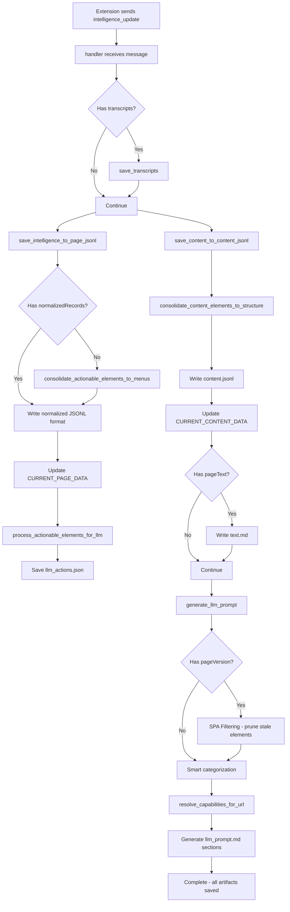
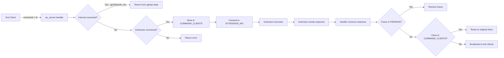
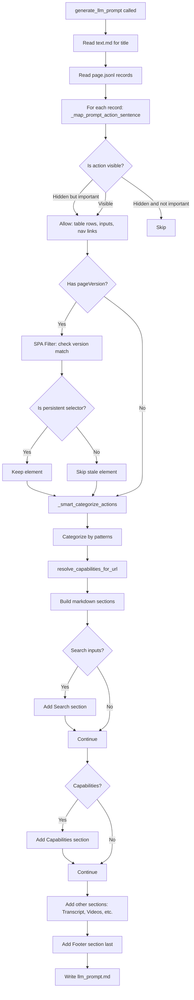

# WebSocket Server Documentation (ws_server.py)

## Overview

**File:** `/Users/andy7string/Projects/Om_E_Web/om_e_web_ws/ws_server.py`
**Lines of Code:** 3,757
**Primary Role:** Central WebSocket communication hub for the Om_E_Web system

### System Architecture Position

The `ws_server.py` file acts as the **bridge between the Chrome Extension (client) and external automation clients (test scripts, LLMs)**. It orchestrates bidirectional communication, processes intelligence updates from web pages, generates LLM-consumable artifacts, and manages persistent storage of page state.

```
┌─────────────────────┐         WebSocket          ┌──────────────────────┐
│  Chrome Extension   │◄──────────────────────────►│   ws_server.py       │
│  (sw.js/content.js) │      Port 17892            │  (Python asyncio)    │
└─────────────────────┘                            └──────────────────────┘
                                                             ▲
                                                             │
                                                             ▼
                                                    ┌──────────────────────┐
                                                    │  Test Clients / LLMs │
                                                    │  (test_navigation.py)│
                                                    └──────────────────────┘
```

### Key Responsibilities

1. **WebSocket Server** - Manages bidirectional connections on port 17892
2. **Message Router** - Routes commands between extension and test clients
3. **Intelligence Processor** - Transforms raw DOM data into LLM artifacts
4. **Artifact Generator** - Creates `page.jsonl`, `content.jsonl`, `text.md`, `llm_prompt.md`, `llm_actions.json`
5. **Transcript Manager** - Handles video transcripts with signature-based deduplication
6. **Capability Resolver** - Dynamically resolves capabilities from `site_configs.json`
7. **State Manager** - Maintains global state for tabs, active page, and content

---

## Global State Variables

```python
# WebSocket Connection Management
CLIENTS = set()                    # All connected WebSocket clients
EXTENSION_WS = None               # Reference to Chrome extension client
PENDING = {}                       # Command ID → Future mapping for async responses
COMMAND_CLIENTS = {}              # Command ID → Client mapping for response routing

# Tab and Page Information
CURRENT_TABS_INFO = None          # Latest tabs_info from extension
LAST_TABS_UPDATE = None           # Timestamp of last tabs update
CURRENT_ACTIVE_TAB = None         # Current active tab details

# Page Intelligence Data
CURRENT_PAGE_DATA = None          # Latest page.jsonl intelligence data
LAST_PAGE_UPDATE = None           # Timestamp of last page update
CURRENT_PAGE_JSONL = "page.jsonl" # Filename for central page file

# Content Data
CURRENT_CONTENT_DATA = None       # Latest content.jsonl data
LAST_CONTENT_UPDATE = None        # Timestamp of last content update
CURRENT_CONTENT_JSONL = "content.jsonl"

# Transcript Management
TRANSCRIPTS_DIR = "@site_structures/transcripts"
CURRENT_TRANSCRIPTS_INFO = []     # Latest transcript references
VIDEO_HISTORY_JSONL = "@site_structures/transcripts/video_history.jsonl"

# Site Configuration
SITE_CONFIGS = {}                 # Loaded from site_configs.json via polling

# File System Configuration
SITE_STRUCTURES_DIR = "@site_structures"

# Server Configuration
SERVER_HEARTBEAT_INTERVAL = 20    # Heartbeat ping interval (seconds)
```

---

## Function Reference

### Core WebSocket Functions

#### `async def main()`
**Purpose:** Entry point - starts WebSocket server and initializes system

**Flow:**
1. Starts site config polling via `start_site_config_polling()`
2. Creates WebSocket server on `ws://127.0.0.1:17892`
3. Configures server parameters (64MB max message size, 128 max queue)
4. Launches heartbeat loop and awaits indefinitely

**Parameters:** None
**Returns:** Never returns (runs forever)

**Calls:**
- `start_site_config_polling()` (from `site_config_manager`)
- `websockets.serve()` (external library)
- `extension_heartbeat_loop()`

---

#### `async def handler(ws)`
**Purpose:** Main WebSocket connection handler - manages client lifecycle and message routing

**Parameters:**
- `ws` (WebSocket) - WebSocket connection instance

**Key Processing Steps:**

1. **Client Registration**
   - Adds client to `CLIENTS` set
   - First client or clients sending `bridge_status` → marked as `EXTENSION_WS`

2. **Message Routing** (handles different message types):
   - `ping`/`pong` → Heartbeat responses
   - `bridge_status` → Extension identification
   - `tabs_info` → Store tab information
   - `active_tab_info` → Store current active tab
   - `intelligence_update` → **Core intelligence processing** (see below)
   - `execute_capability` → Route to capability handlers
   - `dom_content_changed` → DOM change tracking
   - `network_activity` → Network request monitoring
   - `extractPageText` → Text extraction forwarding
   - `llm_instruction` → LLM action execution
   - Commands with `id` and `command` → Forward to extension
   - Responses with `id` and `ok`/`error` → Route to original client

3. **Shortcut Normalization** - Converts sugar syntax to standard messages:
   - `exec_action` → `llm_instruction`
   - `set_value` → `llm_instruction` with `setValue`
   - `click` → `llm_instruction` with `click`
   - `navigate_link` → `llm_instruction` with `navigate`
   - `navigate_url` → `navigate` command

4. **Response Routing**
   - Checks `PENDING` futures for async command responses
   - Routes responses to `COMMAND_CLIENTS` tracking
   - Fallback: broadcasts to all test clients

5. **Cleanup**
   - Removes client from `CLIENTS`
   - Clears `EXTENSION_WS` if extension disconnects
   - Cleans up tracked commands

**Calls:**
- `save_transcripts()`
- `save_intelligence_to_page_jsonl()`
- `save_content_to_content_jsonl()`
- `save_page_text_to_markdown()`
- `process_actionable_elements_for_llm()`
- `generate_llm_prompt()`
- `store_dom_change_context()`
- `get_current_tabs_info()`
- `get_current_page_data()`
- `get_current_content_data()`
- `get_current_active_tab()`
- `process_clean_site_map_data()`
- `siteStructuredLLMmethodinsidethefile()`

**Returns:** None (async coroutine)

---

#### `async def send_command(command, params=None, timeout=8.0)`
**Purpose:** Internal server function to send commands to extension and await responses

**Parameters:**
- `command` (str) - Command name (e.g., "navigate", "click")
- `params` (dict, optional) - Command parameters
- `timeout` (float) - Timeout in seconds (default: 8.0)

**Flow:**
1. Wait up to 1 second for `EXTENSION_WS` to be identified
2. Generate unique command ID (`cmd-{uuid}`)
3. Create asyncio Future and store in `PENDING[cid]`
4. Send command to extension via WebSocket
5. Wait for response via future with timeout
6. Return response or raise timeout error

**Returns:** Response message dict
**Raises:** `RuntimeError` if extension not connected or timeout occurs

**Called by:** Internal server operations requiring extension responses

---

#### `async def extension_heartbeat_loop()`
**Purpose:** Periodically ping extension to detect silent disconnections

**Flow:**
1. Sleep for `SERVER_HEARTBEAT_INTERVAL` (20 seconds)
2. If `EXTENSION_WS` exists, send `server_ping` message
3. Repeat indefinitely

**Parameters:** None
**Returns:** Never returns (runs forever)

---

### Intelligence Processing Functions

#### `async def save_intelligence_to_page_jsonl(intelligence_data, transcript_refs=None)`
**Purpose:** Generate and save central `page.jsonl` file with normalized page structure

**Parameters:**
- `intelligence_data` (dict) - Intelligence update from extension
- `transcript_refs` (list, optional) - Transcript reference metadata

**Key Processing Steps:**

1. **Extract Data**
   - Get `normalizedRecords` (preferred) or fall back to `actionableElements`
   - Extract `pageVersion` for SPA filtering

2. **Enrich Metadata**
   - Add browser state (total tabs, active tab, extension status)
   - Add current page context (URL, title, active status)
   - Inject transcript references

3. **Write JSONL Format**
   - Each record is a separate JSON line
   - First record is always `type: "meta"` with totals and context
   - Subsequent records are sections, text, or actions

4. **Update Global State**
   - Set `CURRENT_PAGE_DATA` with summary
   - Set `LAST_PAGE_UPDATE` timestamp

**Returns:** Filepath to saved `page.jsonl`

**Calls:**
- `consolidate_actionable_elements_to_menus()` (legacy fallback)

**Called by:** `handler()` during `intelligence_update` processing

---

#### `async def save_content_to_content_jsonl(intelligence_data, transcript_refs=None)`
**Purpose:** Generate and save central `content.jsonl` file with page content structure

**Parameters:**
- `intelligence_data` (dict) - Intelligence update from extension
- `transcript_refs` (list, optional) - Transcript reference metadata

**Flow:**
1. Extract `contentElements` from intelligence data
2. Consolidate via `consolidate_content_elements_to_structure()`
3. Create content data structure with browser state
4. Write to `@site_structures/content.jsonl`
5. Update `CURRENT_CONTENT_DATA` and `LAST_CONTENT_UPDATE`

**Returns:** Filepath to saved `content.jsonl`

**Calls:**
- `consolidate_content_elements_to_structure()`

**Called by:** `handler()` during `intelligence_update` processing

---

#### `async def consolidate_actionable_elements_to_menus(actionable_elements)`
**Purpose:** Transform raw actionable elements into organized menu structures

**Parameters:**
- `actionable_elements` (list) - Raw elements from extension

**Flow:**
1. **Categorize Elements** by type and context:
   - Navigation elements (menu links)
   - Toggle elements (buttons, expandables)
   - Action elements (clickable items)
   - Content elements (everything else)

2. **Build Menu Structure**
   - Create `main_navigation` menu with items and toggles
   - Group by menu type (Navigation, Account, Footer, etc.)

3. **Return Consolidated Structure**
   - `menus` array with categorized items
   - `summary` with totals

**Returns:** Dict with `menus` and `summary` keys

**Called by:** `save_intelligence_to_page_jsonl()` (legacy fallback)

---

#### `async def consolidate_content_elements_to_structure(content_elements)`
**Purpose:** Transform raw content elements into organized content structure

**Parameters:**
- `content_elements` (list) - Raw content elements from extension

**Flow:**
1. **Categorize by Type**:
   - Headings (`h1`-`h6`)
   - Paragraphs (`p`)
   - Lists (`ul`, `ol`, `li`)
   - Images (`img`)
   - Tables (`table`, `tr`, `td`, `th`)
   - Other

2. **Build Structure** - Create arrays for each category with:
   - `id` (contentId)
   - `text` (textContent)
   - `selectors` (CSS selectors)
   - Type-specific attributes (level for headings, alt/src for images)

3. **Return Consolidated Structure**
   - `content_structure` object with categorized arrays
   - `summary` with counts

**Returns:** Dict with `content_structure` and `summary` keys

**Called by:** `save_content_to_content_jsonl()`

---

#### `async def process_actionable_elements_for_llm(actionable_elements)`
**Purpose:** Create LLM-friendly action mapping with clear execution instructions

**Parameters:**
- `actionable_elements` (list) - Actionable elements from extension

**Flow:**
1. Get current page context (URL, title from `CURRENT_ACTIVE_TAB`)
2. Create `llm_actions` dict with `_page_context` metadata
3. For each element, create entry with:
   - `action_type`, `description`, `tag_name`, `selectors`, `coordinates`
   - `llm_instruction` - Human-readable instruction
   - `page_url`, `page_title` - Context for validation
4. Save to `@site_structures/llm_actions.json`

**Returns:** Dict of action mappings
**Called by:** `handler()` during `intelligence_update`

---

#### `async def clear_llm_actions()`
**Purpose:** Create empty `llm_actions.json` when no elements available

**Flow:**
1. Get current page context
2. Create empty actions dict with `_page_context` and `status: "no_actionable_elements"`
3. Save to `@site_structures/llm_actions.json`

**Returns:** Filepath
**Called by:** `process_actionable_elements_for_llm()` when no elements

---

### Transcript Management Functions

#### `async def save_transcripts(transcripts, page_state=None)`
**Purpose:** Persist video transcript payloads with signature-based deduplication

**Parameters:**
- `transcripts` (list) - Transcript payloads from extension
- `page_state` (dict, optional) - Current page state for context

**Key Processing Steps:**

1. **Deduplication Check**
   - Build signature from video ID + segment count + sample segments
   - Check against `_collect_existing_transcript_signatures()`
   - Skip if signature already exists

2. **File Generation**
   - Filename: `YYYY-MM-DD__slugified-title.md`
   - Frontmatter: video URL, ID, language, collected timestamp, segment count
   - Body: Markdown list with `[timestamp] text` format

3. **History Tracking**
   - Append entry to `video_history.jsonl`
   - Store signature for future deduplication

4. **Return References**
   - Array of dicts with `title`, `video_id`, `video_url`, `file`, `signature`

**Returns:** List of saved transcript reference dicts

**Calls:**
- `_build_transcript_signature()`
- `_collect_existing_transcript_signatures()`
- `_append_video_history_entry()`
- `slugify()`

**Called by:** `handler()` during `intelligence_update` processing

---

#### `def _build_transcript_signature(video_id, segments)`
**Purpose:** Create stable signature for transcript deduplication

**Parameters:**
- `video_id` (str, optional) - Video identifier
- `segments` (list) - Transcript segments

**Flow:**
1. Sample first 3 and last 3 segments
2. Create string: `{videoId}|{segmentCount}|{sample_timeText|text}`
3. Hash with SHA256

**Returns:** String signature like `{videoId}:{segmentCount}:{hash}`

---

#### `def _collect_existing_transcript_signatures()`
**Purpose:** Gather known transcript signatures from history and markdown files

**Flow:**
1. Read `video_history.jsonl` entries
2. Scan `@site_structures/transcripts/*.md` files for embedded signatures
3. Extract signatures from `<!-- signature: ... -->` comments
4. Fallback: generate signature from file content for legacy files

**Returns:** Dict of `{signature: video_id}`

---

#### `def _ensure_video_history_file()`
**Purpose:** Create empty video history file if it doesn't exist

**Returns:** None

---

#### `def _load_video_history_entries()`
**Purpose:** Load all entries from `video_history.jsonl`

**Returns:** List of history entry dicts

---

#### `def _append_video_history_entry(entry)`
**Purpose:** Append single JSON line to video history file

**Parameters:**
- `entry` (dict) - History entry to append

**Returns:** None

---

### LLM Prompt Generation Functions

#### `def generate_llm_prompt(text_md_path, page_jsonl_path, out_path, max_actions=MAX_ACTIONS)`
**Purpose:** Generate compact, actionable LLM prompt file from artifacts

**Parameters:**
- `text_md_path` (str) - Path to `text.md` file
- `page_jsonl_path` (str) - Path to `page.jsonl` file
- `out_path` (str) - Output path for `llm_prompt.md`
- `max_actions` (int) - Maximum actions to include

**Key Processing Steps:**

1. **Extract Metadata**
   - Read title from `text.md`
   - Parse `page.jsonl` for page URL, version, transcript refs

2. **Process Actions**
   - For each record in `page.jsonl`, call `_map_prompt_action_sentence()`
   - Build action lines like `return (a_id_123) to click 'Button'`

3. **SPA Filtering** (if `pageVersion` present)
   - Parse action IDs: `a_id_{version}_{counter}`
   - Skip stale elements (version < pageVersion)
   - Keep persistent elements via `site_configs.json` selectors

4. **Smart Categorization** via `_smart_categorize_actions()`:
   - Search inputs
   - Transcript actions (CRITICAL - show/hide transcript, segments)
   - Email/message rows
   - Video links (`/watch?v=`)
   - Channel links (`/@`, `/channel/`)
   - Footer links (About, Terms, Privacy)
   - Regular actions

5. **Capability Resolution**
   - Call `resolve_capabilities_for_url()` to inject dynamic capabilities
   - Add as separate section

6. **Generate Markdown**
   - Header: `# (pageVersion) Title`
   - URL line
   - Actions sections (organized by category)
   - Transcript files section (if any)

**Returns:** Output filepath
**Called by:** `handler()` during `intelligence_update`

**Calls:**
- `_map_prompt_action_sentence()` (for each record)
- `_smart_categorize_actions()` (internal helper)
- `resolve_capabilities_for_url()`

---

#### `def _map_prompt_action_sentence(record)`
**Purpose:** Convert single action record to LLM instruction sentence

**Parameters:**
- `record` (dict) - JSONL record with `type: "action"`

**Flow:**
1. **Visibility Filtering** - Skip hidden elements unless:
   - Interactive table/list rows (generic pattern)
   - Input/textarea elements (ChatGPT, Perplexity)
   - Accessibility links with meaningful labels
   - Video links (YouTube)

2. **Generate Instruction**:
   - Input/textarea: `return (id,{yourValue}) to set value for 'Label'. Add submit:true to submit.`
   - Links: `return (id) to navigate to 'Label'`
   - Buttons: `return (id) to click 'Label'`
   - Table rows: `return (id) to click 'Email: Sender — Subject'`

3. **Special Handling**:
   - Table rows (`tr` with `role="row"`) → Call `_format_table_row_label()` for Gmail-style parsing
   - Hidden inputs → Include for automation (critical for AI chat interfaces)

**Returns:** String instruction or `None` if not applicable

---

#### `def _format_table_row_label(record)`
**Purpose:** Parse table row content into structured label (Gmail email rows)

**Parameters:**
- `record` (dict) - Table row record

**Flow:**
1. Extract `textContent` and clean whitespace
2. Split by commas
3. Detect patterns:
   - Sender (first non-skipped token without time)
   - Subject (second token without time)
   - Time (token with `HH:MM` pattern)
   - Preview (remaining text)
4. Combine into display label: `Sender — Subject (Time) — Preview`

**Returns:** Dict with `display`, `sender`, `subject`, `time`, `preview`, `raw`

---

#### `def _smart_categorize_actions(records)`
**Purpose:** Generic pattern-based action categorization (works for ALL sites)

**Parameters:**
- `records` (list) - Action records to categorize

**Flow:**
1. **Pattern Detection** (not domain-specific):
   - Search: "search" in label/placeholder/aria-label + setValue action
   - Transcript: "transcript" in label/aria-label
   - Email rows: `tr` with `role="row"`
   - Video links: `/watch?v=`, `/video/`, `/watch/` in href
   - Channel links: `/@`, `/channel/`, `/user/` in href
   - Footer: matches common keywords (about, terms, privacy, etc.)
   - Regular: everything else

2. **Return Categories**:
   ```python
   {
     'search_inputs': [...],
     'transcript_actions': [...],  # CRITICAL
     'email_actions': [...],
     'video_links': [...],
     'channel_links': [...],
     'footer_links': [...],
     'regular_actions': [...]
   }
   ```

**Returns:** Dict of categorized action arrays

---

### Capability Resolution Functions

#### `def resolve_capabilities_for_url(url)`
**Purpose:** Dynamically resolve capabilities from `site_configs.json` for given URL

**Parameters:**
- `url` (str) - Current page URL

**Flow:**
1. Get all site configs via `get_all_site_configs()`
2. Find matching config by:
   - Checking `url_patterns` array (if defined)
   - Fallback: domain substring match
3. Extract `capabilities` from config
4. Filter capabilities by `url_pattern` match
5. Return list of matching capabilities with `action`, `label`, `description`, `handler`

**Returns:** List of capability dicts

**Called by:** `generate_llm_prompt()` to inject dynamic actions

**Example Output:**
```python
[
  {
    'id': 'transcript',
    'action': 'RetrieveTranscript',
    'label': 'Get video transcript',
    'description': 'Extract full transcript',
    'handler': 'youtube_transcript_handler',
    'domain': 'youtube.com'
  }
]
```

---

### State Accessor Functions

#### `def get_current_tabs_info()`
**Purpose:** Provide external access to stored tab information

**Returns:** Dict with `tabs`, `last_update`, `extension_connected`, `total_clients`

---

#### `def get_current_page_data()`
**Purpose:** Provide external access to current page intelligence

**Returns:** Dict with `page_data`, `last_update`, `total_elements`, `intelligence_version`, `browser_state`

---

#### `def get_current_content_data()`
**Purpose:** Provide external access to current page content

**Returns:** Dict with `content_data`, `last_update`, `total_content_elements`, `browser_state`

---

#### `def get_current_active_tab()`
**Purpose:** Get currently active tab information (most useful for automation)

**Flow:**
1. Return `CURRENT_ACTIVE_TAB` if available (most accurate)
2. Fallback: search `CURRENT_TABS_INFO` for `active: true` tab
3. Error response if no data

**Returns:** Dict with `active_tab`, `last_update`, `extension_connected`, `total_tabs`, `source`

---

### File I/O Functions

#### `async def save_page_text_to_markdown(text_data)`
**Purpose:** Save extracted page text to markdown file

**Parameters:**
- `text_data` (dict) - Text extraction result with `frontmatter`, `markdown`, `statistics`

**Flow:**
1. Extract URL from frontmatter
2. Generate filename from hostname: `{hostname}_page_text.md`
3. Write markdown content to `@site_structures/{filename}`
4. Log statistics (headings, paragraphs, lists)

**Returns:** Filepath or `None`

---

#### `def save_site_map_to_jsonl(site_map_data, suffix="")`
**Purpose:** Save site map data to JSONL file (legacy, mostly disabled)

**Parameters:**
- `site_map_data` (dict) - Site map from extension
- `suffix` (str, optional) - Filename suffix (e.g., `_clean`)

**Returns:** Filepath or `None`

---

#### `async def store_dom_change_context(dom_change_data)`
**Purpose:** Track DOM mutations for LLM context (mostly disabled - too noisy)

**Parameters:**
- `dom_change_data` (dict) - DOM change notification

**Flow:**
1. Create change context entry with timestamp, tabId, mutations
2. Log only if > 5 mutations (reduced logging)

**Returns:** None (file writing disabled)

---

### Site Map Processing Functions

#### `def process_clean_site_map_data(raw_data)`
**Purpose:** Process raw site map into LLM-optimized structure with enhanced filtering

**Parameters:**
- `raw_data` (dict) - Raw site map from extension

**Flow:**
1. **Extract Components**
   - `metadata`, `interactiveElements`, `pageStructure`

2. **Apply Filtering Pipeline**
   - Deduplication via `deduplicate_elements()`
   - Non-interactive filtering via `filter_non_interactive_elements()`

3. **Enhanced Classification**
   - For each element, call `classify_element_enhanced()`
   - Add classification scores and categories

4. **Build Processed Data**
   - Create `FindMe_id` for each element (`FindMe_001`, etc.)
   - Attach enhanced classification metadata
   - Generate statistics (totals, confidence distribution, categories)

5. **Create Mapping** (for debugging, not saved)
   - Map `FindMe_id` → original element + classification

**Returns:** Tuple of `(processed_data, mapping_data, success_status)`

**Calls:**
- `deduplicate_elements()`
- `filter_non_interactive_elements()`
- `classify_element_enhanced()`

**Called by:** `handler()` when processing site map responses

---

#### `def classify_element_enhanced(element_data)`
**Purpose:** Advanced element classification using browser-use techniques

**Parameters:**
- `element_data` (dict) - Raw element from extension

**Classification Factors:**

1. **Interactive Element Detection** (0-1.0 score)
   - Strict selectors: button, input, textarea, select, links
   - ARIA roles: button, link, menuitem, textbox, etc.
   - Event handlers: onclick, etc.

2. **Accessibility Score** (0-1.0)
   - aria-label, aria-describedby, title, alt
   - Proper labeling (for, aria-labelledby)

3. **Search Relevance** (0-1.0)
   - Search indicators in class/ID/data attributes
   - Search-related text content

4. **Content Quality** (0-1.0)
   - Text length analysis
   - Meaningful content patterns (words, numbers, proper nouns)

5. **Functional Importance** (0-1.0)
   - Navigation indicators (nav, menu, breadcrumb)
   - Form indicators
   - Real links vs placeholders

6. **Visibility Score** (0-1.0)
   - Valid coordinates and dimensions
   - Not hidden or aria-hidden

7. **Element Category** - Final classification:
   - `search_element`, `navigation_element`, `form_element`
   - `interactive_element`, `heading_element`, `content_element`
   - `functional_element`, `unknown`

8. **Overall Confidence** - Weighted combination:
   ```
   confidence = (
     interactive * 0.3 +
     accessibility * 0.15 +
     search * 0.2 +
     content * 0.15 +
     functional * 0.1 +
     visibility * 0.1
   )
   ```

**Returns:** Classification dict with all scores and `classification_reasons` array

**Called by:** `process_clean_site_map_data()`

---

#### `def deduplicate_elements(elements)`
**Purpose:** Remove duplicate elements based on content, selectors, and position

**Parameters:**
- `elements` (list) - Element list to deduplicate

**Flow:**
1. **Build Deduplication Key**:
   - Real links: `link:{href}`
   - Text elements: `text:{text}:{normalized_selector}`
   - Others: `type:{type}:{selector}`

2. **Compare Duplicates** via `_should_keep_existing_element()`:
   - Priority: real hrefs > specific selectors > more content

3. **Track in `seen_elements` Dict**

**Returns:** Deduplicated element list

**Calls:**
- `_normalize_selector()` - Remove IDs, nth-child patterns
- `_should_keep_existing_element()` - Decide which duplicate to keep

---

#### `def filter_non_interactive_elements(elements)`
**Purpose:** Remove elements that aren't truly interactive

**Flow:**
1. For each element, call `_is_truly_interactive()`
2. Keep only elements that return `True`

**Returns:** Filtered element list

**Calls:**
- `_is_truly_interactive()`

---

#### `def _is_truly_interactive(element)`
**Purpose:** Strict interactivity check

**Criteria:**
- Real href (not `#`, not `javascript:`)
- Interactive tag: button, input, select, textarea, a
- Interactive ARIA role
- Event handlers (on*)
- Interactive attributes (type="button", etc.)
- Clickable class indicators

**Returns:** Boolean

---

#### `def siteStructuredLLMmethodinsidethefile(filepath)`
**Purpose:** Post-process generated file to remove bloat and consolidate structure

**Parameters:**
- `filepath` (str) - Path to processed JSONL file

**Optimization Steps:**

1. **Metadata Cleanup** - Keep only `url` and `title`

2. **Statistics Removal** - Delete entire `statistics` section

3. **Element Consolidation**:
   - Merge `pageStructure` headings/forms into `elements` array
   - Create unified elements with `FindMe_id`, `element_type`, `context`
   - Skip junk elements (no text, no href)

4. **Enhanced Filtering**:
   - Use `enhanced_classification` scores if available
   - Fallback to `calculate_element_importance_score()`
   - Keep elements with score ≥ 0.6 (high importance)

5. **Write Cleaned File**:
   - New filename: `{original}_cleaned.jsonl`
   - Calculate size reduction percentage

**Returns:** Boolean success status

**Calls:**
- `calculate_element_importance_score()`

**Called by:** `handler()` after processing site maps

---

#### `def calculate_element_importance_score(element)`
**Purpose:** Fallback scoring when enhanced classification unavailable

**Scoring Factors:**
- Element type: interactive (0.4), heading (0.35), form (0.3), input (0.25)
- Content quality: text length bonuses
- Functionality: real hrefs (0.15), placeholder hrefs (0.05)
- Context: navigation/main_content/interaction (0.1 each)
- Selector quality: boost for specific selectors

**Returns:** Float score 0.0-1.0

---

### Utility Functions

#### `def slugify(value)`
**Purpose:** Create filesystem-friendly slugs for transcript filenames

**Parameters:**
- `value` (str) - Input string to slugify

**Flow:**
1. Lowercase and strip
2. Replace non-alphanumeric with `-`
3. Collapse multiple `-` into one
4. Strip leading/trailing `-`

**Returns:** Slugified string

---

## Data Flow Diagrams

### Intelligence Update Flow



### Command Routing Flow



### Transcript Deduplication Flow

```mermaid
graph TD
    A[Transcript payload received] --> B[_build_transcript_signature]
    B --> C[Sample first 3 + last 3 segments]
    C --> D[Hash: videoId|count|sample_text]
    D --> E[_collect_existing_transcript_signatures]
    E --> F[Read video_history.jsonl]
    E --> G[Scan transcripts/*.md files]
    F --> H[Build signature set]
    G --> H
    H --> I{Signature exists?}
    I -->|Yes| J[Skip - duplicate]
    I -->|No| K[Generate filename with date + slug]
    K --> L[Write markdown file with signature comment]
    L --> M[_append_video_history_entry]
    M --> N[Add signature to memory set]
```

### LLM Prompt Generation Flow



---

## Integration Points with Extension

### Messages FROM Extension TO Server

| Message Type | Trigger | Data | Server Action |
|-------------|---------|------|---------------|
| `bridge_status` | Extension startup | Connection status | Mark as `EXTENSION_WS` |
| `tabs_info` | Tab updates | Array of tab objects | Store in `CURRENT_TABS_INFO` |
| `active_tab_info` | Active tab change | Active tab object | Store in `CURRENT_ACTIVE_TAB`, display in terminal |
| `intelligence_update` | DOM scan complete | `actionableElements`, `contentElements`, `pageState`, `transcripts`, `normalizedRecords`, `pageVersion` | Process and save all artifacts |
| `dom_content_changed` | Mutations detected | `tabId`, `totalMutations`, `changeTypes` | Log context (if > 5 mutations) |
| `network_activity` | Network events | `eventType`, `url`, `status`, `inflightRequests` | Log activity, detect idle state |
| Command responses | Command execution | `id`, `ok`, `result`, `error` | Route to `PENDING` or `COMMAND_CLIENTS` |
| `ping` | Heartbeat | `source` | Reply with `pong` |
| `pong` | Heartbeat response | `source` | Log receipt |

### Messages FROM Server TO Extension

| Message Type | Trigger | Data | Extension Action |
|-------------|---------|------|-----------------|
| `server_ping` | Heartbeat timer | `timestamp` | Respond with `pong` |
| `execute_llm_action` | LLM instruction | `actionId`, `actionType`, `params` | Execute action in content script |
| `execute_capability` | Capability request | `action`, `params` | Route to capability handler |
| `extractPageText` | Text extraction request | Empty | Scan page and return text |
| `youtube_find_transcript_button` | YouTube video page | `url` | Find and register transcript button |
| Standard commands | Test client request | `id`, `command`, `params` | Execute and return result |

---

## Artifact File Summary

| File | Purpose | Format | Generator Function | Update Trigger |
|------|---------|--------|-------------------|----------------|
| `page.jsonl` | Central page state with actions | JSONL (1 record per line) | `save_intelligence_to_page_jsonl()` | `intelligence_update` |
| `content.jsonl` | Page content structure | JSON | `save_content_to_content_jsonl()` | `intelligence_update` |
| `text.md` | Human-readable page text | Markdown | `save_page_text_to_markdown()` | `intelligence_update` with `pageText` |
| `llm_actions.json` | Action ID → metadata mapping | JSON | `process_actionable_elements_for_llm()` | `intelligence_update` |
| `llm_prompt.md` | Compact LLM instruction file | Markdown | `generate_llm_prompt()` | After all processing |
| `transcripts/YYYY-MM-DD__slug.md` | Video transcript | Markdown | `save_transcripts()` | `intelligence_update` with transcripts |
| `transcripts/video_history.jsonl` | Transcript metadata history | JSONL | `_append_video_history_entry()` | After each transcript save |

---

## Configuration Dependencies

### From `config.py`
- `MAX_ACTIONS` - Maximum actions in LLM prompt (default: unlimited, can be configured)
- `MAX_FOOTER_LINKS` - Maximum footer links to include

### From `site_config_manager.py`
- `get_site_config(url)` - Get site config for URL
- `get_all_site_configs()` - Get all loaded configs
- `start_site_config_polling()` - Begin config file watching

### From `site_configs.json` (via manager)
- **Capabilities** - Dynamic actions per site/URL pattern
- **Persistent Selectors** - Elements to keep during SPA filtering
- **URL Patterns** - Domain/path matching rules

---

## Error Handling Patterns

1. **Graceful Degradation** - Functions return `None` or empty structures on error
2. **Extensive Logging** - Print statements for debugging (emoji prefixes for clarity)
3. **Try-Except Wrappers** - All async functions wrapped with exception handling
4. **Fallback Processing** - Multiple paths for data processing (normalized → legacy)
5. **Timeout Protection** - WebSocket operations use timeouts
6. **Connection Recovery** - Heartbeat loop detects silent disconnections

---

## Performance Characteristics

- **Message Size Limit:** 64 MB (configured in `websockets.serve`)
- **Queue Depth:** 128 messages
- **Heartbeat Interval:** 20 seconds
- **Command Timeout:** 8 seconds (configurable in `send_command`)
- **File I/O:** Synchronous writes (acceptable for current scale)
- **Memory:** Minimal global state (only latest intelligence data cached)

---

## Future Enhancement Areas

1. **Async File I/O** - Replace synchronous writes with aiofiles
2. **Database Storage** - Move from JSONL to SQLite for better querying
3. **Response Caching** - Cache frequently accessed artifacts
4. **Capability Plugins** - Dynamic capability loading from separate modules
5. **Multi-Extension Support** - Track multiple extension instances
6. **WebSocket Compression** - Enable compression for large payloads
7. **Metrics Collection** - Track processing times, message volumes, error rates

---

## Critical Code Paths

### Path 1: Intelligence Update Processing (Most Frequent)
1. `handler()` receives `intelligence_update`
2. `save_transcripts()` - if transcripts present
3. `save_intelligence_to_page_jsonl()` - core page state
4. `save_content_to_content_jsonl()` - content structure
5. `process_actionable_elements_for_llm()` - action mapping
6. `generate_llm_prompt()` - final LLM consumption file

**Performance Critical:** This path runs on every DOM scan (frequent)

### Path 2: Command Execution (User-Initiated)
1. Test client sends command via WebSocket
2. `handler()` receives and routes
3. Forwards to `EXTENSION_WS`
4. Extension executes and responds
5. `handler()` routes response back via `COMMAND_CLIENTS`

**Performance Critical:** User-facing, must be fast (<500ms ideal)

### Path 3: Capability Execution (Dynamic Actions)
1. Client sends `execute_capability` with action name
2. `handler()` forwards to extension
3. Extension routes via capability handler
4. Response flows back to client

**Performance Critical:** May involve complex DOM operations

---

## Testing Recommendations

1. **Unit Tests** - Test individual functions in isolation:
   - `slugify()`, `_build_transcript_signature()`
   - `_map_prompt_action_sentence()`, `_smart_categorize_actions()`
   - `deduplicate_elements()`, `filter_non_interactive_elements()`

2. **Integration Tests** - Test full message flows:
   - `intelligence_update` → all artifacts generated
   - Command routing → response received
   - Transcript deduplication

3. **Load Tests** - Stress test with:
   - Multiple simultaneous clients
   - Large intelligence payloads (10K+ elements)
   - Rapid message bursts

4. **Regression Tests** - Ensure:
   - SPA filtering doesn't break regular pages
   - Capability resolution works across sites
   - Transcript signatures remain stable

---

## Debugging Tips

1. **Message Tracing** - Messages are logged with first 100 chars (full for `tabs_info`)
2. **State Inspection** - Global variables can be inspected via Python debugger
3. **Artifact Validation** - Check `@site_structures/` for generated files
4. **WebSocket Inspector** - Use browser DevTools or Wireshark
5. **Extension Logs** - Cross-reference with Chrome extension console
6. **Heartbeat Monitoring** - Watch for ping/pong messages every 20s

---

## Common Issues & Solutions

| Issue | Symptom | Solution |
|-------|---------|----------|
| Extension not identified | Commands fail with "No extension" | Check `bridge_status` message sent on startup |
| Stale action IDs | Actions fail with "element not found" | Verify SPA filtering not too aggressive |
| Duplicate transcripts | Same video saved multiple times | Check signature generation consistency |
| Large message failures | Extension disconnects on large payloads | Verify 64MB limit not exceeded |
| Capability not appearing | Capability missing in prompt | Check URL pattern match and config reload |
| Response routing failure | Client never receives response | Check `COMMAND_CLIENTS` tracking |

---

## Code Quality Metrics

- **Total Lines:** 3,757
- **Functions:** 36
- **Async Functions:** 18
- **Global Variables:** 18
- **Max Function Length:** ~700 lines (`handler()`)
- **Documentation Coverage:** ~40% (docstrings present for major functions)
- **Error Handling:** Try-except wrappers on all async I/O

---

## Conclusion

The `ws_server.py` file is the **orchestration hub** of the Om_E_Web system. It bridges the Chrome extension with external automation clients, processes raw DOM intelligence into LLM-friendly artifacts, and manages state persistence. Its modular design allows for easy extension through capabilities and site configs, while maintaining robust error handling and graceful degradation.

**Key architectural decisions:**
- **Event-driven design** - Async/await throughout
- **Artifact-centric** - All intelligence persisted to files for external consumption
- **Dynamic capabilities** - No code changes needed to add new site features
- **Deduplication strategies** - Content-based for elements, signature-based for transcripts
- **Smart categorization** - Generic patterns work across all sites
- **SPA-aware** - Version-based filtering keeps prompts clean

This architecture enables **zero-code site automation** through configuration alone, making it trivial to extend Om_E_Web to new websites and use cases.
