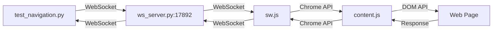
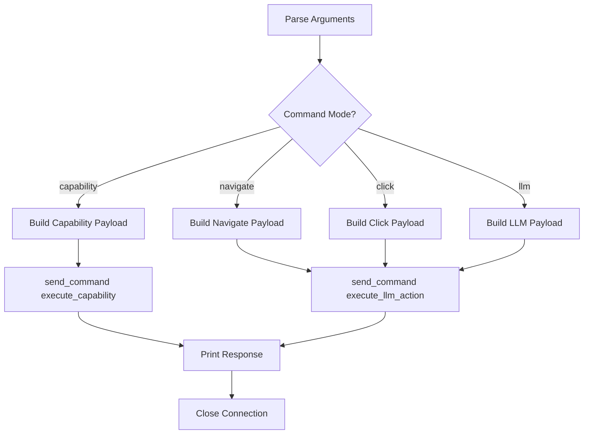
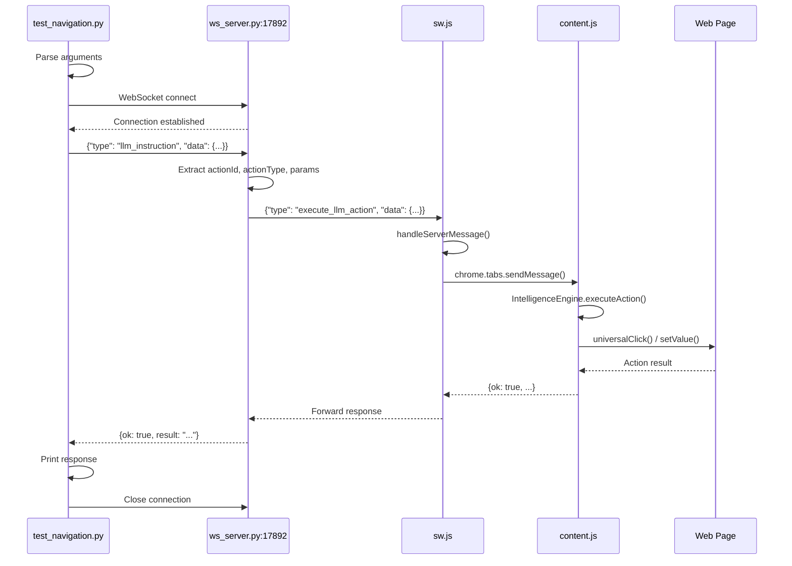
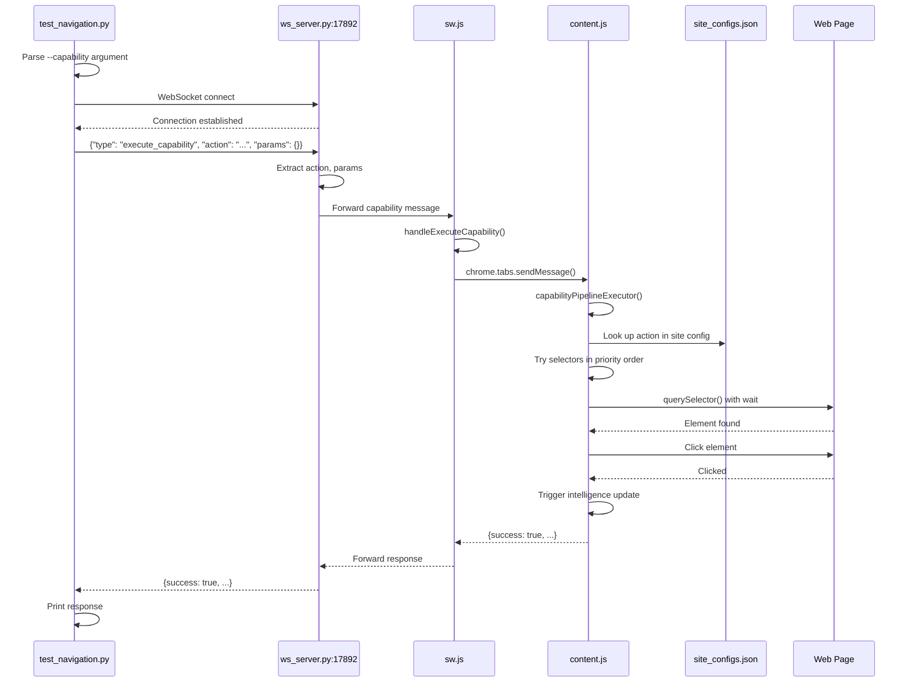
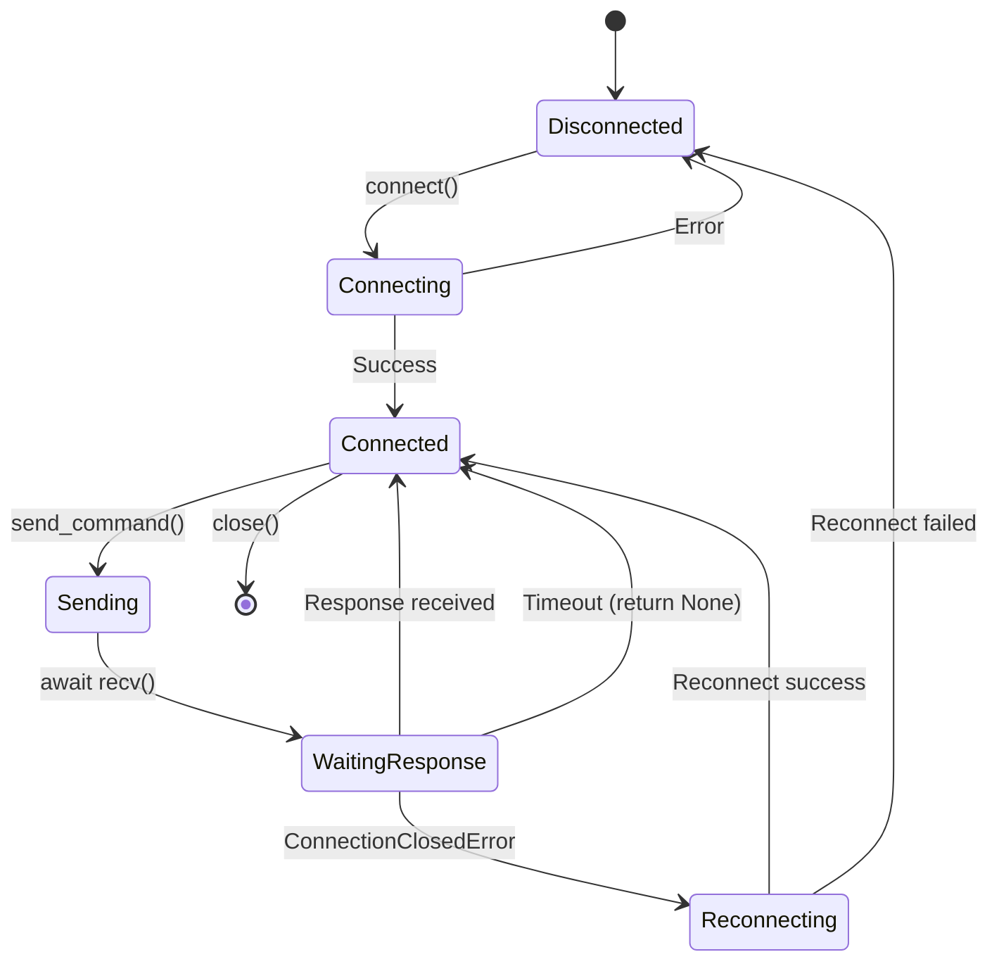

# test_navigation.py - Complete Technical Documentation

**File:** `/Users/andy7string/Projects/Om_E_Web/om_e_web_ws/test_navigation.py`
**Purpose:** WebSocket-based CLI test harness for executing actions and capabilities in the Om_E_Web extension
**Lines of Code:** 336
**Language:** Python 3 (asyncio + websockets)

---

## Table of Contents

1. [Overview](#overview)
2. [Architecture Integration](#architecture-integration)
3. [Class: NavigationTester](#class-navigationtester)
4. [Function Reference](#function-reference)
5. [Message Format Specifications](#message-format-specifications)
6. [Command-Line Interface](#command-line-interface)
7. [Execution Modes](#execution-modes)
8. [Message Flow Diagrams](#message-flow-diagrams)
9. [Usage Examples](#usage-examples)
10. [Error Handling](#error-handling)
11. [Integration with ws_server.py](#integration-with-ws_serverpy)

---

## Overview

### What is test_navigation.py?

`test_navigation.py` is a **non-interactive CLI testing tool** that allows developers and LLMs to execute actions on web pages controlled by the Om_E_Web Chrome extension. It communicates with the WebSocket server (`ws_server.py`) which acts as a bridge to the extension.

### Key Capabilities

- ✅ **Standard Action Execution** - Execute clicks, navigation, setValue via action IDs
- ✅ **Capability Execution** - Trigger dynamic, config-driven capabilities (e.g., RetrieveTranscript)
- ✅ **Form Submission** - Type values and submit forms with a single command
- ✅ **Connection Management** - Auto-reconnect on connection loss
- ✅ **Response Handling** - 10-second timeout with error recovery

### Design Philosophy

This tool embodies the **OME principle of simplicity**:
- **Single-purpose** - One script, one job: execute actions via WebSocket
- **Config-driven** - Commands map directly to message types in ws_server.py
- **No state** - Each invocation is independent (no session management)
- **Clear feedback** - Emoji-based output for quick status recognition

---

## Architecture Integration

### Position in the Om_E_Web Pipeline



### Communication Protocol

**Transport:** WebSocket (ws://localhost:17892)
**Format:** JSON messages with structured `type` field
**Timeout:** 10 seconds per request/response
**Reconnect:** Automatic on connection loss

### Role in Testing Workflow

1. **Developer Testing** - Manually test actions without clicking through UI
2. **LLM Integration** - Programmatic execution of LLM-planned actions
3. **Debugging** - Validate message flows end-to-end
4. **Capability Testing** - Test new capabilities added to site_configs.json

---

## Class: NavigationTester

**Lines:** 50-209
**Purpose:** Encapsulates WebSocket connection lifecycle and command execution

### Class Attributes

| Attribute | Type | Purpose |
|-----------|------|---------|
| `self.websocket` | `WebSocketClientProtocol \| None` | Active WebSocket connection to ws_server.py |
| `self.server_url` | `str` | Server endpoint (default: "ws://localhost:17892") |

### Class Methods

#### `__init__(self)`
**Lines:** 50-52
**Purpose:** Initialize the NavigationTester instance with default configuration

**Parameters:** None

**Side Effects:**
- Sets `self.websocket` to `None`
- Sets `self.server_url` to `"ws://localhost:17892"`

**Returns:** None

**Example:**
```python
tester = NavigationTester()
```

---

#### `async def connect(self)`
**Lines:** 54-63
**Purpose:** Establish WebSocket connection to ws_server.py

**Parameters:** None

**Returns:**
- `bool` - `True` if connection successful, `False` on failure

**Side Effects:**
- Assigns connected WebSocket to `self.websocket`
- Prints connection status with emoji indicators

**Error Handling:**
- Catches all exceptions during connection
- Prints error message and returns `False`

**Dependencies:**
- `websockets.connect()` - Async WebSocket client
- `self.server_url` - Connection target

**Example:**
```python
connected = await tester.connect()
if not connected:
    print("Failed to connect")
```

**Output:**
```
🔌 Connecting to ws://localhost:17892...
✅ Connected to WebSocket server
```

---

#### `async def send_command(self, command, data=None)`
**Lines:** 65-126
**Purpose:** Format and send a command message to ws_server.py, wait for response

**Parameters:**
- `command` (str) - Command type identifier (see [Command Types](#command-types))
- `data` (dict, optional) - Command-specific payload data

**Returns:**
- `dict | None` - Parsed JSON response from server, or `None` on error/timeout

**Side Effects:**
- Sends JSON message via WebSocket
- Prints command execution status
- Auto-reconnects if connection closed

**Error Handling:**
- Connection check before sending
- Auto-reconnect on `ConnectionClosedError`
- 10-second timeout on response
- Returns `None` on any error

**Message Formatting:**
The function applies different message structures based on `command`:

| Command | Message Structure |
|---------|------------------|
| `"intelligence_update"` | `{"type": "intelligence_update", "data": {}}` |
| `"execute_llm_action"` | `{"type": "llm_instruction", "data": {...}}` |
| `"execute_capability"` | `{"type": "execute_capability", "action": "...", "params": {}}` |
| Other | `{"type": "command", "command": "...", "data": {}, "timestamp": 1234567890}` |

**Dependencies:**
- `self.websocket` - Must be connected
- `asyncio.wait_for()` - Response timeout
- `json.dumps()` / `json.loads()` - Serialization

**Example:**
```python
response = await tester.send_command("execute_llm_action", {
    "actionId": "a_id_123",
    "actionType": "click",
    "params": {}
})
```

**Output:**
```
📤 Sending: execute_llm_action
📨 Response: {'ok': True, 'result': 'Action executed'}
```

---

#### `async def execute_action(self, action_id, action="click", params=None)`
**Lines:** 128-144
**Purpose:** Execute a standard action-ID-based action on a web page element

**Parameters:**
- `action_id` (str) - Element action identifier (e.g., "a_id_123")
- `action` (str, default="click") - Action type (NOTE: Currently unused due to auto-detection)
- `params` (dict, optional) - Action-specific parameters (e.g., `{"value": "text"}`)

**Returns:**
- `dict | None` - Response from extension or `None` on failure

**Side Effects:**
- Sends `execute_llm_action` command to server
- Prints execution status and response

**Key Behavior:**
This function intentionally **omits `actionType`** from the message, relying on the extension's auto-detection mechanism. The extension looks up the action type from the IntelligenceEngine registry.

**Message Format:**
```json
{
    "type": "llm_instruction",
    "data": {
        "actionId": "a_id_123",
        "params": {}
    }
}
```

**Dependencies:**
- `self.send_command()` - Message transmission

**Example:**
```python
response = await tester.execute_action("a_id_465")
```

**Output:**
```
🎯 Executing action on a_id_465
📤 Sending: execute_llm_action
📨 Response: {'ok': True, 'clicked': True}
```

---

#### `async def get_actionable_elements(self)`
**Lines:** 146-158
**Purpose:** Trigger intelligence update to refresh current page's actionable elements

**Parameters:** None

**Returns:**
- `dict | None` - Intelligence response with updated element registry

**Side Effects:**
- Sends `intelligence_update` command
- Triggers artifact regeneration in ws_server.py
- Prints intelligence response

**Message Format:**
```json
{
    "type": "intelligence_update",
    "data": {}
}
```

**Dependencies:**
- `self.send_command()` - Message transmission

**Example:**
```python
elements = await tester.get_actionable_elements()
```

**Output:**
```
🔍 Getting actionable elements...
📤 Sending: intelligence_update
📨 Intelligence response: {'ok': True, 'elements': 165}
```

---

#### `async def interactive_test(self)`
**Lines:** 160-209
**Purpose:** Run an interactive test loop for manual action execution (legacy mode)

**Parameters:** None

**Returns:** None

**Side Effects:**
- Enters infinite loop with user prompts
- Executes actions based on user input
- Sends heartbeat pings to keep connection alive
- Closes WebSocket on exit

**Menu Options:**
1. Execute action (prompts for actionId)
2. Get actionable elements
3. Quit

**Heartbeat Mechanism:**
After each command, sends WebSocket ping to prevent connection timeout:
```python
await self.websocket.ping()
```

**Error Handling:**
- Catches `KeyboardInterrupt` (Ctrl+C)
- Finally block ensures connection cleanup

**Usage Note:**
This method is **NOT used** when running with command-line arguments. It's only invoked when the script runs without arguments (deprecated workflow).

**Example:**
```python
await tester.interactive_test()
```

**Output:**
```
🧪 Navigation Test Script
==================================================

📋 Available commands:
1. Execute action (enter actionId)
2. Get actionable elements
3. Quit

🎯 Enter your choice (1-3):
```

---

## Function Reference

### `async def main()`
**Lines:** 211-335
**Purpose:** Entry point for CLI execution - parses arguments and executes non-interactive commands

**Parameters:** None (uses `argparse` for CLI arguments)

**Returns:** None

**Side Effects:**
- Parses command-line arguments
- Creates NavigationTester instance
- Connects to WebSocket server
- Sends formatted command
- Prints response
- Closes connection

**CLI Arguments:**

| Argument | Type | Required | Purpose | Example |
|----------|------|----------|---------|---------|
| `--action-id` | str | Conditional* | Target element ID | `a_id_123` |
| `--value` | str | No | Text for setValue actions | `"Gibson Guitar"` |
| `--submit` | flag | No | Submit form after setValue | (flag only) |
| `--no-submit` | flag | No | Don't submit after setValue | (flag only) |
| `--action-type` | str | No | Override action type | `setValue`, `click`, `navigate` |
| `--command` | str | No | Execution mode (default: `llm`) | `llm`, `navigate`, `click`, `capability` |
| `--capability` | str | Conditional** | Capability action name | `RetrieveTranscript` |

\* Required for all modes except `capability`
\** Required when `--command capability`

**Argument Validation:**
- **Capability mode:** Requires `--capability`, `--action-id` not needed
- **Other modes:** Require `--action-id`

**Execution Flow:**



**Payload Construction Examples:**

**1. Capability Mode:**
```python
payload = {
    "action": "RetrieveTranscript",
    "params": {}
}
await tester.send_command("execute_capability", payload)
```

**2. Navigate Mode:**
```python
payload = {
    "actionId": "a_id_755",
    "actionType": "navigate",  # Default if not provided
    "params": {}
}
await tester.send_command("execute_llm_action", payload)
```

**3. Click Mode:**
```python
payload = {
    "actionId": "a_id_133",
    "actionType": "click",  # Forced
    "params": {}
}
await tester.send_command("execute_llm_action", payload)
```

**4. LLM Mode (with setValue):**
```python
payload = {
    "actionId": "a_id_1",
    "actionType": "setValue",  # Optional, can be auto-detected
    "params": {
        "value": "Gibson Guitar",
        "submit": True
    }
}
await tester.send_command("execute_llm_action", payload)
```

**5. LLM Mode (auto-detect):**
```python
payload = {
    "actionId": "a_id_123",
    # No actionType - extension auto-detects from registry
    "params": {}
}
await tester.send_command("execute_llm_action", payload)
```

**Dependencies:**
- `argparse.ArgumentParser` - CLI parsing
- `NavigationTester` - Command execution
- `asyncio.run()` - Async entry point

---

### Module Entry Point
**Lines:** 334-335
```python
if __name__ == "__main__":
    asyncio.run(main())
```

**Purpose:** Execute `main()` when script is run directly

**Behavior:**
- Runs async `main()` in event loop
- Handles cleanup on exit

---

## Message Format Specifications

### Message Type Transformation

The `send_command()` method transforms command strings into proper message structures for ws_server.py:

#### 1. Intelligence Update
**Command:** `"intelligence_update"`
**Test Script Format:**
```json
{
    "type": "intelligence_update",
    "data": {}
}
```

**ws_server.py Handling:**
- Line 3068-3103 in ws_server.py
- Triggers artifact regeneration
- Broadcasts update to all clients

---

#### 2. LLM Instruction (Standard Action Execution)
**Command:** `"execute_llm_action"`
**Test Script Format:**
```json
{
    "type": "llm_instruction",
    "data": {
        "actionId": "a_id_123",
        "actionType": "click",  // Optional
        "params": {
            "value": "text",      // For setValue
            "submit": true        // For form submission
        }
    }
}
```

**ws_server.py Handling:**
- Lines 3233-3283 in ws_server.py
- Extracts `actionId`, `actionType`, `params`
- Transforms to `execute_llm_action` message for extension:
```json
{
    "id": "llm-a1b2c3d4",
    "type": "execute_llm_action",
    "data": {
        "actionId": "a_id_123",
        "actionType": "click",
        "params": {}
    }
}
```

**Extension Route:**
- sw.js receives `execute_llm_action` → routes to content.js
- content.js `IntelligenceEngine.executeAction()` handles execution

---

#### 3. Capability Execution
**Command:** `"execute_capability"`
**Test Script Format:**
```json
{
    "type": "execute_capability",
    "action": "RetrieveTranscript",
    "params": {}
}
```

**ws_server.py Handling:**
- Lines 3105-3140 in ws_server.py
- Forwards directly to extension without transformation
- Extension routes to capability pipeline

**Extension Route:**
- sw.js `handleExecuteCapability()` (line 1442) → content.js
- content.js `capabilityPipelineExecutor()` (line 10073) handles execution

---

#### 4. Generic Command
**Command:** Any other string
**Test Script Format:**
```json
{
    "type": "command",
    "command": "custom_command",
    "data": {},
    "timestamp": 1700000000.123
}
```

**ws_server.py Handling:**
- Generic message passthrough
- No special handling

---

### Response Format (from ws_server.py)

**Success Response:**
```json
{
    "id": "llm-a1b2c3d4",
    "ok": true,
    "result": "Action executed successfully",
    "error": null
}
```

**Error Response:**
```json
{
    "id": "llm-a1b2c3d4",
    "ok": false,
    "result": null,
    "error": "Element not found"
}
```

**Timeout:**
- Returns `None` after 10 seconds
- Printed as: `⏰ Timeout waiting for response`

---

## Command-Line Interface

### Argument Parser Configuration
**Lines:** 212-221

```python
parser = argparse.ArgumentParser(description="Execute LLM action via WS (non-interactive)")
```

### Mutually Exclusive Arguments

**Submit Group:**
```python
submit_group = parser.add_mutually_exclusive_group()
submit_group.add_argument("--submit", dest="submit", action="store_true")
submit_group.add_argument("--no-submit", dest="no_submit", action="store_true")
```

**Behavior:**
- Can specify `--submit` OR `--no-submit`, not both
- Default: No submit flag included in params
- Only affects setValue actions

### Argument Processing Logic

**Value + Submit Handling (Lines 263-270):**
```python
params = {}
if args.value is not None:
    params["value"] = args.value
    if args.submit:
        params["submit"] = True
    elif args.no_submit:
        params["submit"] = False
```

**Key Insight:**
- Submit flag ONLY included when value is provided
- If neither `--submit` nor `--no-submit` specified, `submit` key omitted from params

---

## Execution Modes

### Mode 1: Capability Execution
**Lines:** 272-286
**Flag:** `--command capability`
**Required:** `--capability <action_name>`
**Optional:** `--value`, `--submit`/`--no-submit`

**Purpose:** Execute dynamic, config-driven capabilities that bypass action-ID registry

**Use Cases:**
- YouTube transcript retrieval
- Modal interactions
- Lazy-loaded content discovery

**Message Flow:**
```
test_navigation.py → ws_server.py → sw.js → content.js → capabilityPipelineExecutor()
```

**Example:**
```bash
python3 test_navigation.py --command capability --capability RetrieveTranscript
```

**Payload:**
```json
{
    "action": "RetrieveTranscript",
    "params": {}
}
```

**Output:**
```
⚙️ CAPABILITY PAYLOAD
    - Executing capability action (e.g., RetrieveTranscript)
    - Server will route to handler based on site_configs.json
    - Handler executes multi-step workflow

🎯 Executing capability: RetrieveTranscript
📤 Sending: execute_capability
📨 Response: {success: true, transcriptSaved: "video_title.md"}
```

---

### Mode 2: Navigate Execution
**Lines:** 287-299
**Flag:** `--command navigate`
**Required:** `--action-id`
**Optional:** `--action-type` (defaults to "navigate")

**Purpose:** Click links or open tabs via action IDs

**Use Cases:**
- Following navigation links
- Opening URLs in new tabs
- Tab management

**Message Flow:**
```
test_navigation.py → ws_server.py → sw.js → content.js → IntelligenceEngine.executeAction()
```

**Example:**
```bash
python3 test_navigation.py --command navigate --action-id a_id_755
```

**Payload:**
```json
{
    "actionId": "a_id_755",
    "actionType": "navigate",
    "params": {}
}
```

**Output:**
```
⚙️ NAVIGATE PAYLOAD
    - actionId: element to click/link
    - actionType: explicit or default to "navigate"
    - params: usually empty (no value)

🎯 Executing navigation action: {...}
📤 Sending: execute_llm_action
📨 Response: {ok: true, navigated: true}
```

---

### Mode 3: Click Execution
**Lines:** 300-311
**Flag:** `--command click`
**Required:** `--action-id`
**Optional:** None (params ignored)

**Purpose:** Force click action without metadata lookup

**Use Cases:**
- Explicit button clicks
- Testing click handlers
- Debugging action execution

**Message Flow:**
```
test_navigation.py → ws_server.py → sw.js → content.js → IntelligenceEngine.executeAction()
```

**Example:**
```bash
python3 test_navigation.py --command click --action-id a_id_133
```

**Payload:**
```json
{
    "actionId": "a_id_133",
    "actionType": "click",
    "params": {}
}
```

**Output:**
```
⚙️ CLICK PAYLOAD
    - actionType forced to "click"
    - params: (not used for clicks)

🎯 Executing click action: {...}
📤 Sending: execute_llm_action
📨 Response: {ok: true, clicked: true}
```

---

### Mode 4: LLM Execution (Default)
**Lines:** 312-324
**Flag:** `--command llm` (default, can be omitted)
**Required:** `--action-id`
**Optional:** `--action-type`, `--value`, `--submit`/`--no-submit`

**Purpose:** Flexible action execution with optional type override and form handling

**Use Cases:**
- Form field input with submission
- Auto-detected action execution
- Custom action types

**Message Flow:**
```
test_navigation.py → ws_server.py → sw.js → content.js → IntelligenceEngine.executeAction()
```

**Example 1: Auto-detect action type**
```bash
python3 test_navigation.py --action-id a_id_123
```

**Payload:**
```json
{
    "actionId": "a_id_123",
    // No actionType - extension auto-detects
    "params": {}
}
```

**Example 2: setValue with submit**
```bash
python3 test_navigation.py --action-id a_id_1 --action-type setValue --value "Gibson Guitar" --submit
```

**Payload:**
```json
{
    "actionId": "a_id_1",
    "actionType": "setValue",
    "params": {
        "value": "Gibson Guitar",
        "submit": true
    }
}
```

**Example 3: setValue without submit**
```bash
python3 test_navigation.py --action-id a_id_1 --action-type setValue --value "just text" --no-submit
```

**Payload:**
```json
{
    "actionId": "a_id_1",
    "actionType": "setValue",
    "params": {
        "value": "just text",
        "submit": false
    }
}
```

**Output:**
```
⚙️ LLM PAYLOAD
    - command llm lets you specify actionType manually or rely on auto-detect
    - For setValue: include --value and --submit / --no-submit flags
    - params becomes {"value": ..., "submit": True/False}

🎯 Executing action (LLM mode): {...}
📤 Sending: execute_llm_action
📨 Response: {ok: true, value_set: true, submitted: true}
```

---

## Message Flow Diagrams

### Standard Action Execution Flow



### Capability Execution Flow



### Connection Lifecycle



---

## Usage Examples

### Example 1: Simple Click
**Goal:** Click a button on a page

**Prerequisites:**
1. ws_server.py running on port 17892
2. Extension loaded in Chrome
3. Page scanned and action IDs assigned

**Command:**
```bash
python3 test_navigation.py --command click --action-id a_id_133
```

**What Happens:**
1. Script connects to ws_server.py
2. Sends `llm_instruction` message with click action
3. ws_server.py forwards to extension
4. Extension clicks element with ID `a_id_133`
5. Response confirms click success
6. Script prints response and exits

**Expected Output:**
```
🔌 Connecting to ws://localhost:17892...
✅ Connected to WebSocket server
⚙️ CLICK PAYLOAD
    - actionType forced to "click"
    - params: (not used for clicks)

🎯 Executing click action: {'actionId': 'a_id_133', 'actionType': 'click', 'params': {}}
📤 Sending: execute_llm_action
📨 Response: {'ok': True, 'result': 'Element clicked', 'clicked': True}
```

---

### Example 2: Search Form Submission
**Goal:** Type search query and submit form

**Prerequisites:**
1. ws_server.py running
2. Extension loaded
3. Search input has action ID `a_id_1`

**Command:**
```bash
python3 test_navigation.py --action-id a_id_1 --action-type setValue --value "Gibson Les Paul" --submit
```

**What Happens:**
1. Script connects to ws_server.py
2. Sends `llm_instruction` with setValue + submit
3. Extension types "Gibson Les Paul" into input field
4. Extension presses Enter and tries submit buttons
5. Form submits and page navigates
6. Response confirms submission

**Expected Output:**
```
🔌 Connecting to ws://localhost:17892...
✅ Connected to WebSocket server
⚙️ LLM PAYLOAD
    - command llm lets you specify actionType manually or rely on auto-detect
    - For setValue: include --value and --submit / --no-submit flags
    - params becomes {"value": ..., "submit": True/False}

🎯 Executing action (LLM mode): {'actionId': 'a_id_1', 'actionType': 'setValue', 'params': {'value': 'Gibson Les Paul', 'submit': True}}
📤 Sending: execute_llm_action
📨 Response: {'ok': True, 'result': 'Value set and form submitted', 'value_set': True, 'submitted': True}
```

---

### Example 3: YouTube Transcript Retrieval
**Goal:** Extract transcript from YouTube video

**Prerequisites:**
1. ws_server.py running
2. Extension loaded
3. YouTube video page open in active tab
4. site_configs.json has RetrieveTranscript capability

**Command:**
```bash
python3 test_navigation.py --command capability --capability RetrieveTranscript
```

**What Happens:**
1. Script connects to ws_server.py
2. Sends `execute_capability` message
3. ws_server.py forwards to extension
4. Extension looks up capability in site_configs.json
5. Tries selectors in priority order:
   - `button[aria-label="Show transcript"]`
   - `button[aria-label*="transcript" i]`
6. Waits up to 5s for element to appear
7. Clicks transcript button
8. Extracts transcript segments
9. Saves to `@site_structures/transcripts/video_title.md`
10. Returns success response

**Expected Output:**
```
🔌 Connecting to ws://localhost:17892...
✅ Connected to WebSocket server
⚙️ CAPABILITY PAYLOAD
    - Executing capability action (e.g., RetrieveTranscript)
    - Server will route to handler based on site_configs.json
    - Handler executes multi-step workflow

🎯 Executing capability: RetrieveTranscript
📤 Sending: execute_capability
📨 Response: {
    "success": true,
    "message": "Transcript retrieved and saved",
    "elementFound": "button[aria-label='Show transcript']",
    "matchedBy": "button[aria-label=\"Show transcript\"]",
    "transcriptSaved": "2025-11-22__video-title.md",
    "segmentCount": 342
}
```

**Artifact Created:**
- File: `@site_structures/transcripts/2025-11-22__video-title.md`
- Content: Full transcript with timestamps

---

### Example 4: Auto-Detect Action Type
**Goal:** Let extension determine action type from registry

**Prerequisites:**
1. ws_server.py running
2. Extension loaded
3. Element registered with action type in IntelligenceEngine

**Command:**
```bash
python3 test_navigation.py --action-id a_id_765
```

**What Happens:**
1. Script omits `actionType` from payload
2. Extension receives only `actionId`
3. Extension looks up `a_id_765` in `intelligenceEngine.actionableElements`
4. Finds stored action type (e.g., "navigate")
5. Executes navigation action
6. Returns success

**Expected Output:**
```
🔌 Connecting to ws://localhost:17892...
✅ Connected to WebSocket server
⚙️ LLM PAYLOAD
    - command llm lets you specify actionType manually or rely on auto-detect
    - For setValue: include --value and --submit / --no-submit flags
    - params becomes {"value": ..., "submit": True/False}

🎯 Executing action (LLM mode): {'actionId': 'a_id_765', 'params': {}}
📤 Sending: execute_llm_action
📨 Response: {'ok': True, 'result': 'Navigation executed', 'actionType': 'navigate'}
```

---

### Example 5: Set Value Without Submit
**Goal:** Type text into input field but don't submit

**Prerequisites:**
1. ws_server.py running
2. Extension loaded
3. Input field has action ID `a_id_42`

**Command:**
```bash
python3 test_navigation.py --action-id a_id_42 --action-type setValue --value "draft message" --no-submit
```

**What Happens:**
1. Script sends `submit: false` in params
2. Extension types "draft message"
3. Extension does NOT press Enter or click submit
4. Input field contains text but form not submitted

**Expected Output:**
```
🔌 Connecting to ws://localhost:17892...
✅ Connected to WebSocket server
⚙️ LLM PAYLOAD
    - command llm lets you specify actionType manually or rely on auto-detect
    - For setValue: include --value and --submit / --no-submit flags
    - params becomes {"value": ..., "submit": True/False}

🎯 Executing action (LLM mode): {'actionId': 'a_id_42', 'actionType': 'setValue', 'params': {'value': 'draft message', 'submit': False}}
📤 Sending: execute_llm_action
📨 Response: {'ok': True, 'result': 'Value set without submission', 'value_set': True, 'submitted': False}
```

---

## Error Handling

### Connection Errors

#### Error: Connection Refused
**Symptom:**
```
🔌 Connecting to ws://localhost:17892...
❌ Connection failed: [Errno 61] Connection refused
```

**Cause:** ws_server.py not running

**Solution:**
```bash
python om_e_web_ws/ws_server.py
```

---

#### Error: Connection Timeout
**Symptom:**
```
🔌 Connecting to ws://localhost:17892...
⏰ Timeout waiting for response
❌ No response received
```

**Cause:** Server not responding within 10 seconds

**Solution:**
- Check server logs for errors
- Verify extension is loaded and active
- Ensure active tab is a web page (not chrome://)

---

### Message Errors

#### Error: No Extension Available
**Response:**
```json
{
    "id": "llm-a1b2c3d4",
    "ok": false,
    "error": "No extension available for instruction execution"
}
```

**Cause:** Extension not connected to ws_server.py

**Solution:**
- Load extension in Chrome
- Open a web page to trigger extension activation
- Check service worker is not suspended

---

#### Error: Element Not Found
**Response:**
```json
{
    "ok": false,
    "error": "Element with actionId a_id_999 not found"
}
```

**Cause:** Invalid action ID or DOM changed

**Solution:**
- Trigger rescan: `python3 test_navigation.py --command intelligence_update`
- Check `llm_prompt.md` for valid action IDs
- Verify page hasn't navigated

---

### Argument Errors

#### Error: Missing Required Argument
**Symptom:**
```
❌ Error: --capability is required when using --command capability
usage: test_navigation.py --command capability --capability <action>
```

**Cause:** Required argument not provided

**Solution:** Add missing argument per usage instructions

---

#### Error: Mutually Exclusive Arguments
**Symptom:**
```
error: argument --no-submit: not allowed with argument --submit
```

**Cause:** Both `--submit` and `--no-submit` specified

**Solution:** Use only one submit flag

---

### Auto-Reconnect Behavior

The script implements automatic reconnection on connection loss:

**Trigger Points:**
1. Before sending command (line 72-75)
2. During send (line 107-112)
3. During receive (line 121-123)

**Reconnect Logic:**
```python
if hasattr(self.websocket, 'state') and self.websocket.state.name == 'CLOSED':
    print("🔌 Connection closed, attempting to reconnect...")
    if not await self.connect():
        return None
```

**Behavior:**
- Attempts to reconnect once
- If reconnect fails, returns `None`
- Prints reconnection status

**Example Output:**
```
🔌 Connection closed, attempting to reconnect...
🔌 Connecting to ws://localhost:17892...
✅ Connected to WebSocket server
📤 Sending: execute_llm_action
```

---

## Integration with ws_server.py

### Message Routing in ws_server.py

**File:** `ws_server.py`
**Handler Function:** `async def handler(ws)` (line 2847)

### 1. Intelligence Update Handling
**Lines:** 3068-3103

**Triggered by:**
```python
await tester.send_command("intelligence_update", {})
```

**ws_server.py Processing:**
```python
if msg.get("type") == "intelligence_update":
    try:
        print("📊 Intelligence update received from extension")
        intelligence_data = msg.get("data", {})

        # Save to page.jsonl, text.md, etc.
        await save_intelligence_to_page_jsonl(intelligence_data)

        # Generate llm_prompt.md, llm_actions.json
        await generate_llm_prompt_from_page_jsonl()

        # Broadcast to all clients
        for client_ws in CLIENTS:
            await client_ws.send(json.dumps({
                "type": "intelligence_update_complete",
                "ok": True
            }))
    except Exception as e:
        print(f"❌ Error processing intelligence update: {e}")
```

---

### 2. LLM Instruction Handling
**Lines:** 3233-3283

**Triggered by:**
```python
await tester.send_command("execute_llm_action", {...})
```

**ws_server.py Processing:**
```python
if msg.get("type") == "llm_instruction":
    print("🤖 LLM instruction received")
    try:
        instruction_data = msg.get("data", {})
        action_id = instruction_data.get("actionId")
        action_type = instruction_data.get("actionType")
        action_params = instruction_data.get("params", {})

        print(f"🤖 LLM Instruction: {action_type} on {action_id}")

        # Forward to extension
        if EXTENSION_WS and EXTENSION_WS != ws:
            instruction_msg = {
                "id": f"llm-{uuid.uuid4().hex[:8]}",
                "type": "execute_llm_action",
                "data": {
                    "actionId": action_id,
                    "actionType": action_type,
                    "params": action_params
                }
            }

            await EXTENSION_WS.send(json.dumps(instruction_msg))
            print("✅ LLM instruction forwarded to extension")

            # Confirm to test client
            response = {
                "id": msg.get("id", "unknown"),
                "ok": True,
                "result": f"LLM instruction forwarded: {action_type} on {action_id}",
                "error": None
            }
            await ws.send(json.dumps(response))
        else:
            # No extension connected
            response = {
                "id": msg.get("id", "unknown"),
                "ok": False,
                "result": None,
                "error": "No extension available for instruction execution"
            }
            await ws.send(json.dumps(response))
    except Exception as e:
        print(f"❌ Error processing LLM instruction: {e}")
        response = {
            "id": msg.get("id", "unknown"),
            "ok": False,
            "error": str(e)
        }
        await ws.send(json.dumps(response))
```

---

### 3. Capability Execution Handling
**Lines:** 3105-3140

**Triggered by:**
```python
await tester.send_command("execute_capability", {
    "action": "RetrieveTranscript",
    "params": {}
})
```

**ws_server.py Processing:**
```python
if msg.get("type") == "execute_capability":
    print("🎯 Capability execution request received")
    try:
        action = msg.get("action")
        params = msg.get("params", {})

        if not action:
            await ws.send(json.dumps({
                "ok": False,
                "error": "Missing action for execute_capability"
            }))
            continue

        print(f"🎯 Executing capability: {action}")

        # Forward to extension (no transformation)
        if EXTENSION_WS:
            capability_command = {
                "type": "execute_capability",
                "action": action,
                "params": params
            }
            await EXTENSION_WS.send(json.dumps(capability_command))
            print(f"📤 Sent capability execution to extension: {action}")
        else:
            print("❌ No extension available for capability execution")
            await ws.send(json.dumps({
                "ok": False,
                "error": "No extension connected"
            }))
    except Exception as e:
        print(f"❌ Error executing capability: {e}")
        await ws.send(json.dumps({
            "ok": False,
            "error": str(e)
        }))
```

---

### WebSocket Client Tracking

**ws_server.py Global Variables:**
```python
CLIENTS = set()           # All connected clients
EXTENSION_WS = None       # Extension WebSocket (singleton)
```

**Connection Lifecycle:**
1. Client connects → added to `CLIENTS`
2. Extension identifies itself → becomes `EXTENSION_WS`
3. test_navigation.py connects → added to `CLIENTS`
4. Messages routed: test client → server → EXTENSION_WS
5. Responses routed: EXTENSION_WS → server → test client
6. Client disconnects → removed from `CLIENTS`

---

### Message ID Generation

For LLM instructions, ws_server.py generates unique message IDs:

```python
instruction_msg = {
    "id": f"llm-{uuid.uuid4().hex[:8]}",  # e.g., "llm-a1b2c3d4"
    "type": "execute_llm_action",
    "data": {...}
}
```

**Purpose:**
- Track request/response pairs
- Debug message flows
- Correlate logs across components

---

## Advanced Usage Patterns

### Pattern 1: Chaining Actions with Script
```bash
#!/bin/bash
# search_and_click.sh - Search for item and click first result

# Step 1: Search
python3 test_navigation.py \
  --action-id a_id_1 \
  --action-type setValue \
  --value "Gibson Les Paul" \
  --submit

# Wait for page load
sleep 2

# Step 2: Click first result
python3 test_navigation.py \
  --command click \
  --action-id a_id_10
```

---

### Pattern 2: Capability Testing Loop
```python
import asyncio
from test_navigation import NavigationTester

async def test_capabilities():
    tester = NavigationTester()
    await tester.connect()

    capabilities = [
        "RetrieveTranscript",
        "OpenComments",
        "ShowDescription"
    ]

    for cap in capabilities:
        print(f"\n🧪 Testing {cap}...")
        response = await tester.send_command("execute_capability", {
            "action": cap,
            "params": {}
        })
        print(f"✅ {cap}: {response}")
        await asyncio.sleep(1)

    await tester.websocket.close()

asyncio.run(test_capabilities())
```

---

### Pattern 3: Interactive Element Discovery
```python
import asyncio
from test_navigation import NavigationTester

async def discover_elements():
    tester = NavigationTester()
    await tester.connect()

    # Trigger intelligence update
    response = await tester.get_actionable_elements()

    # Read generated llm_prompt.md
    with open("@site_structures/llm_prompt.md", "r") as f:
        prompt = f.read()

    # Extract action IDs
    import re
    action_ids = re.findall(r'a_id_\d+', prompt)

    print(f"Found {len(action_ids)} actionable elements:")
    for aid in action_ids[:10]:  # Show first 10
        print(f"  - {aid}")

    await tester.websocket.close()

asyncio.run(discover_elements())
```

---

## Debugging Guide

### Enable Verbose Logging

**Modify send_command() to log full payloads:**
```python
async def send_command(self, command, data=None):
    # ... existing code ...

    print(f"📤 Sending: {command}")
    print(f"📦 Full payload: {json.dumps(message, indent=2)}")  # ADD THIS

    await self.websocket.send(json.dumps(message))

    # ... existing code ...
```

---

### Check Server Logs

**ws_server.py prints:**
- `🤖 LLM instruction received` - Message received from test_navigation.py
- `📤 Sent capability execution to extension` - Forwarded to extension
- `❌ Error processing...` - Processing errors

**Check terminal running ws_server.py for these messages**

---

### Verify Extension Connection

**In Chrome DevTools Console (on any web page):**
```javascript
// Check if content script loaded
console.log("IntelligenceEngine:", typeof intelligenceEngine);

// Check if site config loaded
console.log("Site config:", window.currentSiteConfig);

// Check action registry
console.log("Actions:", intelligenceEngine?.actionableElements?.size);
```

**In Chrome Service Worker Console:**
```javascript
// Check WebSocket connection
// (No direct access, check sw.js logs instead)
```

---

### Test Connection Without Extension

**Minimal WebSocket test:**
```python
import asyncio
import websockets
import json

async def test_connection():
    ws = await websockets.connect("ws://localhost:17892")

    # Send ping message
    await ws.send(json.dumps({"type": "ping"}))

    # Wait for any response
    response = await asyncio.wait_for(ws.recv(), timeout=5.0)
    print(f"Response: {response}")

    await ws.close()

asyncio.run(test_connection())
```

**Expected:** Connection succeeds even without extension

---

## Performance Considerations

### Timeout Configuration

**Current timeout:** 10 seconds (line 116)

**Adjust for slow operations:**
```python
# In send_command()
response = await asyncio.wait_for(self.websocket.recv(), timeout=30.0)  # 30s
```

**When to increase:**
- Capability executions (transcript retrieval)
- Heavy page loads
- Network-dependent actions

---

### Connection Pooling

**Current behavior:** One connection per script invocation

**For multiple commands:**
- Consider keeping connection open
- Implement connection pooling
- Reuse NavigationTester instance

**Example:**
```python
tester = NavigationTester()
await tester.connect()

# Execute multiple commands
await tester.execute_action("a_id_1", params={"value": "test"})
await tester.execute_action("a_id_2")
await tester.execute_action("a_id_3")

await tester.websocket.close()
```

---

## Trace Roots: Function Call Graph

```
Entry Point: main()
├── argparse.ArgumentParser.parse_args()
├── NavigationTester.__init__()
├── NavigationTester.connect()
│   └── websockets.connect()
├── NavigationTester.send_command()  [4 different payloads based on mode]
│   ├── self.websocket.send()
│   ├── asyncio.wait_for()
│   │   └── self.websocket.recv()
│   └── json.loads() / json.dumps()
└── self.websocket.close()

Interactive Mode (deprecated):
main() → NavigationTester.interactive_test()
├── NavigationTester.connect()
├── Loop:
│   ├── input() prompts
│   ├── NavigationTester.execute_action()
│   │   └── NavigationTester.send_command()
│   ├── NavigationTester.get_actionable_elements()
│   │   └── NavigationTester.send_command()
│   └── self.websocket.ping()
└── self.websocket.close()

Helper Methods:
NavigationTester.execute_action()
└── NavigationTester.send_command("execute_llm_action", {...})

NavigationTester.get_actionable_elements()
└── NavigationTester.send_command("intelligence_update", {})
```

---

## Command Type Summary Table

| Command | Message Type | Payload Fields | Purpose | Extension Handler |
|---------|-------------|----------------|---------|-------------------|
| `intelligence_update` | `intelligence_update` | `data: {}` | Trigger page scan and artifact generation | N/A (ws_server.py handles) |
| `execute_llm_action` | `llm_instruction` | `data: {actionId, actionType?, params}` | Execute standard action-ID pipeline | `IntelligenceEngine.executeAction()` |
| `execute_capability` | `execute_capability` | `action: str, params: {}` | Execute capability pipeline | `capabilityPipelineExecutor()` |
| Generic | `command` | `command: str, data: {}, timestamp` | Custom commands | Depends on command |

---

## File Dependencies

**Python Modules:**
- `asyncio` - Async event loop
- `websockets` - WebSocket client
- `json` - Message serialization
- `time` - Timestamp generation
- `argparse` - CLI argument parsing

**External Services:**
- ws_server.py on port 17892 (MUST be running)
- Chrome Extension (sw.js + content.js)

**Generated Artifacts (referenced but not required):**
- `@site_structures/page.jsonl`
- `@site_structures/llm_prompt.md`
- `@site_structures/llm_actions.json`

---

## Future Enhancements (Documented in Code Comments)

### 1. Heartbeat Implementation (Line 196-202)
**Status:** Implemented in interactive mode, not in CLI mode

**Current:**
```python
# Interactive mode only
await self.websocket.ping()
print("💓 Heartbeat sent to keep connection alive")
```

**Potential:** Add heartbeat to CLI mode for long-running operations

---

### 2. Action Type Auto-Detection (Line 132)
**Status:** Implemented

**Behavior:**
```python
# 🆕 NEW: Send ONLY actionId - let extension auto-detect action type
response = await self.send_command("execute_llm_action", {
    "actionId": action_id,
    # No actionType - extension should look it up from registry
    "params": params or {}
})
```

**Note:** This is the preferred pattern for LLM integrations

---

### 3. Response Streaming
**Status:** Not implemented

**Potential:** For long-running capabilities, implement response streaming:
```python
async for chunk in self.websocket:
    update = json.loads(chunk)
    print(f"📊 Progress: {update.get('progress')}%")
```

---

## Security Considerations

### Local-Only Communication
- WebSocket server ONLY listens on localhost (127.0.0.1)
- No authentication required (assumes trusted local environment)
- Port 17892 is non-standard (reduces accidental exposure)

### Input Validation
**Limited validation in test_navigation.py:**
- Relies on ws_server.py and extension for validation
- No sanitization of `--value` argument
- Action IDs trusted as-is

**Recommendation:** Always validate action IDs against generated artifacts

### Connection Security
- Uses `ws://` (unencrypted WebSocket)
- Acceptable for localhost communication
- DO NOT expose to network

---

## Troubleshooting Checklist

**Before running test_navigation.py:**
- [ ] ws_server.py is running (`python om_e_web_ws/ws_server.py`)
- [ ] Chrome Extension is loaded in browser
- [ ] Extension shows "Connected" status in popup
- [ ] Active tab is a real web page (not chrome://)
- [ ] Page has been scanned (check Console for "scan complete")

**If command fails:**
- [ ] Check ws_server.py logs for error messages
- [ ] Verify action ID exists in `llm_prompt.md`
- [ ] Test with `--command click` to isolate action type issues
- [ ] Try `--command intelligence_update` to rescan page
- [ ] Check Chrome DevTools Console for extension errors

**If connection fails:**
- [ ] Verify port 17892 is not in use by another process
- [ ] Check firewall allows localhost connections
- [ ] Restart ws_server.py
- [ ] Check Python websockets module is installed

---

## Conclusion

`test_navigation.py` is a **critical testing tool** in the Om_E_Web ecosystem, providing:

✅ **Direct access** to extension functionality without UI interaction
✅ **Message format validation** for LLM integration
✅ **Capability testing** for config-driven features
✅ **Debugging interface** for tracking message flows
✅ **Scriptable automation** for testing workflows

**Key Insight:**
This script is the **bridge between LLM planning and browser execution** - it demonstrates exactly how an LLM should format messages to control web pages via Om_E_Web.

**Next Steps for Developers:**
1. Run example commands to understand message flows
2. Inspect ws_server.py logs to see message transformations
3. Add new capabilities to site_configs.json and test via `--command capability`
4. Build LLM integrations using the message formats documented here

---

**Document Version:** 1.0
**Last Updated:** 2025-11-23
**Maintainer:** Om_E_Web Architecture Team
