# The Big Daddy Systems Architecture (bigDaDDySA.md)

## Om_E_Web Complete System Architecture - The Definitive Reference

**Document Version:** 2.0 - Enhanced "Big Daddy" Edition
**Analysis Date:** 2025-11-23
**Author:** Claude Code (claude.ai/code) - OME Architecture Expert
**Purpose:** THE definitive systems architecture document - your go-to reference for understanding every aspect of Om_E_Web

This document synthesizes analysis of 18,000+ lines of code across content.js (11,785 lines), sw.js (2,082 lines), and ws_server.py (3,720 lines) into a complete architectural reference.

---

## Table of Contents

1. [System Overview](#system-overview)
2. [Architecture Philosophy](#architecture-philosophy)
3. [Component Overview](#component-overview)
4. [Message Flow Architecture](#message-flow-architecture)
5. [The Two Execution Pipelines](#the-two-execution-pipelines)
6. [Intelligence Gathering System](#intelligence-gathering-system)
7. [Artifact Generation Pipeline](#artifact-generation-pipeline)
8. [Complete Sequence Diagrams](#complete-sequence-diagrams)
9. [Data Transformation Layers](#data-transformation-layers)
10. [Critical Integration Points](#critical-integration-points)
11. [System Bugs & Root Causes](#system-bugs--root-causes)
12. [Design Philosophy & Rationale](#design-philosophy--rationale)

---

## System Overview

Om_E_Web is a **Chrome Extension (MV3) + Python WebSocket Server** system that transforms web pages into LLM-actionable intelligence. The system consists of three core components working in concert:

```
┌─────────────────────────────────────────────────────────────────┐
│                       Om_E_Web System                            │
├─────────────────────────────────────────────────────────────────┤
│                                                                  │
│  ┌──────────────┐      ┌──────────────┐      ┌──────────────┐  │
│  │  content.js  │ ←──→ │    sw.js     │ ←──→ │ ws_server.py │  │
│  │  (DOM Layer) │      │  (Bridge)    │      │  (Artifact   │  │
│  │              │      │              │      │   Generator) │  │
│  └──────────────┘      └──────────────┘      └──────────────┘  │
│         ↕                     ↕                      ↕          │
│    DOM Elements          WebSocket              File System     │
│    MutationObserver      Messages               Artifacts       │
│    Event Listeners       Port Mgmt              JSONL/MD        │
│                                                                  │
└─────────────────────────────────────────────────────────────────┘
```

### Key Characteristics

- **Event-Driven Architecture:** No timers, no polling (except where explicitly justified)
- **Config-Driven Logic:** Site behaviors defined in `site_configs.json`, not runtime code
- **Bidirectional Communication:** WebSocket pipeline enables real-time command execution and intelligence updates
- **Artifact-Based State:** System state persisted in structured files (JSONL, JSON, Markdown)
- **Dual Pipeline:** Standard action-ID pipeline + capability pipeline for edge cases

---

## Architecture Philosophy

### Core Design Principles

1. **Simple Over Clever**
   - Clear, short code preferred over abstract solutions
   - Comments explain WHY, not WHAT
   - No magic numbers, all configuration-driven

2. **Event-Driven Only**
   - MutationObserver, IntersectionObserver, event listeners
   - NO setTimeout/setInterval (unless explicitly justified in config)
   - Wait for conditions via Promises/async-await

3. **Config-Driven Extensibility**
   - Add new sites/capabilities by editing `site_configs.json`
   - Zero code changes for new automation targets
   - Declarative selector hierarchies

4. **Single Responsibility**
   - content.js: DOM scanning, element registration, action execution
   - sw.js: Message routing, WebSocket bridge, content script lifecycle
   - ws_server.py: Artifact generation, intelligence processing, LLM prompt assembly

5. **Fail Fast with Clear Errors**
   - Validate inputs early
   - Return clear error messages
   - Log extensively for debugging

---

## Component Overview

### Component 1: content.js (11,785 lines)

**Role:** DOM Intelligence Engine

**Responsibilities:**
- Scan DOM using framework-specific selectors
- Register interactive elements with unique action IDs
- Detect significant DOM changes via MutationObserver
- Execute actions (click, setValue, navigate) on command
- Generate normalized intelligence records
- Manage page state and change history

**Key Classes:**
- `IntelligenceEngine`: Main orchestrator (lines 5000-10070)
- `ChangeAggregator`: Processes DOM mutations (lines 4900-4995)
- `pageIdleMonitor`: Detects page quiescence (lines 73-300)

**Global State:**
- `actionableElements` Map: actionId → element descriptor
- `actionableElementNodes` Map: actionId → live DOM node
- `contentElements` Map: contentId → content descriptor
- `elementCounter`: Incrementing ID generator (CRITICAL)
- `initialScanCompleted`: Boolean flag
- `siteConfig`: Loaded from site_configs.json

**Critical Functions:**
- `scanAndRegisterPageElements()` (lines 9593-9835): Full page scan with ID preservation
- `registerActionableElement()` (lines 7300-7422): Element registration with deduplication
- `generateActionableId()` (lines 7116-7174): Action ID assignment
- `buildNormalizedPageRecords()` (lines 5809-6649): Artifact data generation
- `queueIntelligenceUpdate()` (lines 5655-5680): Intelligence update queue manager

---

### Component 2: sw.js (2,081 lines)

**Role:** WebSocket Bridge & Content Script Orchestrator

**Responsibilities:**
- Maintain persistent WebSocket connection to server
- Route messages between content scripts and server
- Manage content script lifecycle (injection, re-injection)
- Track tab state and scan history
- Handle keep-alive ports to prevent service worker suspension
- Forward commands to appropriate content scripts

**Global State:**
- `ws`: WebSocket connection instance
- `isConnected`: Connection status
- `pendingMessages`: Queue for messages when WS not ready
- `tabScanState` Map: tabId → { lastUrl, lastScanAt, reason }
- `actionInProgress`: Flag to prevent content refresh during actions
- `internalTabState` Map: tabId → enhanced tab info
- `keepAlivePorts` Set: Active keep-alive ports

**Key Functions:**
- `connectWebSocket()` (lines 70-168): WebSocket lifecycle management
- `handleServerMessage()` (lines 621-723): Routes messages from server
- `triggerIntelligenceScan()` (lines 320-359): Initiates DOM scan in content script
- `ensureContentScriptFresh()` (lines 394-440): Content script re-injection
- `handleExecuteLLMAction()` (lines 1363-1427): Action execution coordinator
- `handleExecuteCapability()` (lines 1442-1485): Capability execution coordinator

**Critical Bugs:**
- `proactivelySendSiteConfig()` called but NEVER defined (lines 417, 886)
- `getCurrentActiveTabId()` called but NEVER defined (line 1859)
- Content script re-injection without cleanup (multiple instances possible)
- 19 different scan triggers with no coordination

---

### Component 3: ws_server.py (3,720 lines)

**Role:** Artifact Generator & Intelligence Processor

**Responsibilities:**
- Receive intelligence updates from extension
- Generate structured artifacts (JSONL, JSON, Markdown)
- Process and consolidate actionable elements
- Generate LLM-friendly prompts
- Manage transcript deduplication
- Maintain video history
- Route commands from test clients to extension

**Global State:**
- `CLIENTS` Set: All connected WebSocket clients
- `EXTENSION_WS`: Reference to extension WebSocket
- `CURRENT_PAGE_DATA`: In-memory page state cache
- `CURRENT_CONTENT_DATA`: In-memory content cache
- `SITE_CONFIGS`: Loaded site configurations
- `SITE_STRUCTURES_DIR`: Output directory for artifacts

**Key Functions:**
- `handler()` (lines 2847-3520): Main WebSocket message router
- `save_intelligence_to_page_jsonl()` (lines 332-454): Page state persistence
- `save_content_to_content_jsonl()` (lines 456-526): Content persistence
- `process_actionable_elements_for_llm()` (lines 745-815): LLM action table generator
- `generate_llm_prompt()` (lines 1087-1451): Compact prompt assembly
- `save_transcripts()` (lines 628-743): Transcript deduplication and storage

**Artifact Files:**
- `@site_structures/page.jsonl`: Normalized page records
- `@site_structures/content.jsonl`: Consolidated content structure
- `@site_structures/text.md`: Page text with frontmatter
- `@site_structures/llm_actions.json`: Action ID → metadata mapping
- `@site_structures/llm_prompt.md`: Categorized action list
- `@site_structures/transcripts/*.md`: Transcript files
- `@site_structures/video_history.jsonl`: Video history log

---

## Message Flow Architecture

### Bidirectional Communication Pipeline

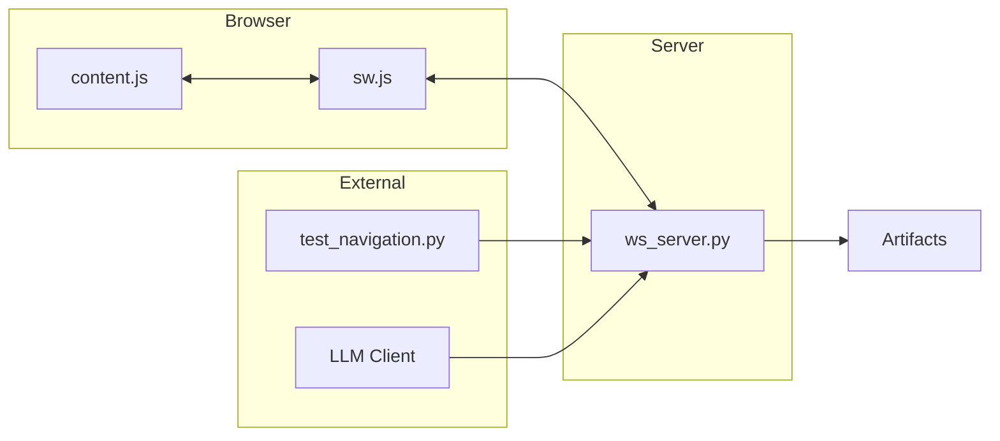

### Message Types by Direction

#### Extension → Server

| Message Type | Source | Handler | Purpose |
|--------------|--------|---------|---------|
| `intelligence_update` | content.js | `handler()` line 2988 | DOM scan results |
| `dom_changed` | content.js | `handler()` line 3148 | DOM mutation notification |
| `network_activity` | content.js | `handler()` line 3165 | Network request tracking |
| `tabs_info` | sw.js | `handler()` line 2964 | All tabs metadata |
| `active_tab_info` | sw.js | `handler()` line 2971 | Current active tab |
| `bridge_status` | sw.js | `handler()` line 2959 | Extension connected |
| `pong` | sw.js | `handler()` line 2954 | Heartbeat response |
| `immediate_scan_results` | content.js | `handler()` line 1982 | Tear-away scan results |

#### Server → Extension

| Message Type | Handler | Target | Purpose |
|--------------|---------|--------|---------|
| `execute_llm_action` | `handleExecuteLLMAction()` | content.js | Execute action by ID |
| `execute_capability` | `handleExecuteCapability()` | content.js | Execute capability |
| `site_configs_update` | `handleServerMessage()` | content.js | Broadcast config updates |
| `navigate` | `handleNavigateCommand()` | tabs API | Navigate to URL |
| `click`, `getText`, etc. | `handleDOMCommand()` | content.js | DOM commands |
| `server_ping` | `extension_heartbeat_loop()` | sw.js | Heartbeat |
| `youtube_find_transcript_button` | `handler()` line 3091 | content.js | Transcript button hunt |

### Internal Extension Messages

| Message Type | Flow | Purpose |
|--------------|------|---------|
| `start_intelligence_scan` | sw.js → content.js | Trigger DOM scan |
| `execute_action` | sw.js → content.js | Execute action |
| `site_configs_update` | sw.js → content.js | Config broadcast |
| `forceRefresh` | popup → sw.js | Force all tabs refresh |
| `force_content_script_reinjection` | tear-away → sw.js | Re-inject content script |

---

## The Two Execution Pipelines

### Pipeline 1: Standard Action-ID Pipeline (95% of cases)

**Use Case:** Execute actions on pre-scanned elements

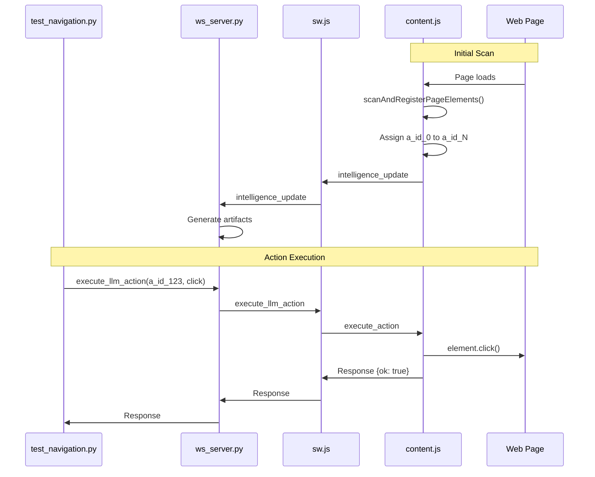

**Flow:**
1. Page loads → content.js scans DOM
2. Elements registered with `a_id_XXX` IDs
3. Intelligence update sent to server
4. Server generates artifacts (page.jsonl, llm_actions.json, llm_prompt.md)
5. LLM reads artifacts and sends `execute_llm_action` with actionId
6. Server forwards to sw.js → content.js
7. Content.js finds element by ID and executes action
8. Response flows back through pipeline

**Strengths:**
- Fast execution (no DOM search needed)
- Stable IDs within page session
- Works for 95% of static content

**Weaknesses:**
- IDs invalidated by DOM changes
- Cannot handle lazy-loaded content
- IDs reset on page navigation

---

### Pipeline 2: Capability Pipeline (Edge Cases)

**Use Case:** Execute actions on dynamic/lazy-loaded content not in registry

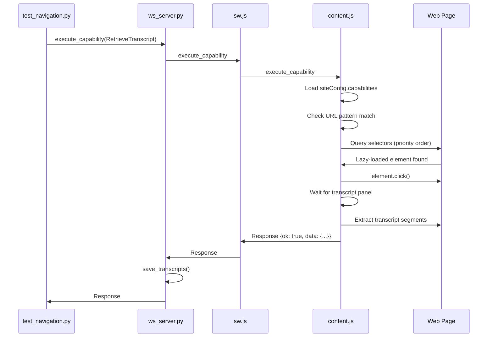

**Flow:**
1. Test client sends `execute_capability` command
2. Server forwards to sw.js → content.js
3. Content.js loads capability config from `siteConfig.capabilities`
4. Checks URL pattern match
5. Queries DOM using selector priority list (specific → generic)
6. Executes multi-step workflow (e.g., click button, wait for panel, extract data)
7. Response flows back with extracted data
8. Server processes data (e.g., save transcript)

**Strengths:**
- Handles lazy-loaded content
- No action ID needed
- Multi-step workflow support
- URL-pattern activation

**Weaknesses:**
- Slower (requires DOM search)
- Selector brittleness
- Requires config maintenance

**Adding New Capabilities:**

Edit `site_configs.json` only - zero code changes:

```json
{
  "youtube.com": {
    "capabilities": {
      "transcript": {
        "action": "RetrieveTranscript",
        "label": "Get video transcript",
        "url_pattern": "/watch?v=",
        "selectors": [
          "button.specific-class[aria-label='Show transcript']",
          "button[aria-label='Show transcript']",
          "#show-transcript"
        ]
      }
    }
  }
}
```

Service worker broadcasts config updates instantly - no extension reload needed.

---

## Intelligence Gathering System

### DOM Scanning Architecture

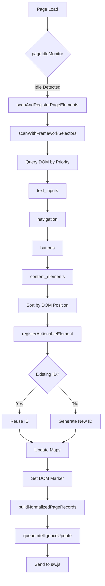

### Scan Triggers Taxonomy

**FULL SCANS (Reset elementCounter to 0):**

1. **Initial Page Load** (content.js line 1278)
   - Source: `scheduleInitialScan('service_worker')`
   - Lock: YES (scan lock at line 9604)
   - Counter Reset: YES (line 9648)

2. **Service Worker Message** (sw.js line 1721, 1728, 1756)
   - Source: `chrome.webNavigation.onCompleted`
   - Source: `chrome.webNavigation.onHistoryStateUpdated`
   - Source: `chrome.tabs.onUpdated` status=complete
   - Lock: YES
   - Counter Reset: YES

3. **Manual Command** (content.js line 2239)
   - Source: `{ command: "scanAndRegisterElements" }`
   - Lock: YES
   - Counter Reset: YES

**PARTIAL REGISTRATIONS (DO NOT reset counter - CAUSES BUGS):**

4. **DOM Mutation** (content.js line 5084)
   - Source: MutationObserver → `analyzeStructureChanges()`
   - Calls: `registerInteractiveSubtree()` (NO LOCK)
   - Counter Reset: NO → **BUG: ID INFLATION**

**INTELLIGENCE UPDATES (No new scanning, just artifact refresh):**

5. **URL Change** (content.js line 10010) - 1s delay
6. **Hash Change** (content.js line 10029) - 500ms delay
7. **Popstate** (content.js line 10039) - 500ms delay
8. **Visibility Change** (content.js line 10053) - 500ms delay
9. **Window Focus** (content.js line 10063) - 500ms delay

### Mutation Observers

**Three Observers Running in Parallel:**

| Observer | Target | Options | Purpose | Scan Trigger |
|----------|--------|---------|---------|--------------|
| pageIdleMonitor | `document` | childList, subtree, attributes | Idle detection | Indirect |
| domChangeObserver | `document.body` | childList, subtree, attributes, characterData | Change detection | **YES - Partial** |
| urlObserver | `document` | subtree, childList, attributes, href | URL change | Intelligence update |

**CRITICAL BUG:** `domChangeObserver` triggers `registerInteractiveSubtree()` which:
- Does NOT acquire scan lock
- Does NOT reset `elementCounter`
- Assigns new IDs to potentially existing elements
- Creates duplicate entries in `actionableElements` Map

---

## Artifact Generation Pipeline

### Artifact Transformation Flow

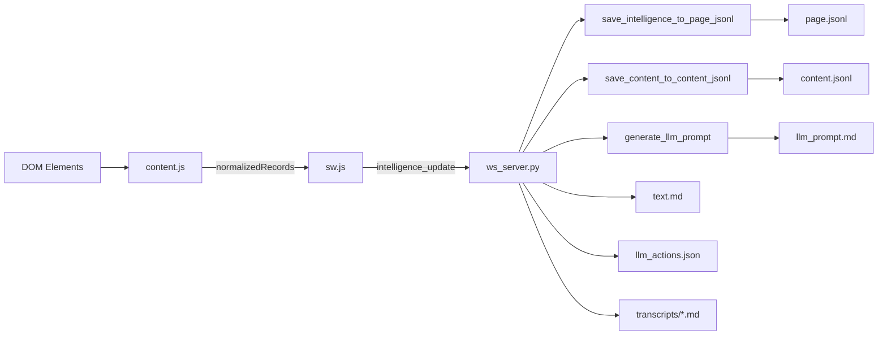

### Artifact Files Explained

#### 1. page.jsonl (Line-delimited JSON)

**Purpose:** Complete page structure with metadata, sections, and actionables

**Format:**
```jsonl
{"type":"meta","title":"...","url":"...","timestamp":"..."}
{"type":"section","level":1,"heading":"..."}
{"type":"actionable","id":"a_id_0","actionType":"click","label":"...","selector":"..."}
{"type":"text","content":"..."}
```

**Generation:** `save_intelligence_to_page_jsonl()` (ws_server.py line 332)

**Update Mode:** Wholesale replacement (no merging)

---

#### 2. content.jsonl

**Purpose:** Cleaned content structure (headings, paragraphs, lists, images)

**Format:**
```jsonl
{"type":"heading","level":1,"text":"..."}
{"type":"paragraph","text":"..."}
{"type":"list","items":["...","..."]}
{"type":"image","src":"...","alt":"..."}
```

**Generation:** `save_content_to_content_jsonl()` (ws_server.py line 456)

**Update Mode:** Wholesale replacement

---

#### 3. llm_actions.json

**Purpose:** Action ID → metadata lookup table

**Format:**
```json
{
  "page_url": "https://...",
  "page_title": "...",
  "timestamp": "...",
  "actions": {
    "a_id_0": {
      "actionType": "click",
      "label": "Subscribe",
      "selector": "button.subscribe",
      "href": null
    },
    "a_id_1": {
      "actionType": "setValue",
      "label": "Search",
      "selector": "input#search",
      "placeholder": "Search..."
    }
  }
}
```

**Generation:** `process_actionable_elements_for_llm()` (ws_server.py line 745)

**Update Mode:** Wholesale replacement

---

#### 4. llm_prompt.md

**Purpose:** Compact, categorized action list optimized for LLM context window

**Format:**
```markdown
# Page Title

**URL:** https://example.com

## Actions

### Search
- return (a_id_1,{yourValue}) to set value for 'Search'. Add submit:true to submit.

### Capabilities
- return (RetrieveTranscript) to retrieve the full transcript for this video

### Videos
- return (a_id_10) to navigate to 'Video Title 1'
- return (a_id_11) to navigate to 'Video Title 2'

### Other Actions
- return (a_id_20) to click 'Subscribe'
```

**Generation:** `generate_llm_prompt()` (ws_server.py line 1087)

**Smart Categorization:**
- Search inputs (priority 1)
- Capabilities (from site_configs.json)
- Transcript actions
- Video links
- Channel links
- Footer links (limited to MAX_FOOTER_LINKS)
- Regular actions

**Deduplication:**
- **BY LINE TEXT, NOT ACTION ID** (ws_server.py lines 1148-1156)
- **RISK:** Hides action ID collisions if labels identical

**Update Mode:** Wholesale replacement

---

#### 5. text.md

**Purpose:** Human-readable page transcript with frontmatter

**Format:**
```markdown
---
title: Page Title
url: https://example.com
timestamp: 2025-11-23T12:00:00Z
---

# Heading 1

Paragraph text here.

## Heading 2

More content.
```

**Generation:** Direct from `pageText` field (ws_server.py lines 3036-3057)

**Update Mode:** Wholesale replacement

---

#### 6. transcripts/*.md

**Purpose:** Long-form video/audio transcripts with signature-based deduplication

**Signature:** Hash of `video_id + segment timestamps + segment text`

**Deduplication:** Compares signature against all existing transcripts (ws_server.py lines 564-610)

**Format:**
```markdown
---
video_id: abc123
video_title: Video Title
video_url: https://youtube.com/watch?v=abc123
timestamp: 2025-11-23T12:00:00Z
signature: sha256_hash_here
---

# Video Title

[00:00] First segment text
[00:15] Second segment text
...
```

**Generation:** `save_transcripts()` (ws_server.py line 628)

**Update Mode:** Create new file only if signature NOT found

---

#### 7. video_history.jsonl

**Purpose:** Append-only log of all videos processed

**Format:**
```jsonl
{"video_id":"abc123","timestamp":"...","title":"...","url":"..."}
```

**Generation:** `_append_video_history_entry()` (ws_server.py line 557)

**Update Mode:** Append only (no overwrite)

---

## Complete Sequence Diagrams

### Sequence 1: Initial Page Load and Scan

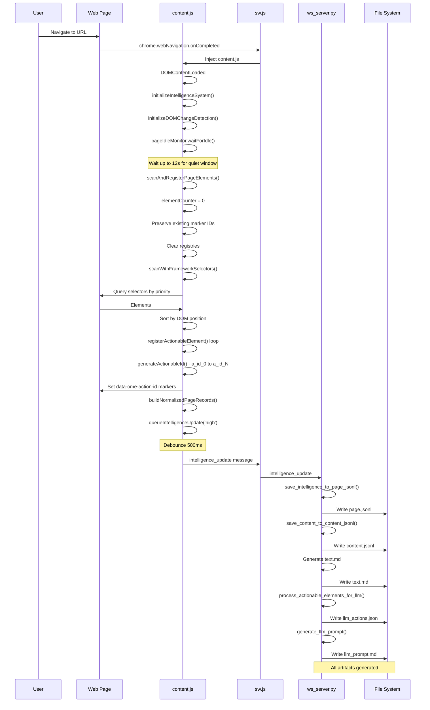

---

### Sequence 2: Standard Action Execution

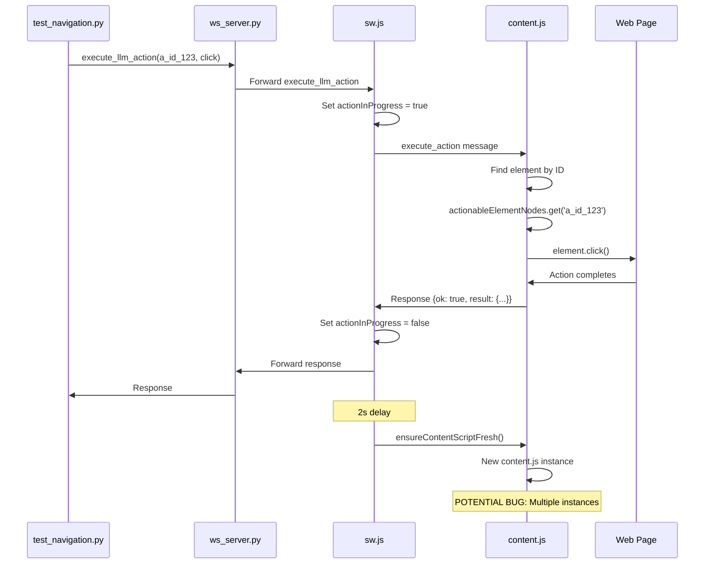

---

### Sequence 3: Capability Execution (RetrieveTranscript)

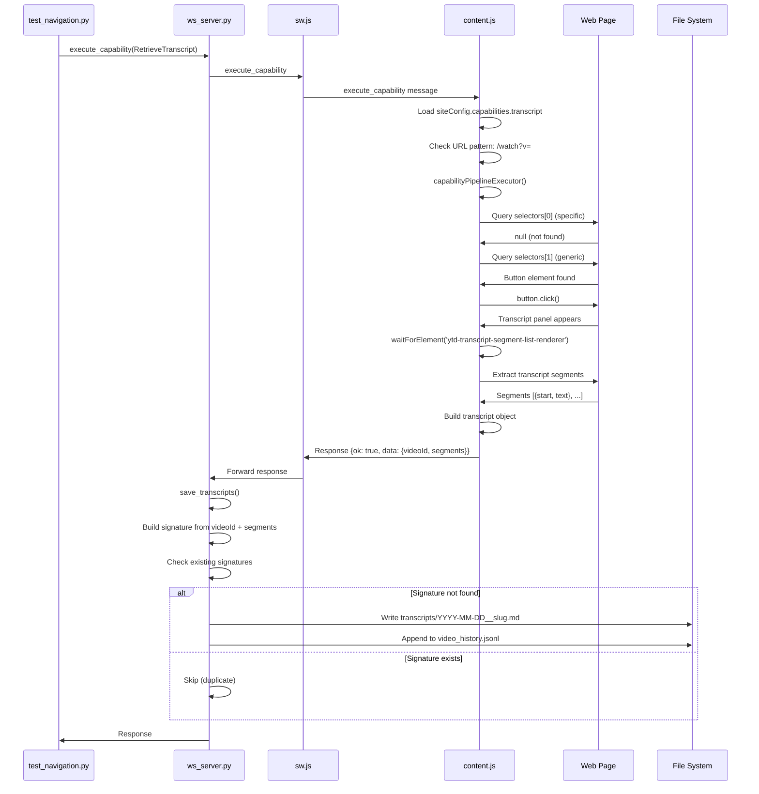

---

### Sequence 4: DOM Mutation and Partial Registration (BUG)

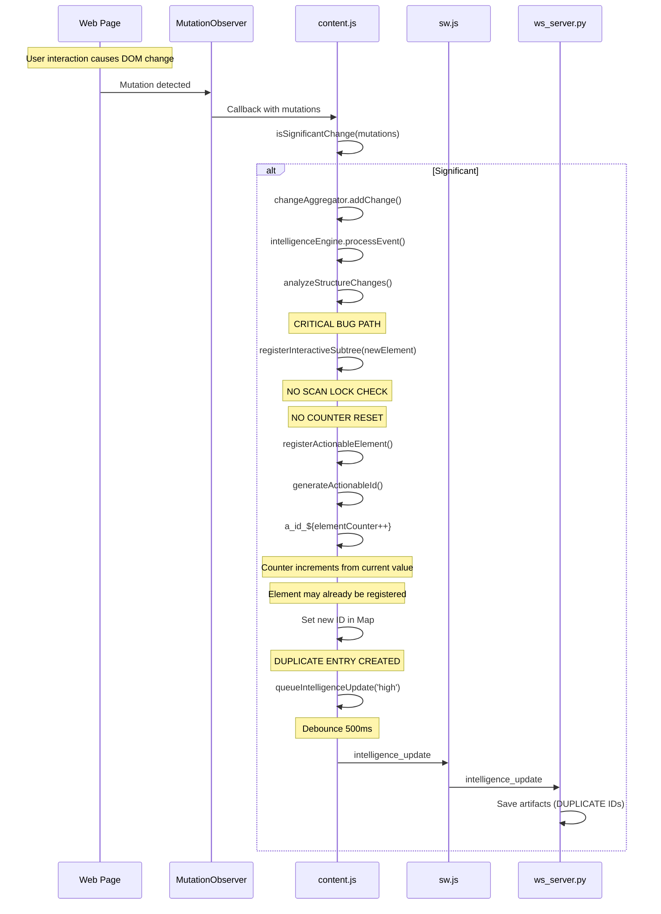

**This is the root cause of action ID inflation.**

---

### Sequence 5: SPA Navigation (Multiple Overlapping Scans)

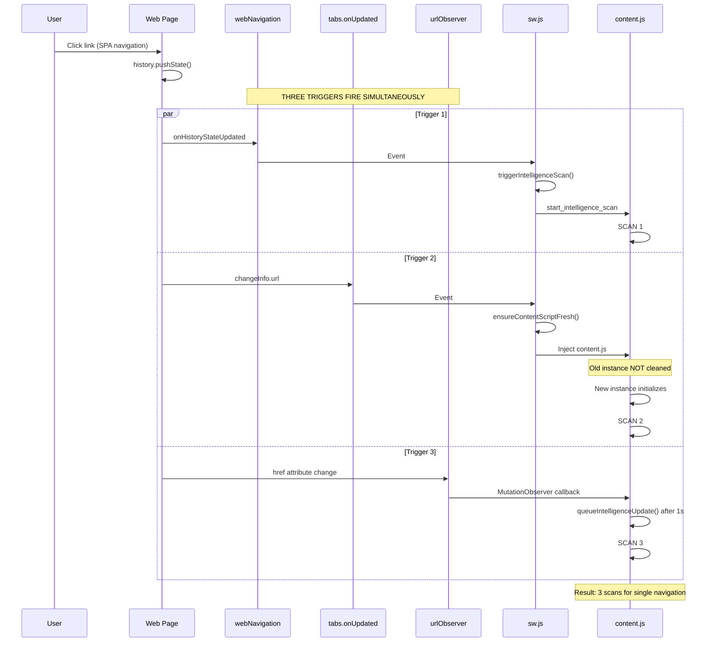

---

## Data Transformation Layers

### Layer 1: DOM → content.js Data Structures

**Input:** Raw DOM elements

**Process:**
- Query selectors from `siteConfig.selectors`
- Priority order: text_inputs → navigation → buttons → content
- WeakSet deduplication (within single scan)

**Output:**
```javascript
{
  element: HTMLElement,
  type: "text_input" | "navigation" | "button" | "content",
  selector: "input#search",
  framework: "youtube"
}
```

---

### Layer 2: content.js → normalizedRecords

**Input:** Scanned elements + page state

**Process:**
- `buildNormalizedPageRecords()` (content.js lines 5809-6649)
- Categorize by type (meta, section, text, actionable, image, list)
- Enrich with metadata (URL, timestamp, selectors, aria labels)

**Output:**
```javascript
[
  {
    type: "meta",
    title: "Page Title",
    url: "https://...",
    timestamp: "2025-11-23T..."
  },
  {
    type: "section",
    level: 1,
    heading: "Main Heading"
  },
  {
    type: "actionable",
    id: "a_id_0",
    actionType: "click",
    tagName: "button",
    label: "Subscribe",
    selector: "button.subscribe",
    href: null
  }
]
```

---

### Layer 3: normalizedRecords → page.jsonl

**Input:** normalizedRecords array from content.js

**Process:**
- `save_intelligence_to_page_jsonl()` (ws_server.py line 332)
- Enrich meta record with browser_state, current_page, transcripts
- Write line-delimited JSON

**Output (File):**
```jsonl
{"type":"meta","title":"...","url":"...","browser_state":{...}}
{"type":"section","level":1,"heading":"..."}
{"type":"actionable","id":"a_id_0","actionType":"click","label":"..."}
```

---

### Layer 4: page.jsonl → llm_actions.json

**Input:** page.jsonl file

**Process:**
- `process_actionable_elements_for_llm()` (ws_server.py line 745)
- Extract actionable records only
- Build action ID → metadata mapping
- Add page context

**Output (File):**
```json
{
  "page_url": "https://...",
  "actions": {
    "a_id_0": {
      "actionType": "click",
      "label": "Subscribe",
      "selector": "button.subscribe"
    }
  }
}
```

---

### Layer 5: page.jsonl → llm_prompt.md

**Input:** page.jsonl + text.md

**Process:**
- `generate_llm_prompt()` (ws_server.py line 1087)
- Extract action records
- Deduplicate by line text
- Smart categorization by pattern
- Resolve capabilities from URL
- Format as compact markdown

**Output (File):**
```markdown
# Page Title

## Actions

### Search
- return (a_id_1,{yourValue}) to set value for 'Search'

### Capabilities
- return (RetrieveTranscript) to retrieve transcript

### Videos
- return (a_id_10) to navigate to 'Video 1'
```

**CRITICAL:** Deduplication is by LINE TEXT, not action ID. This can hide action ID collisions.

---

## Critical Integration Points

### Integration Point 1: content.js ↔ sw.js

**Channel:** Chrome extension messaging (`chrome.runtime.sendMessage`)

**Contracts:**

| Message | Direction | Required Fields | Response |
|---------|-----------|----------------|----------|
| `start_intelligence_scan` | sw.js → content.js | `type`, `reason`, `quietPeriod`, `maxWait` | Async scan triggered |
| `intelligence_update` | content.js → sw.js | `type`, `data.normalizedRecords`, `data.pageState` | Forwarded to server |
| `execute_action` | sw.js → content.js | `type`, `data.actionId`, `data.actionType`, `data.params` | `{ok: bool, result/error}` |
| `execute_capability` | sw.js → content.js | `type`, `action`, `params` | `{ok: bool, data/error}` |
| `dom_changed` | content.js → sw.js | `type`, `isSignificant`, `changeCount`, `url` | No response |

**Error Handling:**
- content.js wraps all action execution in try-catch
- Returns `{ok: false, error: message}` on failure
- sw.js forwards errors to server without modification

**State Synchronization:**
- sw.js tracks `tabScanState` to prevent duplicate scans for same URL
- content.js manages scan lock to prevent concurrent scans
- **BUG:** No coordination between partial registrations and full scans

---

### Integration Point 2: sw.js ↔ ws_server.py

**Channel:** WebSocket (port 17892)

**Contracts:**

| Message | Direction | Required Fields | Response |
|---------|-----------|----------------|----------|
| `intelligence_update` | sw.js → server | `type`, `data.normalizedRecords` | No response (fire and forget) |
| `execute_llm_action` | server → sw.js | `type`, `actionId`, `actionType`, `params` | `{ok: bool, result/error}` |
| `execute_capability` | server → sw.js | `type`, `action`, `params` | `{ok: bool, data/error}` |
| `tabs_info` | sw.js → server | `type`, `tabs` | No response |
| `ping/pong` | bidirectional | `type` | `pong` response |

**Connection Management:**
- sw.js automatically reconnects on disconnect (500ms/1000ms delay)
- Server tracks EXTENSION_WS reference for routing
- Pending messages queued until connection established
- Keep-alive port prevents service worker suspension

**Error Handling:**
- Server sends error responses with `{ok: false, error: message}`
- sw.js forwards errors to original requester
- Network errors trigger reconnection attempt

**State Synchronization:**
- Server maintains global state: CURRENT_PAGE_DATA, CURRENT_TABS_INFO
- State replaced wholesale on each intelligence update
- No incremental updates or merging

---

### Integration Point 3: Site Config Broadcasting

**File:** `web_extension/site_configs.json`

**Update Flow:**
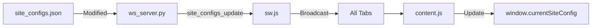

**Broadcasting:**
- Server detects config changes (file watcher or manual reload)
- Sends `site_configs_update` message to extension
- sw.js broadcasts to all tabs with `chrome.tabs.sendMessage()`
- content.js updates `siteConfig` and `window.currentSiteConfig`
- **No extension reload required** - instant activation

**Config Structure:**
```json
{
  "youtube.com": {
    "framework": "youtube",
    "selectors": {
      "text_inputs": ["input#search", "input[aria-label='Search']"],
      "navigation": ["a#endpoint", "a.yt-simple-endpoint"],
      "buttons": ["button[aria-label]", "button.yt-button"]
    },
    "capabilities": {
      "transcript": {
        "action": "RetrieveTranscript",
        "label": "Get video transcript",
        "url_pattern": "/watch?v=",
        "selectors": [...]
      }
    }
  }
}
```

---

### Integration Point 4: Action ID Lifecycle

**Generation:**
- `content.js: generateActionableId()` (line 7123)
- Format: `a_id_${elementCounter++}`
- Counter starts at 0 on full scan
- Counter increments on partial registration (BUG)

**Preservation:**
- Full scan builds `markerIdMap` from existing `data-ome-action-id` attributes (lines 9612-9642)
- Elements with matching keys reuse existing IDs
- Element key: `${placeholder}|${ariaLabel}|${id}|${href}|${selector}`

**Storage:**
- `actionableElements` Map: actionId → descriptor
- `actionableElementNodes` Map: actionId → live DOM node
- DOM marker: `data-ome-action-id="a_id_123"` attribute

**Invalidation:**
- Action IDs invalidated when element removed from DOM
- Stale IDs remain in Maps (no cleanup)
- Full scan clears Maps and regenerates IDs

**Communication:**
- content.js → sw.js → ws_server.py: IDs sent in normalizedRecords
- ws_server.py → sw.js → content.js: IDs used in execute_llm_action
- No server-side ID generation or validation

---

## System Bugs & Root Causes

### BUG #1: Action ID Inflation from Partial Registration

**Location:** `content.js: registerInteractiveSubtree()` (lines 5114-5153)

**Root Cause:**
- Called from `analyzeStructureChanges()` on EVERY significant DOM mutation
- Does NOT check scan lock (`_scanInProgress`)
- Does NOT reset `elementCounter`
- Assigns new IDs starting from current counter value
- Elements may already be registered with different IDs

**Flow:**
```
1. Initial scan: a_id_0 to a_id_99 (100 elements)
2. DOM mutation: 5 new elements added
3. registerInteractiveSubtree() assigns a_id_100 to a_id_104
4. Next full scan: resets counter to 0
5. Same 5 elements reassigned a_id_0 to a_id_4
6. Result: 10 Map entries for 5 elements
```

**Evidence:**
- `elementCounter` never reset except during full scan (line 9648)
- No check if element already in Map before creating new entry
- Partial registration bypasses ID preservation logic

**Impact:**
- Action IDs increment by 200+ per navigation on YouTube
- Duplicate entries in page.jsonl and llm_actions.json
- LLM sees 200 actions when only 50 exist
- llm_prompt.md hides duplicates via text-based deduplication

**Fix Required:**
- Add scan lock check in `registerInteractiveSubtree()`
- OR: Check if element already registered before assigning new ID
- OR: Use element fingerprinting to detect duplicates

---

### BUG #2: No Cleanup of Stale Map Entries

**Location:** `content.js: actionableElements` Map (line 5014)

**Root Cause:**
- Elements added to Map but NEVER removed
- When element gets new ID, old ID remains in Map
- When element removed from DOM, Map entry persists
- `getStoredActionableNode()` checks if connected (line 7441) but doesn't remove entry

**Evidence:**
```javascript
// No code removes entries from Map outside of full scan clear
this.actionableElements.set(actionId, descriptor); // Add
// ... but no this.actionableElements.delete(oldId) anywhere
```

**Impact:**
- Map grows indefinitely
- After 10 YouTube video navigations: 1000+ entries for 100 actual elements
- Stale entries written to artifacts
- Action execution may fail if targeting stale ID

**Fix Required:**
- Remove stale entries before adding new ones
- Implement garbage collection after scans
- Use WeakMap for automatic cleanup (but lose string keys)

---

### BUG #3: Multiple Overlapping Scan Triggers

**Location:** Throughout `sw.js` and `content.js`

**Root Cause:**
- 19 different scan triggers operate independently
- No central scan scheduler or deduplication layer
- `tabScanState` only prevents same-URL rescans, NOT in-flight scans
- Multiple event handlers fire for same event (webNavigation + tabs.onUpdated)

**Triggers:**

**Full Scans:**
1. Service worker message (sw.js line 1721)
2. webNavigation.onHistoryStateUpdated (sw.js line 1728)
3. tabs.onUpdated status=complete (sw.js line 1756)
4. Manual command (content.js line 2239)

**Partial Registrations:**
5. DOM mutation (content.js line 5084) **← PRIMARY BUG**

**Intelligence Updates:**
6-11. URL change, hash change, popstate, visibility, focus (content.js lines 10010-10063)

**Content Script Re-injection (triggers scans):**
12. tabs.onActivated (sw.js line 1684)
13. tabs.onUpdated URL change (sw.js line 1744)
14. DOM command execution (sw.js line 878)
15. Post-action refresh (sw.js line 1405)
16-19. Force refresh, reinjection, extension reload (sw.js lines 978, 1867, 1937)

**Evidence:**
- Page load triggers 3-4 simultaneous scans
- SPA navigation triggers 3 scans (webNavigation + tabs + urlObserver)
- YouTube video autoplay: 10-20 scans per minute

**Impact:**
- Overlapping scans cause race conditions
- Action IDs shift during scan
- elementCounter increments unpredictably
- Artifacts written 3-4 times for single event

**Fix Required:**
- Add in-flight scan tracking (Map of tabId → Promise)
- Debounce rapid triggers (1-2s window)
- Consolidate event handlers (use ONLY webNavigation.onCompleted)
- Add actionInProgress check to ALL scan trigger paths

---

### BUG #4: Content Script Re-injection Without Cleanup

**Location:** `sw.js: ensureContentScriptFresh()` (lines 394-440)

**Root Cause:**
- Re-injects content.js via `chrome.scripting.executeScript()`
- Does NOT send cleanup message to old content script
- Does NOT wait for old script to terminate
- Old intelligence engine continues running

**Evidence:**
```javascript
// No cleanup before injection
await chrome.scripting.executeScript({
    target: { tabId },
    files: ['content.js']
});
// Old content.js still active in page
```

**Impact:**
- Multiple intelligence engines running simultaneously
- Each engine registers its own action IDs
- Duplicate intelligence updates sent to server
- Artifacts thrash as updates overwrite each other

**Fix Required:**
- Send cleanup message before re-injection
- Set flag in content.js to disable old instance
- Wait for cleanup confirmation
- OR: Detect if content script already fresh before re-injecting

---

### BUG #5: Undefined Functions Called

**Location:** `sw.js` lines 417, 886, 1859

**Root Cause:**
- `proactivelySendSiteConfig()` called but NEVER defined
- `getCurrentActiveTabId()` called but NEVER defined

**Evidence:**
```javascript
// Line 417, 886
await proactivelySendSiteConfig(tabId, url); // ReferenceError

// Line 1859
const targetTabId = tabId || await getCurrentActiveTabId(); // ReferenceError
```

**Impact:**
- Runtime errors break tear-away system
- DOM command execution fails
- Force content script reinjection fails

**Fix Required:**
- Define missing functions
- OR: Remove calls if not needed
- Add try-catch to prevent crashes

---

### BUG #6: Text-Based Deduplication Hides ID Collisions

**Location:** `ws_server.py: generate_llm_prompt()` (lines 1148-1156)

**Root Cause:**
- Deduplicates by full line text, NOT by action ID
- If two action IDs have identical labels, only first kept
- Does not detect if same action ID appears multiple times

**Evidence:**
```python
seen: set[str] = set()  # Tracks line text, not IDs
for rec in action_records_with_index:
    if rec['line'] in seen:
        continue  # Skip duplicate LINE
    seen.add(rec['line'])
```

**Example:**
```
return (a_id_1) to click 'Subscribe'  ← Kept
return (a_id_2) to click 'Subscribe'  ← Discarded (same text)
```

**Impact:**
- llm_prompt.md hides action ID inflation
- LLM doesn't see full extent of duplicate IDs
- Action execution may fail if LLM returns discarded ID
- Masks underlying bugs in content.js

**Fix Required:**
- Deduplicate by action ID, not line text
- OR: Detect ID collisions and log warnings
- OR: Change deduplication to preserve all unique IDs

---

### BUG #7: YouTube Transcript Hunter Triggers Additional Scan

**Location:** `ws_server.py` lines 3078-3097

**Root Cause:**
- Sends `youtube_find_transcript_button` command after intelligence update
- Command may trigger DOM scan in extension
- Could result in second intelligence update

**Evidence:**
```python
if "/watch?v=" in page_url and "youtube.com" in page_url:
    await send_command("youtube_find_transcript_button", {
        "tabId": tab_id,
        "url": page_url
    }, timeout=5)
```

**Impact:**
- Additional intelligence update shortly after main update
- Artifacts written twice
- Potential for overlapping scans

**Fix Required:**
- Remove automatic transcript hunting
- OR: Make it opt-in via config
- OR: Only hunt if transcript not already in data

---

## Design Philosophy & Rationale

### Why Site Configs vs. Hardcoded Logic?

**Problem:** Different websites have different DOM structures.

**Bad Solution:** Write custom code for each website.

**Good Solution:** Declarative configuration with selector priorities.

**Benefits:**
- Add new sites without code changes
- Test selectors independently
- Update selectors as sites change
- Share configs across projects

**Trade-offs:**
- Config file can become large
- Selector brittleness (sites change)
- No type safety in JSON

---

### Why Two Pipelines (Action-ID vs. Capability)?

**Problem:** Action-ID pipeline fails for lazy-loaded content.

**Example:** YouTube transcript button doesn't exist until clicked.

**Solutions Considered:**

1. **Wait and rescan:** Slow, brittle
2. **Predict lazy loads:** Complex, fragile
3. **Separate pipeline:** Clean separation of concerns

**Why Capability Pipeline Wins:**
- Clear use case separation
- URL-pattern activation
- Multi-step workflow support
- No interference with standard pipeline

**Trade-offs:**
- Two code paths to maintain
- Selector configuration duplication
- Complexity in routing logic

---

### Why Wholesale Artifact Replacement vs. Incremental Updates?

**Problem:** How to persist intelligence state?

**Solutions Considered:**

1. **Database:** Overkill, adds dependency
2. **Incremental JSONL:** Complex diffing logic
3. **Wholesale replacement:** Simple, clear state

**Why Wholesale Wins:**
- Simplicity: Each update is complete snapshot
- No stale data: Always current page state
- No merge conflicts: Last write wins
- Easy debugging: Files always consistent

**Trade-offs:**
- Performance: Rewrites entire file each time
- History loss: Previous states not preserved
- Race conditions: Rapid updates thrash files

**Mitigation:**
- Debounce intelligence updates (500ms)
- Use in-memory cache for fast reads
- Timestamped filenames for history (optional)

---

### Why Text-Based Deduplication in llm_prompt.md?

**Problem:** Same action may appear multiple times with same label.

**Example:**
```
return (a_id_10) to navigate to 'Subscribe'
return (a_id_20) to navigate to 'Subscribe'
```

**Why Text-Based:**
- Reduces LLM context window usage
- Focuses on unique user-visible actions
- Hides implementation details (multiple IDs)

**Trade-offs:**
- Masks action ID collisions (BUG)
- May discard valid alternatives
- No visibility into underlying duplicates

**Better Solution:**
- Deduplicate by element fingerprint (not text)
- Log discarded IDs for debugging
- Add config flag to disable deduplication

---

### Why MutationObserver vs. Polling?

**Problem:** Detect DOM changes for rescanning.

**Solutions Considered:**

1. **Polling (setInterval):** Simple, reliable
2. **MutationObserver:** Event-driven, efficient

**Why MutationObserver Wins:**
- OME coding philosophy: Event-driven only
- Performance: No wasted CPU cycles
- Precision: Fires only when DOM changes
- Browser-native: Well-tested, reliable

**Trade-offs:**
- Noise: Fires for all DOM changes
- Filtering: Need `isSignificantChange()` logic
- Debugging: Harder to trace triggers

**Mitigation:**
- Significant change filter (rate limiting, mutation count)
- Logging for debugging
- Disable for specific sites via config

---

### Why Keep-Alive Ports in Service Worker?

**Problem:** Chrome suspends inactive service workers after 30s.

**Impact:** WebSocket connection closes, intelligence updates lost.

**Solution:** Keep-alive port connection prevents suspension.

**Implementation:**
```javascript
// content.js
const port = chrome.runtime.connect({ name: "ome_keep_alive" });

// sw.js
chrome.runtime.onConnect.addListener((port) => {
    if (port.name === "ome_keep_alive") {
        keepAlivePorts.add(port);
        port.onDisconnect.addListener(() => {
            keepAlivePorts.delete(port);
        });
    }
});
```

**Why This Works:**
- Port connection keeps service worker alive
- No active page required (unlike DOM interaction)
- Works even on chrome:// pages (via any web page)

**Trade-offs:**
- Memory overhead (minimal)
- Prevents service worker from hibernating (intentional)

---

### Why JSONL vs. JSON Arrays?

**Problem:** How to store sequential records?

**Solutions Considered:**

1. **JSON Array:** `[{}, {}, {}]`
2. **JSONL:** `{}\n{}\n{}`

**Why JSONL Wins:**
- Append-friendly: Add records without rewriting file
- Stream-friendly: Process line-by-line
- Fault-tolerant: Partial reads still valid
- Grep-friendly: Text tools work

**Trade-offs:**
- Less common: Some tools don't support
- No top-level array: Need to parse line-by-line
- Trailing newlines: Need to handle empty lines

**When to Use JSON:**
- llm_actions.json: Lookup table (not sequential)
- site_configs.json: Configuration (not records)

**When to Use JSONL:**
- page.jsonl: Sequential records
- content.jsonl: Sequential records
- video_history.jsonl: Append-only log

---

## Conclusion

Om_E_Web is a sophisticated system that transforms web pages into LLM-actionable intelligence through a three-tier architecture: DOM scanning (content.js), message routing (sw.js), and artifact generation (ws_server.py). The system's config-driven design enables adding new automation targets without code changes, while the dual pipeline architecture (action-ID + capability) handles both static and dynamic content.

**Strengths:**
- Event-driven architecture (no timers/polling)
- Config-driven extensibility
- Bidirectional WebSocket pipeline
- Structured artifact generation
- Signature-based transcript deduplication

**Critical Bugs:**
1. Partial registration bypasses scan lock → action ID inflation
2. No cleanup of stale Map entries → memory leaks
3. Multiple overlapping scan triggers → race conditions
4. Content script re-injection without cleanup → duplicate engines
5. Text-based deduplication hides ID collisions

**Recommended Fixes:**
1. Add scan lock check to `registerInteractiveSubtree()`
2. Implement Map garbage collection
3. Add in-flight scan tracking and debouncing
4. Send cleanup message before content script re-injection
5. Change deduplication to ID-based with collision detection

**Design Philosophy:**
The system prioritizes simplicity, event-driven architecture, and config-driven logic over complex abstractions. This makes it easy to understand, extend, and debug, though the current implementation has several bugs that stem from insufficient coordination between scan triggers and no cleanup of stale state.

---

**End of Document**
