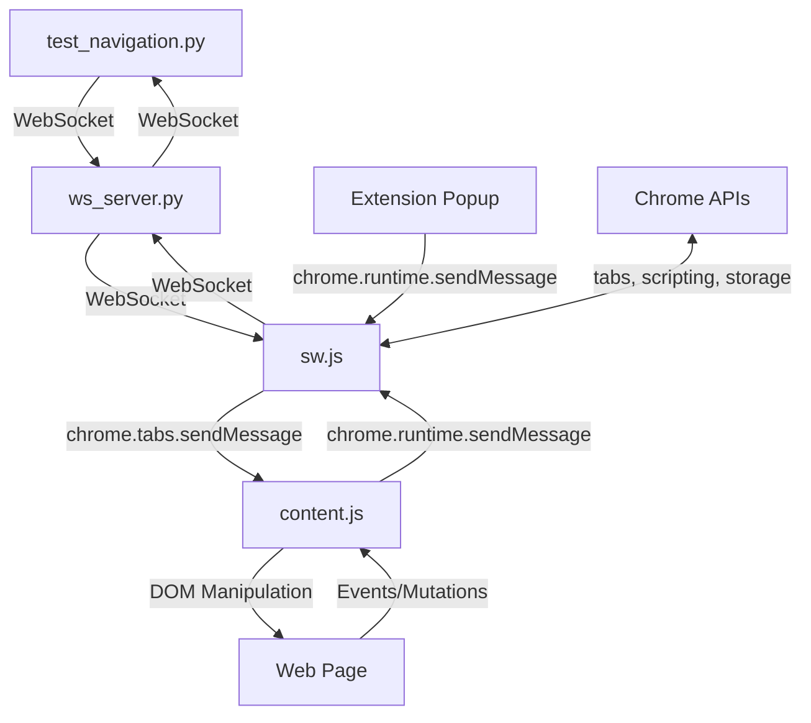
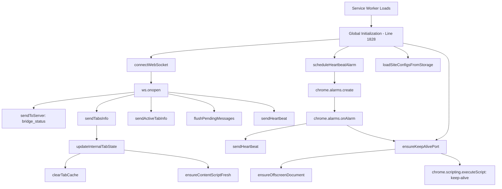
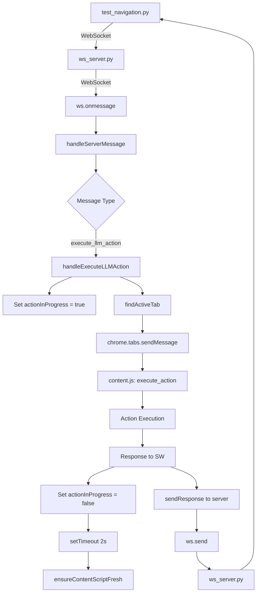
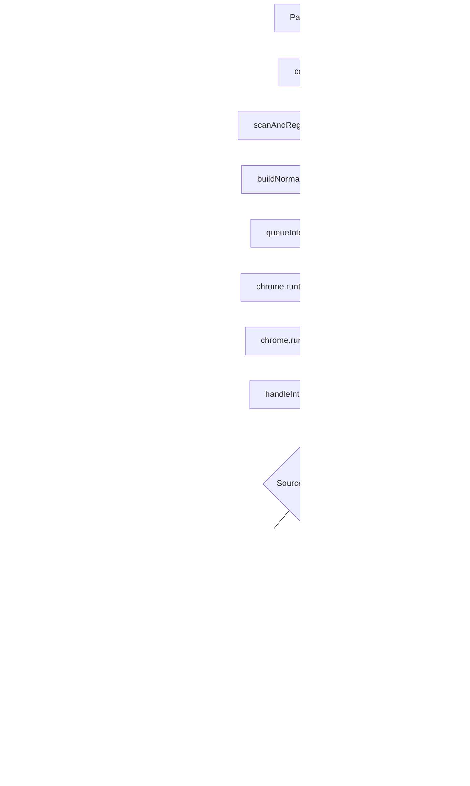
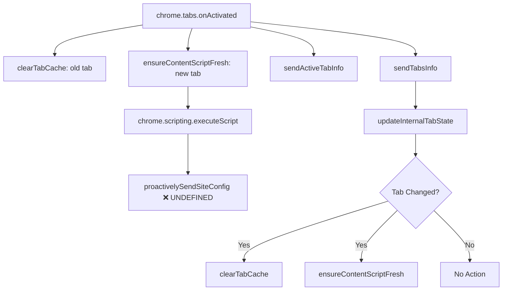
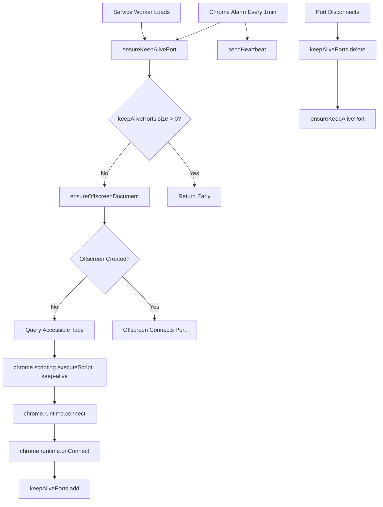
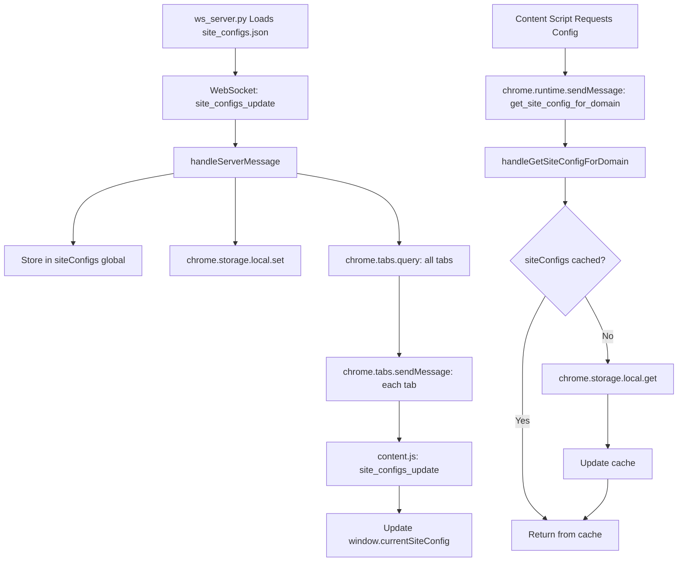

# Service Worker (sw.js) - Complete Documentation

**File:** `/Users/andy7string/Projects/Om_E_Web/web_extension/sw.js`
**Lines:** 2,081
**Role:** WebSocket Bridge & Content Script Orchestrator
**Version:** Documented 2025-11-23

---

## Table of Contents

1. [Overview](#overview)
2. [Architecture Role](#architecture-role)
3. [Global State Management](#global-state-management)
4. [Function Catalog](#function-catalog)
5. [Message Routing System](#message-routing-system)
6. [WebSocket Bridge](#websocket-bridge)
7. [Tab State Management](#tab-state-management)
8. [Keep-Alive System](#keep-alive-system)
9. [Content Script Lifecycle](#content-script-lifecycle)
10. [Event Listeners](#event-listeners)
11. [Trace Roots & Dependencies](#trace-roots--dependencies)
12. [Known Issues & Bugs](#known-issues--bugs)

---

## Overview

The service worker (`sw.js`) acts as the **central message routing hub** in the Om_E_Web system. It bridges the gap between:
- **WebSocket Server** (ws_server.py) running on localhost:17892
- **Content Scripts** (content.js) injected into web pages
- **Chrome Extension APIs** (tabs, scripting, storage)

### Key Responsibilities

1. **WebSocket Bridge**: Maintain persistent connection to ws_server.py
2. **Message Router**: Forward commands and responses between server and content scripts
3. **Tab Manager**: Track tab state, URL changes, and active tab detection
4. **Content Script Orchestrator**: Inject, refresh, and manage content script lifecycle
5. **Keep-Alive Guardian**: Prevent MV3 service worker suspension
6. **Intelligence Coordinator**: Route DOM scan results to server for artifact generation

### Communication Flow

```
┌──────────────────────────────────────────────────────────────────┐
│                    Service Worker Pipeline                        │
├──────────────────────────────────────────────────────────────────┤
│                                                                   │
│  Test Client                                                      │
│       ↓                                                           │
│  ws_server.py (Port 17892)                                        │
│       ↓                                                           │
│  ┌────────────────────────────────────────┐                      │
│  │        Service Worker (sw.js)          │                      │
│  │  - WebSocket connection management      │                      │
│  │  - Message routing & transformation     │                      │
│  │  - Tab state tracking                   │                      │
│  │  - Content script lifecycle             │                      │
│  │  - Keep-alive port management           │                      │
│  └────────────────────────────────────────┘                      │
│       ↓                                                           │
│  Content Script (content.js)                                      │
│       ↓                                                           │
│  DOM Elements / Page Actions                                      │
│                                                                   │
└──────────────────────────────────────────────────────────────────┘
```

---

## Architecture Role

### Position in System Architecture



### Primary Interfaces

| Interface | Direction | Protocol | Purpose |
|-----------|-----------|----------|---------|
| WebSocket Server | Bidirectional | WebSocket (ws://127.0.0.1:17892) | Command execution & intelligence updates |
| Content Scripts | Bidirectional | chrome.tabs.sendMessage / chrome.runtime.sendMessage | DOM commands & responses |
| Extension Popup | Receives | chrome.runtime.sendMessage | Status queries & control commands |
| Chrome APIs | Calls | Chrome Extension APIs | Tab management, script injection, storage |

---

## Global State Management

### WebSocket State

```javascript
// Line 29
let ws = null;  // WebSocket connection to server

// Line 32
let isConnected = false;  // Connection status flag

// Line 35
let pendingMessages = [];  // Queue for messages when WebSocket isn't ready
```

**Purpose:**
- `ws`: Active WebSocket connection instance
- `isConnected`: Quick status check without querying WebSocket state
- `pendingMessages`: Buffer messages during reconnection to prevent data loss

**Lifecycle:**
- Created in `connectWebSocket()` (line 68)
- Destroyed on `ws.onclose` (line 117)
- Flushed via `flushPendingMessages()` (line 303)

---

### Tab State Tracking

```javascript
// Line 38
const tabScanState = new Map();
// tabId -> { lastUrl: string, lastScanAt: number, reason: string }

// Line 41
let actionInProgress = false;  // Prevents content script refresh during action execution

// Line 44
let internalTabState = new Map();
// tabId -> enhanced tab info with DOM changes, site config, scan status

// Line 45
let lastActiveTabId = null;  // Track active tab changes

// Line 46
let tabCache = new Map();  // tabId -> cached data
```

**Purpose:**

| State Variable | Purpose | Updated By |
|----------------|---------|------------|
| `tabScanState` | Prevent duplicate scans for same URL | `triggerIntelligenceScan()` |
| `actionInProgress` | Prevent content script refresh interrupting action execution | `handleExecuteLLMAction()` |
| `internalTabState` | Comprehensive tab metadata with DOM changes, config status | `updateInternalTabState()` |
| `lastActiveTabId` | Detect tab switches for cache clearing | `chrome.tabs.onActivated` |
| `tabCache` | Cache DOM data to reduce rescans | `clearTabCache()` |

**Critical Enhancement (lines 566-579):**
`internalTabState` now includes:
```javascript
{
  ...tabInfo,
  lastUpdate: Date.now(),
  needsFreshScan: true,
  contentScriptFresh: false,
  cacheCleared: true,
  domChanges: {
    totalChanges: 0,
    lastChangeTime: null,
    changeTypes: new Set(),
    lastMutationCount: 0
  },
  siteConfigSent: false,
  lastConfigSent: null,
  currentDomain: null,
  currentFramework: 'generic',
  siteConfigError: null,
  lastConfigError: null
}
```

---

### Site Config Management

```javascript
// Line 49
let siteConfigs = {};  // Store site configs locally for immediate access
```

**Purpose:**
- Local cache of `site_configs.json` for proactive sending to content scripts
- Eliminates need to fetch from storage on every content script injection
- Loaded from chrome.storage.local on service worker startup (line 261)
- Updated when server broadcasts `site_configs_update` (line 627)

**Lifecycle:**
1. Load from storage on startup: `loadSiteConfigsFromStorage()` (line 261)
2. Update from server: `handleServerMessage()` when type=`site_configs_update` (line 627)
3. Store in chrome.storage.local for persistence (line 635)
4. Broadcast to all content scripts (line 642)
5. Lookup for domain: `handleGetSiteConfigForDomain()` (line 2036)

---

### Keep-Alive System State

```javascript
// Line 52-57
const KEEP_ALIVE_PORT_NAME = "ome_keep_alive";
const KEEP_ALIVE_CHECK_INTERVAL_MS = 30 * 1000;  // 30 seconds
const HEARTBEAT_ALARM_NAME = "ome_ws_heartbeat";
const HEARTBEAT_PERIOD_MINUTES = 1;
const keepAlivePorts = new Set();
let lastHeartbeatSent = 0;
```

**Purpose:**
Chrome MV3 service workers suspend after ~30 seconds of inactivity. The keep-alive system prevents suspension by:
1. Maintaining long-lived message ports with content scripts/offscreen documents
2. Sending periodic heartbeats via Chrome alarms
3. Creating offscreen documents when no regular tabs are available

**Critical Insight:**
Without keep-alive ports, the service worker suspends and the WebSocket connection dies. This breaks the entire command pipeline.

---

## Function Catalog

### WebSocket Management Functions

#### `connectWebSocket()` (lines 68-138)

**Purpose:** Establish WebSocket connection to server on localhost:17892

**Parameters:** None

**Returns:** None (async)

**Side Effects:**
- Creates global `ws` WebSocket instance
- Sets `isConnected = true` on open
- Registers event handlers (onopen, onmessage, onclose, onerror)
- Sends initial messages: `bridge_status`, `tabs_info`, `active_tab_info`
- Flushes pending messages queue
- Schedules reconnection on close (1s delay)

**Dependencies:**
- Calls: `sendToServer()`, `sendTabsInfo()`, `sendActiveTabInfo()`, `flushPendingMessages()`, `sendHeartbeat()`
- Called by: `chrome.runtime.onStartup`, `chrome.runtime.onInstalled`, global initialization (line 1828)

**Logic Flow:**
```javascript
1. Check if already connected/connecting → return early
2. Create WebSocket("ws://127.0.0.1:17892")
3. On open (line 79):
   - Wait 100ms for connection to stabilize
   - Send bridge_status: "connected"
   - Send initial tabs info
   - Send active tab info
   - Flush pending messages
   - Send immediate heartbeat
4. On message (line 112):
   - Log received message
   - Call handleServerMessage()
5. On close (line 117):
   - Set isConnected = false
   - Schedule reconnection after 1s
6. On error (line 129):
   - Log error
```

**Example Message Flow:**
```
[SW] Extension startup / reconnect, connecting WebSocket…
[SW] WS open
[SW] WebSocket fully ready, sending initial messages
[SW] Message sent successfully: bridge_status
[SW] Tabs info updated and sent to server
[SW] 🎯 Active tab info sent: {...}
[SW] Flushing 0 pending messages
[SW] Message sent successfully: ping
```

---

#### `sendToServer(data)` (lines 284-298)

**Purpose:** Send JSON message to WebSocket server with queuing fallback

**Parameters:**
- `data` (Object): Message object to send (will be JSON.stringify'd)

**Returns:** None

**Side Effects:**
- Sends message via WebSocket if connected
- Queues message in `pendingMessages` if not connected
- Logs success/failure

**Dependencies:**
- Uses: `ws` global, `pendingMessages` global
- Called by: Almost every function that needs to communicate with server

**Logic Flow:**
```javascript
if (ws && ws.readyState === WebSocket.OPEN) {
  ws.send(JSON.stringify(data));
  console.log("[SW] Message sent successfully:", data.type || 'data');
} else {
  console.warn("[SW] WebSocket not ready, cannot send:", data);
  pendingMessages.push(data);
}
```

**Critical Pattern:**
ALL server communication must go through this function - never call `ws.send()` directly.

---

#### `flushPendingMessages()` (lines 303-318)

**Purpose:** Send all queued messages when WebSocket becomes ready

**Parameters:** None

**Returns:** None

**Side Effects:**
- Sends all messages in `pendingMessages` array
- Clears `pendingMessages` after sending
- Logs each message sent

**Dependencies:**
- Uses: `pendingMessages`, `ws`
- Called by: `connectWebSocket()` on successful connection

**Logic Flow:**
```javascript
if (pendingMessages.length > 0 && ws && ws.readyState === WebSocket.OPEN) {
  console.log(`[SW] Flushing ${pendingMessages.length} pending messages`);
  const messagesToSend = [...pendingMessages];  // Copy array
  pendingMessages = [];  // Clear original

  messagesToSend.forEach(message => {
    ws.send(JSON.stringify(message));
  });
}
```

**Example:**
```
[SW] Flushing 3 pending messages
[SW] Pending message sent: intelligence_update
[SW] Pending message sent: dom_changed
[SW] Pending message sent: active_tab_info
```

---

### Keep-Alive Functions

#### `ensureKeepAlivePort()` (lines 143-190)

**Purpose:** Ensure at least one keep-alive port is connected to prevent service worker suspension

**Parameters:** None

**Returns:** None (async)

**Side Effects:**
- Creates offscreen document if needed
- Injects keep-alive port script into accessible tabs
- Updates `keepAlivePorts` Set

**Dependencies:**
- Calls: `ensureOffscreenDocument()`, `isTabAccessible()`
- Called by: `chrome.tabs.onUpdated`, `chrome.tabs.onCreated`, `chrome.tabs.onRemoved`, periodic interval

**Logic Flow:**
```javascript
1. Check if keepAlivePorts.size > 0 → return early
2. Try to create offscreen document
   - If successful, port will be created automatically
   - Return if port now exists
3. Fallback: Query all HTTP(S) tabs
4. For each accessible tab:
   - Try to inject keep-alive port script
   - Script connects port and stores in window.__omeKeepAlivePort
   - If injection succeeds, return
5. Log warning if no tabs available
```

**Critical Insight:**
MV3 service workers MUST have either:
- An offscreen document with a message port
- OR a content script in a regular (non-chrome://) tab with a port

Without these, the service worker suspends after ~30s and the WebSocket dies.

---

#### `ensureOffscreenDocument()` (lines 196-216)

**Purpose:** Create/ensure offscreen document exists for keep-alive port

**Parameters:** None

**Returns:** None (async)

**Side Effects:**
- Creates offscreen.html document if not exists
- Offscreen document connects keep-alive port automatically

**Dependencies:**
- Uses: `chrome.offscreen.createDocument()`, `chrome.offscreen.hasDocument()`
- Called by: `ensureKeepAlivePort()`

**Logic Flow:**
```javascript
1. Check if chrome.offscreen API exists → return if not
2. Check if offscreen document already exists → return if yes
3. Create offscreen document:
   - URL: chrome.runtime.getURL("offscreen.html")
   - Reason: "TESTING" (Chrome requires a reason)
   - Justification: "Keep OM-E automation bridge alive while tabs are inactive"
4. Log success
```

**Chrome MV3 Note:**
Offscreen documents are a MV3 feature specifically designed to keep service workers alive. They run in a hidden context and can maintain long-lived connections.

---

#### `scheduleHeartbeatAlarm()` (lines 221-226)

**Purpose:** Create periodic Chrome alarm to wake service worker

**Parameters:** None

**Returns:** None

**Side Effects:**
- Creates Chrome alarm named "ome_ws_heartbeat"
- Alarm fires every 1 minute

**Dependencies:**
- Uses: `chrome.alarms.create()`
- Called by: `chrome.runtime.onStartup`, `chrome.runtime.onInstalled`, global initialization

**Listener:**
```javascript
// Lines 228-233
chrome.alarms.onAlarm.addListener((alarm) => {
  if (alarm.name === HEARTBEAT_ALARM_NAME) {
    sendHeartbeat("alarm");
    ensureKeepAlivePort();
  }
});
```

**Purpose of Alarm:**
Chrome alarms wake up suspended service workers. This ensures:
1. Service worker wakes every minute
2. Heartbeat sent to server (proves connection alive)
3. Keep-alive port checked and recreated if needed

---

#### `sendHeartbeat(reason)` (lines 238-253)

**Purpose:** Send ping to server to prove connection is alive

**Parameters:**
- `reason` (string): Why heartbeat was sent ("onopen", "alarm", "manual")

**Returns:** None

**Side Effects:**
- Sends ping message to server via WebSocket
- Updates `lastHeartbeatSent` timestamp
- Attempts reconnection if WebSocket not open

**Dependencies:**
- Calls: `sendToServer()`, `connectWebSocket()`
- Called by: `connectWebSocket()` on open, Chrome alarm listener

**Message Format:**
```javascript
{
  type: "ping",
  source: "extension",
  reason: "alarm",  // or "onopen", "manual"
  keepAlivePorts: 1,  // Number of active ports
  timestamp: 1700000000000
}
```

**Server Response:**
Server may respond with `pong` message (handled in `handleServerMessage()` line 671).

---

### Tab Management Functions

#### `sendTabsInfo(forceRefresh)` (lines 450-479)

**Purpose:** Query all tabs and send metadata to server with internal state update

**Parameters:**
- `forceRefresh` (boolean): If true, clear all internal state before updating

**Returns:** None (async)

**Side Effects:**
- Queries all tabs via `chrome.tabs.query({})`
- Updates `internalTabState` Map
- Sends `tabs_info` message to server
- Sends `active_tab_info` message immediately after

**Dependencies:**
- Calls: `updateInternalTabState()`, `sendToServer()`, `sendActiveTabInfo()`
- Called by: `connectWebSocket()`, `chrome.tabs.onActivated`, `chrome.tabs.onUpdated`, `chrome.tabs.onCreated`, `chrome.tabs.onRemoved`

**Message Format:**
```javascript
{
  type: "tabs_info",
  tabs: [
    {
      id: 123,
      url: "https://youtube.com/watch?v=abc",
      title: "Video Title",
      active: true,
      status: "complete",
      pendingUrl: null
    },
    // ... more tabs
  ]
}
```

**Logic Flow:**
```javascript
1. Query all tabs: chrome.tabs.query({})
2. Map tabs to info objects (id, url, title, active, status, pendingUrl)
3. Update internal state: updateInternalTabState(tabsInfo, forceRefresh)
4. Send tabs_info to server
5. Send active_tab_info immediately after
```

---

#### `sendActiveTabInfo()` (lines 487-516)

**Purpose:** Send just the current active tab information to server

**Parameters:** None

**Returns:** None (async)

**Side Effects:**
- Queries active tab in current window
- Sends `active_tab_info` message to server

**Dependencies:**
- Calls: `sendToServer()`
- Called by: `connectWebSocket()`, `sendTabsInfo()`, `chrome.tabs.onActivated`, `chrome.tabs.onUpdated`, `chrome.tabs.onCreated`, `chrome.tabs.onRemoved`

**Purpose:**
Terminal/server needs immediate visibility into which tab is active. This message is sent separately from `tabs_info` to provide instant feedback.

**Message Format:**
```javascript
{
  type: "active_tab_info",
  activeTab: {
    id: 123,
    url: "https://youtube.com/watch?v=abc",
    title: "Video Title",
    status: "complete",
    pendingUrl: null
  },
  timestamp: 1700000000000
}
```

---

#### `updateInternalTabState(tabsInfo, forceRefresh)` (lines 524-611)

**Purpose:** Update internal tab state with enhanced management and cache clearing

**Parameters:**
- `tabsInfo` (Array): Array of tab information objects from `chrome.tabs.query()`
- `forceRefresh` (boolean): If true, clear all state before updating

**Returns:** None

**Side Effects:**
- Updates `internalTabState` Map
- Clears cache for changed tabs via `clearTabCache()`
- Ensures content script fresh for changed tabs via `ensureContentScriptFresh()`
- Updates `lastActiveTabId`
- Removes stale tabs from state

**Dependencies:**
- Calls: `clearTabCache()`, `ensureContentScriptFresh()`
- Called by: `sendTabsInfo()`

**Logic Flow:**
```javascript
1. If forceRefresh:
   - Clear internalTabState Map
   - Clear tabCache Map

2. For each tab in tabsInfo:
   - Get old state from internalTabState
   - Check if tab changed:
     - URL different
     - Title different
     - Active status different
     - Status different

   - If changed:
     - Log change details
     - Clear tab cache
     - Update state with enhanced info:
       {
         ...tabInfo,
         lastUpdate: Date.now(),
         needsFreshScan: true,
         contentScriptFresh: false,
         cacheCleared: true,
         domChanges: { totalChanges: 0, ... },
         siteConfigSent: false,
         ...
       }
     - If new active tab: ensureContentScriptFresh()
     - If URL changed: ensureContentScriptFresh()

3. Remove tabs no longer in tabsInfo from state
4. Log summary statistics
```

**Critical Enhancement:**
This function now tracks DOM changes and site config status per tab (lines 566-579).

---

#### `clearTabCache(tabId)` (lines 366-387)

**Purpose:** Clear cached data for a specific tab and mark for fresh scan

**Parameters:**
- `tabId` (number): Tab ID to clear cache for

**Returns:** None

**Side Effects:**
- Removes entry from `tabCache` Map
- Sets `needsFreshScan = true` in `internalTabState`
- Sets `lastCacheClear` timestamp

**Dependencies:**
- Uses: `tabCache`, `internalTabState`
- Called by: `updateInternalTabState()`, `handleNavigateCommand()`, `chrome.tabs.onActivated`, `chrome.tabs.onUpdated`

**Logic Flow:**
```javascript
1. Check if tabCache has entry for tabId
   - If yes:
     - Log cached data summary
     - Delete from tabCache
2. Get tabState from internalTabState
   - If exists:
     - Set needsFreshScan = true
     - Set lastCacheClear = Date.now()
     - Log that tab marked for fresh scan
```

**Purpose:**
Cache clearing ensures stale DOM data doesn't interfere with actions. Cache is cleared when:
- Tab URL changes
- Tab becomes active
- Navigation occurs
- Force refresh requested

---

#### `ensureContentScriptFresh(tabId)` (lines 394-440)

**Purpose:** Force re-injection of content script to ensure fresh context

**Parameters:**
- `tabId` (number): Tab ID to refresh content script for

**Returns:** None (async)

**Side Effects:**
- Injects content.js into tab via `chrome.scripting.executeScript()`
- **NEW:** Proactively sends site config after injection (line 417)
- Updates `internalTabState` with refresh timestamp
- Sets `contentScriptFresh = true`

**Dependencies:**
- Calls: `proactivelySendSiteConfig()` (line 417) - **BUG: FUNCTION NEVER DEFINED**
- Uses: `internalTabState`, `actionInProgress`
- Called by: `updateInternalTabState()`, `handleForceRefresh()`, `chrome.tabs.onActivated`

**Logic Flow:**
```javascript
1. Check if actionInProgress flag set
   - If yes: log skip and return (prevents interrupting action execution)

2. Log content script refresh start

3. Inject content.js via chrome.scripting.executeScript()

4. Log refresh success

5. **NEW:** Proactively send site config (line 417)
   - Get tab info
   - Call proactivelySendSiteConfig(tabId, tab.url) ⚠️ UNDEFINED FUNCTION

6. Update internalTabState:
   - contentScriptFresh = true
   - lastContentScriptRefresh = Date.now()

7. On error:
   - Log failure
   - Update internalTabState:
     - contentScriptRefreshFailed = true
     - lastRefreshError = Date.now()
```

**CRITICAL BUG (Line 417):**
```javascript
await proactivelySendSiteConfig(tabId, tab.url);
```

This function is called but NEVER DEFINED anywhere in sw.js. This will cause a runtime error.

**Expected Behavior:**
Function should load site config for the tab's domain and send it to the content script via `chrome.tabs.sendMessage()`.

---

#### `findActiveTab()` (lines 1488-1607)

**Purpose:** Find currently active tab with multiple fallback strategies

**Parameters:** None

**Returns:** Promise<Object> - Active tab object or null

**Side Effects:**
- Queries tabs via Chrome APIs
- Refreshes tab info via `chrome.tabs.get()`
- Logs extensive debugging information

**Dependencies:**
- Calls: `isTabAccessible()`, `chrome.tabs.query()`, `chrome.tabs.get()`, `chrome.windows.getCurrent()`
- Called by: `handleNavigateCommand()`, `handleDOMCommand()`, `handleExecuteLLMAction()`, `handleExecuteCapability()`, `handleIntelligenceUpdate()`

**Logic Flow (Multi-Strategy):**

```javascript
Strategy 1: Active tab in current window (lines 1492-1512)
  - Query: { active: true, currentWindow: true }
  - Check if accessible (not chrome://)
  - Refresh tab info
  - Return if found

Strategy 2: Active tab in last focused window (lines 1514-1532)
  - Query: { active: true, lastFocusedWindow: true }
  - Check if accessible
  - Refresh tab info
  - Return if found

Strategy 3: Best accessible tab in current window (lines 1534-1568)
  - Get current window
  - Query all tabs in window
  - Filter for accessible tabs
  - Sort by priority:
    1. Non-chrome:// over chrome://
    2. Active over inactive
  - Return best match

Strategy 4: Any visible accessible tab (last resort) (lines 1571-1598)
  - Query all tabs across all windows
  - Filter for accessible AND visible tabs
  - Sort by active status
  - Return best match

Strategy 5: Give up (line 1600)
  - Log warning
  - Return null
```

**Critical Insight:**
This function is robust but complex. It handles edge cases like:
- All tabs are chrome:// URLs (extension pages)
- Current window has no accessible tabs
- Tab became inaccessible during query

**Each strategy logs extensively for debugging.**

---

#### `isTabAccessible(tab)` (lines 1615-1629)

**Purpose:** Check if tab URL is accessible for content script injection

**Parameters:**
- `tab` (Object): Tab object with `url` property

**Returns:** boolean - True if accessible, false otherwise

**Side Effects:** None (pure function)

**Logic:**
```javascript
if (!tab.url) return false;

// Blocked URL schemes:
if (tab.url.startsWith('chrome://')) return false;
if (tab.url.startsWith('chrome-extension://')) return false;
if (tab.url.startsWith('about:')) return false;
if (tab.url.startsWith('edge://')) return false;
if (tab.url.startsWith('moz-extension://')) return false;

// Special case:
if (tab.url === 'about:blank') return false;

return true;  // HTTP(S) URLs are accessible
```

**Purpose:**
Content scripts cannot be injected into:
- Chrome internal pages (chrome://)
- Extension pages (chrome-extension://)
- About pages (about:blank, about:config)
- Browser-specific internal pages (edge://, moz-extension://)

This function prevents injection failures and keeps logs clean.

---

### Message Handling Functions

#### `handleServerMessage(messageData)` (lines 621-717)

**Purpose:** Parse and route messages from WebSocket server

**Parameters:**
- `messageData` (string): Raw JSON string from server

**Returns:** None

**Side Effects:**
- Parses JSON
- Routes to appropriate handler function
- Updates site config storage
- Sends responses to server

**Dependencies:**
- Calls: Various handler functions based on message type
- Called by: `ws.onmessage` (line 114)

**Supported Message Types:**

| Message Type | Handler Function | Line |
|--------------|------------------|------|
| `site_configs_update` | Inline handler | 627 |
| `execute_llm_action` | `handleExecuteLLMAction()` | 656 |
| `execute_capability` | `handleExecuteCapability()` | 665 |
| `server_ping` | Inline handler | 671 |
| Commands (navigate, click, etc.) | `handleNavigateCommand()` or `handleDOMCommand()` | 682-712 |

**Logic Flow:**

```javascript
1. Parse JSON: JSON.parse(messageData)
2. Log parsed message

3. Handle site_configs_update (line 627):
   - Store in global siteConfigs object
   - Store in chrome.storage.local
   - Broadcast to all content scripts

4. Handle execute_llm_action (line 656):
   - Call handleExecuteLLMAction()

5. Handle execute_capability (line 665):
   - Call handleExecuteCapability()

6. Handle server_ping (line 671):
   - Send pong response immediately

7. Handle commands (line 682):
   - Check for message.command and message.id
   - Route based on command type:
     - "navigate" → handleNavigateCommand()
     - DOM commands → handleDOMCommand()
   - Send error if unknown command
```

**Supported DOM Commands (line 691-707):**
```javascript
"waitFor", "getText", "click", "getPageMarkdown", "extractPageText",
"getCurrentTabInfo", "getNavigationContext", "searchActions",
"discoverLoginControls", "generateSiteMap", "scanAndRegisterElements",
"navigateBack", "navigateForward", "jumpToHistoryEntry",
"getHistoryState", "searchHistory", "clearHistory"
```

**Site Config Broadcast (lines 642-651):**
```javascript
chrome.tabs.query({}, (tabs) => {
  tabs.forEach(tab => {
    chrome.tabs.sendMessage(tab.id, {
      type: "site_configs_update",
      data: message.data
    }).catch(() => {
      // Tab might not have content script loaded
    });
  });
});
```

This broadcasts updated site configs to ALL tabs instantly - no extension reload needed.

---

#### `handleExecuteLLMAction(message, sendResponse)` (lines 1363-1436)

**Purpose:** Execute LLM action command on active tab

**Parameters:**
- `message` (Object): Message with `data: { actionId, actionType, params }`
- `sendResponse` (Function): Response callback

**Returns:** None (async)

**Side Effects:**
- Sets `actionInProgress = true` to prevent content script refresh
- Sends `execute_action` message to content script
- Clears `actionInProgress = false` after completion
- Schedules content script refresh 2 seconds after action completes

**Dependencies:**
- Calls: `findActiveTab()`, `chrome.tabs.sendMessage()`, `ensureContentScriptFresh()`
- Called by: `handleServerMessage()` when type=`execute_llm_action`

**Logic Flow:**

```javascript
1. Log action execution start
2. Extract actionId, actionType, params from message.data

3. Set actionInProgress = true (line 1370)
   - Prevents ensureContentScriptFresh() from interrupting action

4. Find active tab via findActiveTab()
   - If no tab: clear flag, send error response, return

5. Build action message:
   {
     type: "execute_action",
     data: { actionId, actionType, params }
   }

6. Send to content script via chrome.tabs.sendMessage()

7. Wait for response from content script

8. Check response.ok:
   - If true (line 1396):
     - Clear actionInProgress flag immediately (line 1400)
     - Log success
     - Wait 2 seconds (line 1405)
     - Then refresh content script (only if tab still needs it)
     - Send success response to server

   - If false (line 1418):
     - Clear actionInProgress flag (line 1421)
     - Log failure
     - Send error response to server

9. On exception (line 1427):
   - Clear actionInProgress flag (line 1431)
   - Send error response to server
```

**Critical Pattern (lines 1405-1414):**
```javascript
setTimeout(() => {
  if (activeTab && internalTabState.has(activeTab.id)) {
    const tabState = internalTabState.get(activeTab.id);
    if (tabState && tabState.needsFreshScan) {
      console.log("[SW] 🔄 Now refreshing content script after action execution delay");
      ensureContentScriptFresh(activeTab.id);
    }
  }
}, 2000);  // 2 second delay
```

**Purpose of Delay:**
Actions may trigger DOM changes (e.g., click opens modal). Waiting 2 seconds:
1. Lets DOM mutations settle
2. Prevents rescanning mid-action
3. Ensures action response is sent before rescan

---

#### `handleExecuteCapability(message)` (lines 1442-1476)

**Purpose:** Execute capability command (dynamic selector-based action)

**Parameters:**
- `message` (Object): Message with `action` and `params`

**Returns:** None (async)

**Side Effects:**
- Sends `execute_capability` message to content script
- Content script queries DOM using site config selectors

**Dependencies:**
- Calls: `findActiveTab()`, `chrome.tabs.sendMessage()`
- Called by: `handleServerMessage()` when type=`execute_capability`

**Logic Flow:**

```javascript
1. Log capability execution start
2. Extract action and params from message

3. Find active tab via findActiveTab()
   - If no tab: log error and return

4. Build capability message:
   {
     type: "execute_capability",
     action: "RetrieveTranscript",
     params: {}
   }

5. Send to content script via chrome.tabs.sendMessage()

6. Wait for response

7. Check response.ok:
   - If true: log success
   - If false: log error with details
```

**Capability Pipeline:**
Unlike standard actions, capabilities:
- Use selector-based DOM queries (no action IDs)
- Load config from `siteConfig.capabilities[action]`
- Support URL pattern matching
- Handle lazy-loaded content

See content.js `capabilityPipelineExecutor()` for implementation details.

---

#### `handleNavigateCommand(message)` (lines 814-840)

**Purpose:** Navigate active tab to new URL

**Parameters:**
- `message` (Object): Command message with `params.url`

**Returns:** None (async)

**Side Effects:**
- Navigates tab via `chrome.tabs.update()`
- Clears tab cache via `clearTabCache()`
- Sends success/error response to server

**Dependencies:**
- Calls: `findActiveTab()`, `clearTabCache()`, `sendSuccessResponse()`, `sendErrorResponse()`
- Called by: `handleServerMessage()` when command="navigate"

**Logic Flow:**

```javascript
1. Extract url from message.params
2. Find active tab via findActiveTab()
   - If no tab: send error response and return

3. Navigate tab:
   chrome.tabs.update(activeTab.id, { url: url })

4. Clear tab cache (line 831):
   clearTabCache(activeTab.id)

5. Send success response:
   sendSuccessResponse(message.id, {})
```

**Cache Clearing:**
Navigation invalidates all cached DOM data, so cache is cleared immediately after navigation starts.

---

#### `handleDOMCommand(message)` (lines 850-924)

**Purpose:** Execute DOM command (click, getText, etc.) on active tab

**Parameters:**
- `message` (Object): Command message with `command` and `params`

**Returns:** None (async)

**Side Effects:**
- Injects content script if not present
- **NEW:** Proactively sends site config after injection (line 886)
- Sends command to content script
- Updates tab state on successful scan
- Sends response to server

**Dependencies:**
- Calls: `findActiveTab()`, `ensureContentScriptFresh()`, `chrome.scripting.executeScript()`, `proactivelySendSiteConfig()`, `chrome.tabs.sendMessage()`, `sendSuccessResponse()`, `sendErrorResponse()`
- Called by: `handleServerMessage()` for DOM commands

**Logic Flow:**

```javascript
1. Log command being sent
2. Find active tab via findActiveTab()
   - If no tab: send error response and return

3. Check if content script needs refresh (line 871):
   - Get tabState from internalTabState
   - If needsFreshScan or !contentScriptFresh:
     - Call ensureContentScriptFresh()

4. Try to inject content script (line 878):
   chrome.scripting.executeScript({
     target: { tabId: activeTab.id },
     files: ['content.js']
   })

5. **NEW:** Proactively send site config (line 886)
   await proactivelySendSiteConfig(activeTab.id, activeTab.url)
   ⚠️ UNDEFINED FUNCTION

6. Wait 100ms for content script to initialize (line 893)

7. Send command to content script:
   chrome.tabs.sendMessage(activeTab.id, {
     command: message.command,
     params: message.params || {}
   })

8. Wait for response

9. Check response for error:
   - If error: send error response
   - If success:
     - Mark tab as successfully scanned (if command was "generateSiteMap")
     - Send success response
```

**CRITICAL BUG (Line 886):**
```javascript
await proactivelySendSiteConfig(activeTab.id, activeTab.url);
```

This function is called but NEVER DEFINED. This occurs in TWO places:
- Line 417 (ensureContentScriptFresh)
- Line 886 (handleDOMCommand)

---

#### `handleIntelligenceUpdate(message, sender, sendResponse)` (lines 1270-1352)

**Purpose:** Receive and forward intelligence updates from content script to server

**Parameters:**
- `message` (Object): Intelligence update with `data` field
- `sender` (Object): Chrome sender object with `tab` info
- `sendResponse` (Function): Response callback

**Returns:** None (async)

**Side Effects:**
- Validates message format
- Checks if source tab is active
- Attaches tab metadata to intelligence data
- Forwards to server via WebSocket

**Dependencies:**
- Calls: `findActiveTab()`, `ws.send()`
- Called by: `chrome.runtime.onMessage.addListener` when type=`intelligence_update`

**Logic Flow:**

```javascript
1. Validate message format (line 1275):
   - Check message and message.data exist
   - If invalid: send error response and return

2. Extract tab context from sender (line 1281):
   - sourceTabId = sender.tab.id
   - sourceTabUrl = sender.tab.url || 'unknown'
   - sourceTabTitle = sender.tab.title || 'Unknown'
   - If no tabId: send error and return

3. Check if source tab is active (line 1292):
   - Get active tab via findActiveTab()
   - If source tab not active:
     - Log skip with reason
     - Send { ok: true, skipped: true, reason: 'inactive_tab' }
     - Return
   - Purpose: Prevents background tabs from sending stale data

4. Extract intelligence data (line 1304):
   - Log summary: actionableElements count, insights count, etc.

5. Attach tab metadata (line 1315):
   intelligenceData.tabId = sourceTabId
   intelligenceData.tabUrl = sourceTabUrl
   intelligenceData.tabTitle = sourceTabTitle

6. Validate actionableElements (line 1320):
   - Warn if missing or not array

7. Forward to server (line 1325):
   if (ws && ws.readyState === WebSocket.OPEN) {
     const serverMessage = {
       type: "intelligence_update",
       tabId: sourceTabId,
       tabUrl: sourceTabUrl,
       tabTitle: sourceTabTitle,
       data: intelligenceData
     };
     ws.send(JSON.stringify(serverMessage));
     sendResponse({ ok: true, message: "Intelligence update sent to server" });
   } else {
     sendResponse({ ok: false, error: "WebSocket not available" });
   }
```

**Critical Validation (lines 1292-1302):**
```javascript
const activeTab = await findActiveTab();
if (!activeTab || activeTab.id !== sourceTabId) {
  console.log('[SW] ⏸️ Skipping intelligence update from inactive tab', {
    sourceTabId, sourceTabUrl, activeTabId: activeTab?.id,
    reason: 'inactive_tab'
  });
  sendResponse({ ok: true, skipped: true, reason: 'inactive_tab' });
  return;
}
```

**Purpose:**
Prevents race condition where background tab sends intelligence update after user switches tabs. Only active tab intelligence is forwarded to server.

---

### Internal Message Handlers

#### `chrome.runtime.onMessage.addListener` (lines 725-786)

**Purpose:** Handle internal extension messages from popup, content scripts, and other components

**Parameters:**
- `message` (Object): Message with `type` field
- `sender` (Object): Chrome sender object
- `sendResponse` (Function): Response callback

**Returns:** true (to keep channel open for async responses)

**Side Effects:**
- Routes to various handler functions
- Returns async responses

**Supported Message Types:**

| Message Type | Handler | Purpose |
|--------------|---------|---------|
| `setWsUrl` | `handleSetWsUrl()` | Update WebSocket URL |
| `forceRefresh` | `handleForceRefresh()` | Force refresh all tabs |
| `clearAllCache` | `handleClearAllCache()` | Clear all tab cache |
| `getStatus` | `handleGetStatus()` | Get service worker status |
| `dom_changed` | `handleDOMChanged()` | DOM mutation notification |
| `network_activity` | `handleNetworkActivity()` | Network request tracking |
| `intelligence_update` | `handleIntelligenceUpdate()` | Intelligence update |
| `get_site_config_for_domain` | `handleGetSiteConfigForDomain()` | Site config lookup |
| `execute_llm_action` | `handleExecuteLLMAction()` | LLM action execution |
| `ping` | Inline | Context validation |
| `force_content_script_reinjection` | `handleForceContentScriptReinjection()` | Force content script refresh |
| `force_extension_reload` | `handleForceExtensionReload()` | Extension reload |
| `immediate_scan_results` | `handleImmediateScanResults()` | Tear-away scan results |

**Logic Flow:**

```javascript
1. Log message received
2. Try/catch wrapper:
   - Switch on message.type
   - Call appropriate handler with sendResponse
   - Catch errors and send error response
3. Return true to keep channel open
```

**Critical Pattern:**
ALL handlers must call `sendResponse()` either synchronously or asynchronously. Returning `true` tells Chrome to keep the message channel open for async responses.

---

#### `handleDOMChanged(message, sendResponse)` (lines 1105-1186)

**Purpose:** Process DOM change notifications from content script

**Parameters:**
- `message` (Object): Message with `changeNumber`, `types`, `totalMutations`, `url`, `timestamp`
- `sendResponse` (Function): Response callback (not used)

**Returns:** None (async)

**Side Effects:**
- Updates `internalTabState` DOM change tracking
- Sends `dom_content_changed` to server for significant changes
- Triggers intelligence scan if significant and not during action

**Dependencies:**
- Uses: `internalTabState`
- Calls: `sendToServer()`, `triggerIntelligenceScan()`
- Called by: `chrome.runtime.onMessage.addListener` when type=`dom_changed`

**Logic Flow:**

```javascript
1. Log DOM change received (line 1107):
   - changeNumber, types, mutations, url, timestamp

2. Find tab that sent message (line 1116):
   - Search internalTabState for matching URL
   - Store as targetTabId

3. If tab found (line 1124):
   - Get tabState
   - Update DOM change tracking (line 1129):
     - totalChanges = message.changeNumber
     - lastChangeTime = message.timestamp
     - lastMutationCount = message.totalMutations
     - Add change types to Set

   - Mark tab as needing fresh scan:
     - needsFreshScan = true
     - lastDOMChange = message.timestamp

   - Log update summary

4. If significant changes (>10 mutations, line 1156):
   - Send dom_content_changed to server:
     {
       type: "dom_content_changed",
       tabId: targetTabId,
       url: message.url,
       timestamp: message.timestamp,
       changes: { changeNumber, types, mutations }
     }

5. If significant AND not during action (line 1174):
   - Wait 500ms for DOM to settle
   - Trigger intelligence scan:
     triggerIntelligenceScan(targetTabId, message.url, "dom_mutation", true)
```

**Action Protection (lines 1174-1181):**
```javascript
if (targetTabId && message.isSignificant && !actionInProgress) {
  console.log("[SW] 🔁 Triggering rescan due to significant DOM changes (action not in progress)");
  setTimeout(() => {
    triggerIntelligenceScan(targetTabId, message.url, "dom_mutation", true);
  }, 500);  // Small delay to let DOM settle
} else if (actionInProgress) {
  console.log("[SW] ⏸️ Skipping DOM mutation rescan - action in progress");
}
```

**Purpose:**
Prevents rescanning during action execution, which would invalidate action IDs before the action completes.

---

#### `handleNetworkActivity(message, sender)` (lines 1190-1258)

**Purpose:** Track network activity from content script

**Parameters:**
- `message` (Object): Message with `eventType`, `url`, `status`, `inflightRequests`, `timestamp`
- `sender` (Object): Chrome sender object with `tab` info

**Returns:** None (async)

**Side Effects:**
- Updates `internalTabState` network activity tracking
- Sends `network_activity` to server
- Triggers intelligence scan on network idle (if not during action)

**Dependencies:**
- Uses: `internalTabState`
- Calls: `sendToServer()`, `triggerIntelligenceScan()`
- Called by: `chrome.runtime.onMessage.addListener` when type=`network_activity`

**Logic Flow:**

```javascript
1. Get tabId from sender.tab.id
   - If no tabId: return

2. Log network activity (line 1195):
   - eventType, url, status, inflightRequests, tabId

3. Update tab state (line 1203):
   - Initialize networkActivity if needed:
     {
       inflightRequests: 0,
       lastActivity: null,
       recentRequests: []
     }

   - Update values:
     - inflightRequests = message.inflightRequests || 0
     - lastActivity = message.timestamp

   - If request ended (line 1218):
     - Add to recentRequests array:
       { url, status, timestamp }
     - Keep only last 10 requests

4. Send to server (line 1231):
   {
     type: "network_activity",
     tabId, eventType, url, status, timestamp, inflightRequests
   }

5. If network idle AND not during action (line 1244):
   - If eventType ends with '_end' AND inflightRequests === 0:
     - Wait 1 second
     - Trigger intelligence scan:
       triggerIntelligenceScan(tabId, tab.url, "network_idle", true)
```

**Action Protection (lines 1244-1254):**
```javascript
if (message.eventType.includes('_end') && message.inflightRequests === 0 && !actionInProgress) {
  console.log("[SW] 🔁 Network activity completed, scheduling rescan (action not in progress)...");
  setTimeout(() => {
    const tab = internalTabState.get(tabId);
    if (tab && tab.url) {
      triggerIntelligenceScan(tabId, tab.url, "network_idle", true);
    }
  }, 1000);  // Wait 1 second after network idle
} else if (actionInProgress) {
  console.log("[SW] ⏸️ Skipping network idle rescan - action in progress");
}
```

**Purpose:**
SPAs load content via AJAX. Network idle indicates new content has loaded and should be scanned. But rescanning during action execution would invalidate IDs.

---

#### `handleGetSiteConfigForDomain(message, sendResponse)` (lines 2036-2081)

**Purpose:** Look up site config for a specific domain

**Parameters:**
- `message` (Object): Message with `domain` field
- `sendResponse` (Function): Response callback

**Returns:** None (async)

**Side Effects:**
- Loads site configs from storage if not cached
- Sends site config or null to caller

**Dependencies:**
- Uses: `siteConfigs` global
- Calls: `chrome.storage.local.get()`
- Called by: `chrome.runtime.onMessage.addListener` when type=`get_site_config_for_domain`

**Logic Flow:**

```javascript
1. Extract domain from message.domain
2. Check if siteConfigs cache is empty (line 2042):
   - If empty: load from chrome.storage.local
   - Update siteConfigs global

3. Look up site config (line 2049):
   - Check for exact domain match
   - If not found: check for partial match (domain contains configDomain)
   - If not found: fallback to 'default' config

4. Send response:
   - If found: { config: siteConfig }
   - If not found: { config: null }
```

**Domain Matching Strategy:**

```javascript
// Exact match:
if (siteConfigs[domain]) {
  siteConfig = siteConfigs[domain];
}
// Partial match:
else {
  for (const [configDomain, config] of Object.entries(siteConfigs)) {
    if (domain.includes(configDomain) && configDomain !== 'default') {
      siteConfig = config;
      break;
    }
  }
}
// Fallback:
if (!siteConfig && siteConfigs['default']) {
  siteConfig = siteConfigs['default'];
}
```

**Example:**
```
domain = "www.youtube.com"
configDomain = "youtube.com"
→ Match because "www.youtube.com".includes("youtube.com")
```

---

### Response Functions

#### `sendSuccessResponse(id, result)` (lines 1637-1643)

**Purpose:** Send success response to server

**Parameters:**
- `id` (string): Command ID to match with request
- `result` (Object): Result data to send

**Returns:** None

**Side Effects:**
- Sends message to server via `sendToServer()`

**Message Format:**
```javascript
{
  id: "cmd_123",
  ok: true,
  result: { /* command result */ },
  error: null
}
```

**Called By:**
- `handleNavigateCommand()`
- `handleDOMCommand()`

---

#### `sendErrorResponse(id, code, msg)` (lines 1653-1663)

**Purpose:** Send error response to server

**Parameters:**
- `id` (string): Command ID to match with request
- `code` (string): Error code (e.g., "NO_ACTIVE_TAB", "NAVIGATION_ERROR")
- `msg` (string): Error message

**Returns:** None

**Side Effects:**
- Sends message to server via `sendToServer()`

**Message Format:**
```javascript
{
  id: "cmd_123",
  ok: false,
  result: null,
  error: {
    code: "NO_ACTIVE_TAB",
    msg: "No active tab found"
  }
}
```

**Called By:**
- `handleNavigateCommand()`
- `handleDOMCommand()`
- `handleServerMessage()` for unknown commands

---

### Trigger Functions

#### `triggerIntelligenceScan(tabId, url, reason)` (lines 320-359)

**Purpose:** Trigger intelligence scan in content script with duplicate prevention

**Parameters:**
- `tabId` (number): Tab ID to scan
- `url` (string): Tab URL
- `reason` (string): Scan trigger reason (for debugging)

**Returns:** None (async)

**Side Effects:**
- Injects content.js if needed
- Sends `start_intelligence_scan` message to content script
- Updates `tabScanState` to prevent duplicate scans

**Dependencies:**
- Uses: `tabScanState`
- Calls: `chrome.scripting.executeScript()`, `chrome.tabs.sendMessage()`
- Called by: `chrome.webNavigation.onCompleted`, `chrome.webNavigation.onHistoryStateUpdated`, `chrome.tabs.onUpdated`, `handleDOMChanged()`, `handleNetworkActivity()`

**Logic Flow:**

```javascript
1. Check if URL is chrome:// (line 321):
   - If yes: return (can't scan chrome pages)

2. Check duplicate scan (line 325):
   - Get previous scan from tabScanState
   - If lastUrl === url:
     - Log skip
     - Return (prevents rescanning same URL)

3. Log scan trigger (line 331):
   - tabId, url, reason

4. Try to inject content script (line 333):
   chrome.scripting.executeScript({
     target: { tabId },
     files: ['content.js']
   })
   - If fails: log warning and continue

5. Send start_intelligence_scan message (line 342):
   chrome.tabs.sendMessage(tabId, {
     type: "start_intelligence_scan",
     url, reason, timestamp: Date.now()
   })

6. Update tabScanState (line 354):
   tabScanState.set(tabId, {
     lastUrl: url,
     lastScanAt: Date.now(),
     reason
   })
```

**Duplicate Prevention:**
```javascript
const previous = tabScanState.get(tabId);
if (previous && previous.lastUrl === url) {
  console.log(`[SW] ⏭️ Skipping intelligence scan for ${url} (already processed)`);
  return;
}
```

**Purpose:**
Prevents multiple scans of the same URL within a short time window. However, this doesn't prevent overlapping scans if URL changes rapidly.

---

## Event Listeners

### chrome.tabs.onActivated (lines 1670-1708)

**Purpose:** Handle tab activation (user switches tabs)

**Event Data:**
- `activeInfo.tabId`: ID of newly active tab

**Actions:**
1. Clear cache for previously active tab (lines 1674-1677)
2. Update `lastActiveTabId` (line 1680)
3. Inject content script into newly active tab (lines 1683-1689)
4. Mark tab as having fresh content script (lines 1695-1699)
5. Send active tab info to server (line 1706)
6. Send all tabs info to server (line 1707)

**Critical Enhancement (lines 1674-1677):**
```javascript
if (lastActiveTabId && lastActiveTabId !== activeInfo.tabId) {
  console.log("[SW] Clearing cache for previously active tab:", lastActiveTabId);
  clearTabCache(lastActiveTabId);
}
```

**Purpose:**
When user switches tabs, clear old tab's cache to force fresh scan next time user switches back.

---

### chrome.webNavigation.onBeforeNavigate (lines 1710-1715)

**Purpose:** Clear scan state when navigation starts

**Event Data:**
- `details.tabId`: Tab ID
- `details.frameId`: Frame ID (0 = main frame)

**Actions:**
1. Check if main frame (frameId === 0)
2. Delete tab from `tabScanState`

**Purpose:**
Clears scan history so new page will be scanned even if URL is same.

**Filter:**
```javascript
{ url: [{ schemes: ['http', 'https'] }] }
```

Only listens to HTTP(S) URLs.

---

### chrome.webNavigation.onCompleted (lines 1717-1722)

**Purpose:** Trigger scan when navigation completes

**Event Data:**
- `details.tabId`: Tab ID
- `details.url`: Final URL
- `details.frameId`: Frame ID (0 = main frame)

**Actions:**
1. Check if main frame (frameId === 0)
2. Trigger intelligence scan with reason "webNavigation.onCompleted"

**Filter:**
```javascript
{ url: [{ schemes: ['http', 'https'] }] }
```

**Purpose:**
Most reliable way to detect page load completion. Fires after DOM is ready.

---

### chrome.webNavigation.onHistoryStateUpdated (lines 1724-1729)

**Purpose:** Detect SPA navigation (pushState/replaceState)

**Event Data:**
- `details.tabId`: Tab ID
- `details.url`: New URL
- `details.frameId`: Frame ID (0 = main frame)

**Actions:**
1. Check if main frame (frameId === 0)
2. Trigger intelligence scan with reason "webNavigation.onHistoryStateUpdated"

**Filter:**
```javascript
{ url: [{ schemes: ['http', 'https'] }] }
```

**Purpose:**
SPAs change URL without full page reload using `history.pushState()`. This event detects those changes and triggers scan.

**Example:**
```
YouTube video page: /watch?v=abc
User clicks another video: /watch?v=xyz
→ SPA navigation via pushState
→ onHistoryStateUpdated fires
→ Trigger scan
```

---

### chrome.tabs.onUpdated (lines 1736-1760)

**Purpose:** Handle tab updates (URL, title, status changes)

**Event Data:**
- `tabId`: Tab ID
- `changeInfo`: Object with changed properties
- `tab`: Full tab object

**Actions:**
1. If URL or title changed (line 1737):
   - Clear tab cache
   - Force content script refresh
   - If active tab: send active tab info
   - Send all tabs info

2. If status === 'complete' and not chrome:// (line 1755):
   - Trigger intelligence scan with reason "tabs.onUpdated complete"

3. Ensure keep-alive port exists (line 1759)

**Logic Flow:**

```javascript
if (changeInfo.url || changeInfo.title) {
  console.log("[SW] Tab updated:", tabId, "to:", changeInfo.url || tab.url);

  clearTabCache(tabId);
  await ensureContentScriptFresh(tabId);

  if (tab.active) {
    await sendActiveTabInfo();
  }

  await sendTabsInfo(false);
}

if (changeInfo.status === 'complete' && tab.url && !tab.url.startsWith('chrome://')) {
  await triggerIntelligenceScan(tabId, tab.url, "tabs.onUpdated complete");
}

await ensureKeepAlivePort();
```

**Purpose:**
Handles multiple update types:
- URL change: Clear cache, refresh script, send updates
- Title change: Just send updates (title may change after page loads)
- Status complete: Trigger scan when page finishes loading

---

### chrome.tabs.onCreated (lines 1767-1772)

**Purpose:** Handle new tab creation

**Event Data:**
- `tab`: Full tab object

**Actions:**
1. Log tab created
2. Send active tab info to server
3. Send all tabs info to server
4. Ensure keep-alive port exists

**Purpose:**
Keep server informed of tab count changes. Also ensures keep-alive port exists if this is the first tab.

---

### chrome.tabs.onRemoved (lines 1779-1787)

**Purpose:** Handle tab closure

**Event Data:**
- `tabId`: Tab ID
- `removeInfo`: Object with closure details

**Actions:**
1. Log tab removed
2. Delete from `tabScanState`
3. Send active tab info to server
4. Send all tabs info to server
5. If no keep-alive ports: ensure one exists

**Critical Check (line 1784):**
```javascript
if (keepAlivePorts.size === 0) {
  await ensureKeepAlivePort();
}
```

**Purpose:**
If the last tab with a keep-alive port is closed, service worker will suspend unless we create an offscreen document or inject into another tab.

---

### chrome.runtime.onStartup (lines 1795-1800)

**Purpose:** Handle browser startup

**Actions:**
1. Log extension startup
2. Connect WebSocket
3. Ensure keep-alive port exists
4. Schedule heartbeat alarm

**Purpose:**
When browser starts, service worker needs to re-establish WebSocket connection and keep-alive mechanisms.

---

### chrome.runtime.onInstalled (lines 1808-1813)

**Purpose:** Handle extension installation or update

**Actions:**
1. Log extension installed/updated
2. Connect WebSocket
3. Ensure keep-alive port exists
4. Schedule heartbeat alarm

**Purpose:**
When extension is first installed or updated, initialize all systems.

---

### chrome.runtime.onConnect (lines 791-804)

**Purpose:** Handle long-lived port connections for keep-alive

**Event Data:**
- `port`: Port object with `name` property

**Actions:**
1. Check if port.name === "ome_keep_alive"
   - If not: ignore
2. Add port to `keepAlivePorts` Set
3. Log connection
4. Listen for port disconnect:
   - Remove from Set
   - Log disconnection
   - Ensure keep-alive port exists

**Logic Flow:**

```javascript
chrome.runtime.onConnect.addListener((port) => {
  if (port.name !== KEEP_ALIVE_PORT_NAME) {
    return;
  }

  keepAlivePorts.add(port);
  console.log("[SW] Keep-alive port connected", { total: keepAlivePorts.size });

  port.onDisconnect.addListener(() => {
    keepAlivePorts.delete(port);
    console.log("[SW] Keep-alive port disconnected", { remaining: keepAlivePorts.size });
    ensureKeepAlivePort();
  });
});
```

**Critical Pattern:**
When a port disconnects, immediately try to create a new one. This ensures service worker never loses all ports and suspends.

---

### chrome.alarms.onAlarm (lines 228-233)

**Purpose:** Handle Chrome alarms for heartbeat

**Event Data:**
- `alarm.name`: Alarm name

**Actions:**
1. Check if alarm.name === "ome_ws_heartbeat"
2. Send heartbeat to server
3. Ensure keep-alive port exists

**Purpose:**
Alarms wake up suspended service workers. This ensures:
- Service worker wakes every minute
- Heartbeat proves connection alive
- Keep-alive port checked/recreated

---

## Trace Roots & Dependencies

### Initialization Trace



### Command Execution Trace (Standard Action)



### Intelligence Update Trace



### Tab State Update Trace



### Keep-Alive Trace



### Site Config Distribution Trace



---

## Known Issues & Bugs

### Critical Bug 1: Undefined Function `proactivelySendSiteConfig()`

**Locations:**
- Line 417 (in `ensureContentScriptFresh`)
- Line 886 (in `handleDOMCommand`)

**Code:**
```javascript
// Line 417
await proactivelySendSiteConfig(tabId, tab.url);

// Line 886
await proactivelySendSiteConfig(activeTab.id, activeTab.url);
```

**Problem:**
Function is called but NEVER DEFINED anywhere in sw.js. This will cause runtime errors:
```
Uncaught (in promise) ReferenceError: proactivelySendSiteConfig is not defined
```

**Expected Behavior:**
Function should:
1. Extract domain from URL
2. Look up site config from `siteConfigs` global
3. Send config to content script via `chrome.tabs.sendMessage()`

**Proposed Implementation:**
```javascript
async function proactivelySendSiteConfig(tabId, url) {
  try {
    if (!url || url.startsWith('chrome://')) {
      return;
    }

    // Extract domain
    const urlObj = new URL(url);
    const domain = urlObj.hostname;

    // Look up config
    let siteConfig = null;
    if (siteConfigs[domain]) {
      siteConfig = siteConfigs[domain];
    } else {
      // Partial match
      for (const [configDomain, config] of Object.entries(siteConfigs)) {
        if (domain.includes(configDomain) && configDomain !== 'default') {
          siteConfig = config;
          break;
        }
      }
      // Fallback to default
      if (!siteConfig && siteConfigs['default']) {
        siteConfig = siteConfigs['default'];
      }
    }

    if (siteConfig) {
      await chrome.tabs.sendMessage(tabId, {
        type: 'site_config_update',
        domain: domain,
        config: siteConfig
      });
      console.log(`[SW] ✅ Proactively sent site config for ${domain} to tab ${tabId}`);

      // Update internal state
      const tabState = internalTabState.get(tabId);
      if (tabState) {
        tabState.siteConfigSent = true;
        tabState.lastConfigSent = Date.now();
        tabState.currentDomain = domain;
        tabState.currentFramework = siteConfig.framework || 'generic';
      }
    }
  } catch (error) {
    console.error(`[SW] ❌ Failed to proactively send site config:`, error);
  }
}
```

**Impact:**
HIGH - Breaks content script refresh and DOM command execution.

---

### Critical Bug 2: Undefined Function `getCurrentActiveTabId()`

**Location:**
- Line 1859 (in `handleForceContentScriptReinjection`)

**Code:**
```javascript
const targetTabId = tabId || await getCurrentActiveTabId();
```

**Problem:**
Function is called but NEVER DEFINED anywhere in sw.js. This will cause runtime error.

**Expected Behavior:**
Function should return the current active tab ID.

**Proposed Implementation:**
```javascript
async function getCurrentActiveTabId() {
  const activeTab = await findActiveTab();
  return activeTab ? activeTab.id : null;
}
```

Or simply replace the call with:
```javascript
const targetTabId = tabId || (await findActiveTab())?.id;
```

**Impact:**
MEDIUM - Breaks tear-away system's force content script reinjection.

---

### Bug 3: Content Script Re-injection Without Cleanup

**Problem:**
`ensureContentScriptFresh()` injects content.js without first checking if it's already running. This can lead to:
- Multiple content script instances in the same tab
- Duplicate event listeners
- Duplicate IntelligenceEngine instances
- Conflicting action ID counters

**Evidence:**
No cleanup before injection at line 405:
```javascript
await chrome.scripting.executeScript({
  target: { tabId: tabId },
  files: ['content.js']
});
```

**Solution:**
content.js should implement singleton pattern with context validation:
```javascript
// In content.js
if (window.__OME_CONTENT_SCRIPT_LOADED) {
  console.log('[Content] Already loaded, skipping re-initialization');
  return;
}
window.__OME_CONTENT_SCRIPT_LOADED = true;
```

**Impact:**
MEDIUM - Can cause duplicate scans and inflated action IDs.

---

### Bug 4: Race Condition in `triggerIntelligenceScan()`

**Problem:**
`triggerIntelligenceScan()` prevents duplicate scans for the same URL (lines 325-329), but doesn't prevent overlapping scans if URL changes rapidly.

**Scenario:**
```
Time 0ms:  User navigates to /page1
Time 10ms: Scan starts for /page1
Time 50ms: User navigates to /page2
Time 60ms: Scan starts for /page2
Time 100ms: /page1 scan completes (sends intelligence update)
Time 150ms: /page2 scan completes (sends intelligence update)
```

Result: Server receives intelligence for /page1 AFTER /page2, potentially overwriting correct state.

**Solution:**
Add scan ID and only process latest:
```javascript
let currentScanId = 0;

async function triggerIntelligenceScan(tabId, url, reason) {
  const scanId = ++currentScanId;

  // ... existing logic ...

  chrome.tabs.sendMessage(tabId, {
    type: "start_intelligence_scan",
    url, reason, timestamp: Date.now(),
    scanId: scanId
  });
}

// In content.js:
if (message.scanId < lastProcessedScanId) {
  console.log('[Content] Ignoring stale scan request');
  return;
}
```

**Impact:**
LOW - Rare edge case, but can cause stale intelligence data.

---

### Bug 5: No WebSocket Reconnection Backoff

**Problem:**
WebSocket reconnection attempts every 1 second indefinitely (lines 126, 136). If server is down for extended period, this creates unnecessary load.

**Code:**
```javascript
ws.onclose = (event) => {
  isConnected = false;
  setTimeout(connectWebSocket, 1000);  // Always 1 second
};
```

**Solution:**
Implement exponential backoff:
```javascript
let reconnectAttempts = 0;
const MAX_RECONNECT_DELAY = 60000;  // 1 minute max

ws.onclose = (event) => {
  isConnected = false;
  reconnectAttempts++;
  const delay = Math.min(1000 * Math.pow(2, reconnectAttempts - 1), MAX_RECONNECT_DELAY);
  setTimeout(connectWebSocket, delay);
};

ws.onopen = () => {
  reconnectAttempts = 0;  // Reset on successful connection
  // ... existing logic ...
};
```

**Impact:**
LOW - Performance/resource optimization.

---

### Bug 6: `actionInProgress` Flag Not Cleared on All Error Paths

**Problem:**
`actionInProgress` flag is cleared in `handleExecuteLLMAction()` on success (line 1400), failure (line 1421), and exception (line 1431), but if the function returns early (e.g., no active tab at line 1376), flag may not be cleared.

**Code:**
```javascript
if (!activeTab) {
  actionInProgress = false;  // ✅ Cleared here
  sendResponse({ ok: false, error: "No active tab found" });
  return;
}
```

Actually, looking at line 1376, it IS cleared. False alarm - this is handled correctly.

**Status:** NOT A BUG

---

### Bug 7: Infinite Loop Risk in `ensureKeepAlivePort()`

**Problem:**
If `ensureKeepAlivePort()` fails to create any port, it returns without error (line 186). But `chrome.runtime.onConnect.addListener` calls `ensureKeepAlivePort()` on disconnect (line 802), which could create an infinite loop if port creation keeps failing.

**Scenario:**
```
1. Last port disconnects
2. onDisconnect calls ensureKeepAlivePort()
3. ensureKeepAlivePort() tries to create port
4. Port creation fails
5. Function returns without port created
6. Service worker suspends
7. On wake, alarm fires
8. Alarm calls ensureKeepAlivePort()
9. Loop continues
```

**Solution:**
Add failure counter and logging:
```javascript
let keepAliveFailures = 0;
const MAX_KEEP_ALIVE_FAILURES = 5;

async function ensureKeepAlivePort() {
  if (keepAlivePorts.size > 0) {
    keepAliveFailures = 0;  // Reset on success
    return;
  }

  if (keepAliveFailures >= MAX_KEEP_ALIVE_FAILURES) {
    console.error('[SW] 🚨 Keep-alive port creation failed too many times, giving up');
    return;
  }

  // ... existing logic ...

  if (keepAlivePorts.size === 0) {
    keepAliveFailures++;
    console.warn(`[SW] ⚠️ Keep-alive port creation failed (${keepAliveFailures}/${MAX_KEEP_ALIVE_FAILURES})`);
  } else {
    keepAliveFailures = 0;
  }
}
```

**Impact:**
LOW - Service worker will suspend, but reconnection will recover.

---

## Summary

### sw.js Responsibilities

| Category | Functions | Purpose |
|----------|-----------|---------|
| **WebSocket Management** | `connectWebSocket`, `sendToServer`, `flushPendingMessages`, `sendHeartbeat` | Maintain connection to ws_server.py |
| **Message Routing** | `handleServerMessage`, `handleExecuteLLMAction`, `handleExecuteCapability`, `handleNavigateCommand`, `handleDOMCommand` | Route commands to content scripts |
| **Tab Management** | `sendTabsInfo`, `sendActiveTabInfo`, `updateInternalTabState`, `findActiveTab`, `isTabAccessible` | Track tab state and find active tab |
| **Cache Management** | `clearTabCache` | Clear stale DOM data |
| **Content Script Lifecycle** | `ensureContentScriptFresh`, `triggerIntelligenceScan` | Inject and refresh content scripts |
| **Intelligence Handling** | `handleIntelligenceUpdate`, `handleDOMChanged`, `handleNetworkActivity` | Process and forward intelligence data |
| **Keep-Alive** | `ensureKeepAlivePort`, `ensureOffscreenDocument`, `scheduleHeartbeatAlarm` | Prevent service worker suspension |
| **Site Config** | `loadSiteConfigsFromStorage`, `handleGetSiteConfigForDomain`, `proactivelySendSiteConfig` ❌ | Manage site configurations |
| **Response** | `sendSuccessResponse`, `sendErrorResponse` | Send formatted responses to server |

### Critical Data Flows

1. **Command Execution:**
   ```
   test_navigation.py → ws_server.py → ws.onmessage → handleServerMessage →
   handleExecuteLLMAction → chrome.tabs.sendMessage → content.js →
   response → handleExecuteLLMAction → ws.send → ws_server.py → test_navigation.py
   ```

2. **Intelligence Update:**
   ```
   content.js → chrome.runtime.sendMessage → chrome.runtime.onMessage →
   handleIntelligenceUpdate → ws.send → ws_server.py → save_intelligence_to_page_jsonl
   ```

3. **Tab Activation:**
   ```
   chrome.tabs.onActivated → clearTabCache(old) → ensureContentScriptFresh(new) →
   sendActiveTabInfo → sendTabsInfo → updateInternalTabState
   ```

4. **Site Config Distribution:**
   ```
   ws_server.py → ws.send → handleServerMessage → chrome.storage.local.set →
   chrome.tabs.query → chrome.tabs.sendMessage(all) → content.js
   ```

### Performance Characteristics

| Metric | Value | Notes |
|--------|-------|-------|
| WebSocket Reconnect Delay | 1 second | No backoff ⚠️ |
| Heartbeat Interval | 1 minute | Via Chrome alarm |
| Keep-Alive Check Interval | 30 seconds | Via setInterval |
| Action Completion Delay | 2 seconds | Before content script refresh |
| DOM Settle Delay | 500ms | Before rescan after mutation |
| Network Idle Delay | 1 second | Before rescan after network idle |
| Content Script Init Delay | 100ms | Before sending commands |

### Event-Driven Architecture

sw.js follows the OME philosophy of event-driven design:

✅ **Event-Driven:**
- Tab events (onActivated, onUpdated, onCreated, onRemoved)
- WebSocket events (onopen, onmessage, onclose, onerror)
- Navigation events (onBeforeNavigate, onCompleted, onHistoryStateUpdated)
- Chrome alarms (onAlarm)
- Port connections (onConnect, onDisconnect)

❌ **Timer-Based (Justified):**
- `setInterval` for keep-alive check (line 1833): 30s interval to verify port exists
  - **Justification:** Chrome has no event for "service worker about to suspend"
- `setTimeout` for WebSocket reconnect (lines 126, 136): 1s delay after disconnect
  - **Justification:** Immediate reconnect would hammer server
- `setTimeout` for content script init (line 893): 100ms delay
  - **Justification:** Content script needs time to initialize
- `setTimeout` for action completion (line 1405): 2s delay
  - **Justification:** Wait for DOM mutations to settle
- `setTimeout` for DOM settle (line 1176): 500ms delay
  - **Justification:** Wait for mutation batch to complete
- `setTimeout` for network idle (line 1246): 1s delay
  - **Justification:** Wait for AJAX requests to complete

All timers have clear justifications and are unavoidable in MV3 architecture.

---

## Conclusion

The service worker is the **nervous system** of Om_E_Web. It:

1. **Bridges** WebSocket server and content scripts
2. **Routes** commands and responses bidirectionally
3. **Manages** content script lifecycle across tabs
4. **Tracks** tab state, DOM changes, and network activity
5. **Prevents** service worker suspension via keep-alive system
6. **Distributes** site configs to all content scripts
7. **Coordinates** intelligence updates to server

**Key Strengths:**
- Robust tab state management with cache clearing
- Multi-strategy active tab detection
- Keep-alive system prevents suspension
- Action-in-progress flag prevents race conditions
- Extensive logging for debugging

**Critical Bugs:**
- `proactivelySendSiteConfig()` called but undefined (HIGH severity)
- `getCurrentActiveTabId()` called but undefined (MEDIUM severity)
- Content script re-injection without cleanup (MEDIUM severity)

**Architectural Quality:**
- Clear separation of concerns
- Event-driven with justified timers
- Comprehensive error handling
- Extensive logging
- Well-documented code structure

The service worker successfully implements the WebSocket bridge pattern and handles MV3 lifecycle challenges effectively, despite the undefined function bugs that need immediate fixing.
