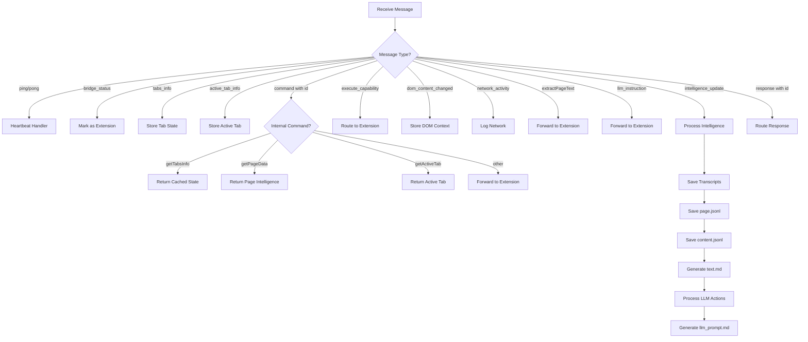

# ws_server.py - Complete Architecture Documentation

**File**: `/Users/andy7string/Projects/Om_E_Web/om_e_web_ws/ws_server.py`
**Purpose**: WebSocket server that acts as central communication bridge between Chrome Extension, test clients, and LLM systems
**Lines**: 3720
**Language**: Python 3 (asyncio-based)

---

## Table of Contents

1. [System Overview](#system-overview)
2. [Global State Management](#global-state-management)
3. [Core Architecture Patterns](#core-architecture-patterns)
4. [Function Reference](#function-reference)
5. [Message Flow Diagrams](#message-flow-diagrams)
6. [Data Transformation Pipeline](#data-transformation-pipeline)
7. [Integration Points](#integration-points)

---

## System Overview

### Purpose

The WebSocket server serves as the **central nervous system** of Om_E_Web, providing:

1. **Bidirectional Communication Bridge**: Routes messages between:
   - Chrome Extension (MV3) ↔ Server
   - Test Clients ↔ Server ↔ Extension
   - LLM Systems ↔ Server ↔ Extension

2. **Intelligence Data Processing**: Transforms raw DOM data into LLM-optimized artifacts:
   - `page.jsonl` - Ordered JSONL with meta, sections, text, actions
   - `content.jsonl` - Cleaned content structure
   - `text.md` - Human-readable transcript
   - `llm_actions.json` - ActionId → metadata lookup
   - `llm_prompt.md` - Compact LLM prompt with categorized actions
   - `transcripts/*.md` - Long-form transcripts (YouTube, etc.)

3. **Artifact Generation**: Creates 5 layers of data transformation from raw extension data to LLM-ready prompts

4. **State Management**: Maintains current browser state (tabs, active page, capabilities)

### Architecture Diagram

```
┌─────────────────┐         ┌──────────────────┐         ┌─────────────────┐
│ Chrome Extension│◄───────►│   ws_server.py   │◄───────►│  Test Clients   │
│   (content.js)  │   WS    │   Port 17892     │   WS    │  (Python/LLM)   │
└─────────────────┘         └──────────────────┘         └─────────────────┘
                                     │
                                     ▼
                            ┌─────────────────┐
                            │  Artifact Files │
                            │  @site_structures/│
                            │  - page.jsonl    │
                            │  - content.jsonl │
                            │  - text.md       │
                            │  - llm_actions.json│
                            │  - llm_prompt.md │
                            │  - transcripts/*.md│
                            └─────────────────┘
```

---

## Global State Management

### Connection State

```python
CLIENTS = set()                    # All connected WebSocket clients
EXTENSION_WS = None               # Reference to Chrome extension client
PENDING = {}                      # Command ID → Future mapping for responses
COMMAND_CLIENTS = {}              # Command ID → Client mapping for routing
```

**Purpose**: Track active WebSocket connections and route messages between clients.

**Lifecycle**:
- `CLIENTS`: Added on connect in `handler()`, removed in `finally` block
- `EXTENSION_WS`: Set to first client, or client sending `bridge_status` message
- `PENDING`: Populated by `send_command()`, resolved when response arrives
- `COMMAND_CLIENTS`: Populated when forwarding commands, cleared on response

### Browser State

```python
CURRENT_TABS_INFO = None           # Latest tabs_info from extension
LAST_TABS_UPDATE = None            # Timestamp of last update
CURRENT_ACTIVE_TAB = None          # Current active tab information
```

**Purpose**: Cache current browser state for external queries (via `getTabsInfo`, `getActiveTab`).

**Updated by**: `tabs_info` and `active_tab_info` messages from extension

**Accessed by**:
- `get_current_tabs_info()` - Returns all tabs
- `get_current_active_tab()` - Returns active tab only
- `save_intelligence_to_page_jsonl()` - Enriches artifacts with browser state

### Intelligence State

```python
CURRENT_PAGE_DATA = None           # Latest page intelligence (actionable elements)
LAST_PAGE_UPDATE = None            # Timestamp of last update
CURRENT_CONTENT_DATA = None        # Latest page content structure
LAST_CONTENT_UPDATE = None         # Timestamp of last content update
CURRENT_TRANSCRIPTS_INFO = []      # List of saved transcript references
```

**Purpose**: Cache processed intelligence data for external access.

**Updated by**:
- `save_intelligence_to_page_jsonl()` - Updates `CURRENT_PAGE_DATA`
- `save_content_to_content_jsonl()` - Updates `CURRENT_CONTENT_DATA`
- `save_transcripts()` - Updates `CURRENT_TRANSCRIPTS_INFO`

**Accessed by**:
- `get_current_page_data()` - Returns page intelligence
- `get_current_content_data()` - Returns content structure

### Site Configuration State

```python
SITE_CONFIGS = {}                  # Loaded site configurations with capabilities
```

**Purpose**: Store site-specific configurations loaded from `web_extension/site_configs.json`.

**Loaded by**: `load_site_configs()` on server startup

**Used by**: `resolve_capabilities_for_url()` to dynamically add capabilities to `llm_prompt.md`

### File System State

```python
SITE_STRUCTURES_DIR = "@site_structures"
CURRENT_PAGE_JSONL = "page.jsonl"
CURRENT_CONTENT_JSONL = "content.jsonl"
TRANSCRIPTS_DIR = os.path.join(SITE_STRUCTURES_DIR, "transcripts")
VIDEO_HISTORY_JSONL = os.path.join(TRANSCRIPTS_DIR, "video_history.jsonl")
```

**Purpose**: Define artifact storage locations.

**File Structure**:
```
@site_structures/
├── page.jsonl              # Current page intelligence
├── content.jsonl           # Current page content
├── text.md                 # Human-readable transcript
├── llm_actions.json        # ActionId → metadata lookup
├── llm_prompt.md           # LLM-optimized prompt
└── transcripts/
    ├── video_history.jsonl # Transcript metadata history
    └── *.md                # Individual transcript files
```

---

## Core Architecture Patterns

### 1. Message Routing Pattern

**Bidirectional Routing**: Server acts as transparent bridge between clients.

```
Test Client → Server → Extension
Extension → Server → Test Client
```

**Implementation**:
- Commands from test clients include `"id"` field
- Server stores `COMMAND_CLIENTS[msg["id"]] = ws` to track sender
- Extension response includes same `"id"` field
- Server routes response back using `COMMAND_CLIENTS[msg["id"]]`

**Code**: Lines 3286-3506 in `handler()`

### 2. Future-based Command Pattern

**Internal Server Commands**: Server sends commands to extension and waits for responses.

```python
async def send_command(command, params=None, timeout=8.0):
    cid = f"cmd-{uuid.uuid4().hex[:8]}"
    fut = asyncio.get_event_loop().create_future()
    PENDING[cid] = fut
    await EXTENSION_WS.send(json.dumps({"id": cid, "command": command, "params": params}))
    result = await asyncio.wait_for(fut, timeout=timeout)
    return result
```

**Flow**:
1. Generate unique command ID
2. Create future, store in `PENDING`
3. Send command to extension
4. Wait for response (blocks until future resolved)
5. Response handler resolves future with `fut.set_result(msg)`

**Code**: Lines 3522-3575

### 3. Intelligence Data Pipeline

**5-Layer Transformation**: Raw extension data → LLM-ready artifacts.

```
Layer 1: Extension Intelligence Update
         ↓
Layer 2: save_intelligence_to_page_jsonl()
         → page.jsonl (JSONL with meta, sections, actions)
         ↓
Layer 3: save_content_to_content_jsonl()
         → content.jsonl (cleaned content structure)
         ↓
Layer 4: process_actionable_elements_for_llm()
         → llm_actions.json (actionId mapping)
         ↓
Layer 5: generate_llm_prompt()
         → llm_prompt.md (compact prompt with categories)
```

**Trigger**: `intelligence_update` message from extension

**Code**: Lines 2987-3076 in `handler()`

### 4. Shortcut Normalization Pattern

**Client Sugar Syntax**: Convert convenient client commands to standard message format.

```python
# Shortcut: {"type": "click", "actionId": "a_id_123"}
# Normalized: {"type": "llm_instruction", "data": {"actionId": "a_id_123", "actionType": "click"}}
```

**Supported Shortcuts**:
- `exec_action` → `llm_instruction`
- `set_value` → `llm_instruction` with `actionType: "setValue"`
- `click` → `llm_instruction` with `actionType: "click"`
- `navigate_link` → `llm_instruction` with `actionType: "navigate"`
- `navigate_url` → `navigate` command

**Code**: Lines 2883-2938 in `handler()`

### 5. Capability Resolution Pattern

**Dynamic Capability Loading**: Resolve capabilities from URL at prompt generation time.

```python
def resolve_capabilities_for_url(url: str) -> list:
    # 1. Find matching site config by domain
    # 2. Extract capabilities from config
    # 3. Filter by url_pattern
    # 4. Return list of matching capabilities
```

**Integration**: Called in `generate_llm_prompt()` to inject capabilities into prompt.

**Code**: Lines 3594-3658

---

## Function Reference

### File System Functions

#### `slugify(value: str) -> str`
**Lines**: 72-81
**Purpose**: Create filesystem-friendly slugs for transcript filenames
**Input**: String value (e.g., "Global Takedown: Australian Laws")
**Output**: Slugified string (e.g., "global-takedown-australian-laws")
**Algorithm**:
1. Convert to lowercase
2. Replace non-alphanumeric characters with `-`
3. Collapse multiple dashes
4. Strip leading/trailing dashes

**Used by**: `save_transcripts()` to create filename for transcript markdown files

---

### Data Consolidation Functions

#### `consolidate_actionable_elements_to_menus(actionable_elements)`
**Lines**: 83-187
**Purpose**: **LEGACY FUNCTION** - Consolidate raw actionable elements into clean menu structure
**Status**: Replaced by normalized records in `save_intelligence_to_page_jsonl()`
**Input**: List of actionable elements from extension
**Output**: Dictionary with `menus` array and `summary` stats
**Algorithm**:
1. Categorize elements by type (navigation, toggle, action, content)
2. Build main navigation menu with items and toggles
3. Return consolidated structure with summary

**Called by**: `save_intelligence_to_page_jsonl()` as fallback when `normalizedRecords` not available

**Data Flow**:
```
actionable_elements (raw) → categorize by type → build menu structure → return consolidated
```

#### `consolidate_content_elements_to_structure(content_elements)`
**Lines**: 189-330
**Purpose**: **LEGACY FUNCTION** - Consolidate raw content elements into clean content structure
**Status**: Replaced by normalized records in content.jsonl
**Input**: List of content elements from extension
**Output**: Dictionary with `content_structure` and `summary` stats
**Algorithm**:
1. Categorize by content type (headings, paragraphs, lists, images, tables)
2. Extract relevant fields for each category
3. Build structured hierarchy
4. Return with summary statistics

**Called by**: `save_content_to_content_jsonl()` as fallback

---

### Intelligence Persistence Functions

#### `save_intelligence_to_page_jsonl(intelligence_data, transcript_refs=None)`
**Lines**: 332-454
**Purpose**: **CORE FUNCTION** - Save intelligence data to central page.jsonl file
**Input**:
- `intelligence_data`: Intelligence update data from extension
- `transcript_refs`: Optional list of transcript references

**Output**: File path of saved page.jsonl, or None on error

**Side Effects**:
- Updates `CURRENT_PAGE_DATA` global
- Updates `LAST_PAGE_UPDATE` timestamp
- Writes to `@site_structures/page.jsonl`

**Algorithm**:

**Modern Path (normalizedRecords available)**:
1. Extract `normalizedRecords` from intelligence data
2. Enrich records with browser state and transcript refs
3. Insert meta record if not present
4. Write records as JSONL (one JSON object per line)
5. Update global state

**Legacy Path (no normalizedRecords)**:
1. Consolidate actionable elements into menus
2. Build page data dictionary with consolidated structure
3. Write as single JSON object
4. Update global state

**Data Enrichment**:
```python
meta_record = {
    "type": "meta",
    "browser_state": {
        "total_tabs": len(CURRENT_TABS_INFO),
        "active_tab": CURRENT_ACTIVE_TAB,
        "extension_connected": EXTENSION_WS is not None
    },
    "current_page": {
        "url": active_tab.url,
        "title": active_tab.title,
        "is_active_tab": True
    },
    "transcripts": transcript_refs
}
```

**Called by**: `handler()` when processing `intelligence_update` message

#### `save_content_to_content_jsonl(intelligence_data, transcript_refs=None)`
**Lines**: 456-526
**Purpose**: Save content data to central content.jsonl file
**Input**: Same as `save_intelligence_to_page_jsonl()`
**Output**: File path or None
**Side Effects**:
- Updates `CURRENT_CONTENT_DATA` global
- Updates `LAST_CONTENT_UPDATE` timestamp
- Writes to `@site_structures/content.jsonl`

**Algorithm**:
1. Get browser state
2. Consolidate content elements into structure
3. Build content data dictionary
4. Write to content.jsonl
5. Update global state
6. Print summary statistics

**Data Structure**:
```json
{
  "timestamp": 1234567890.123,
  "browser_state": {...},
  "current_page": {...},
  "content_structure": {
    "headings": [...],
    "paragraphs": [...],
    "lists": [...],
    "images": [...],
    "tables": [...]
  },
  "summary": {
    "total_content_elements": 150,
    "headings": 12,
    "paragraphs": 80,
    "lists": 5,
    "images": 3,
    "tables": 0
  }
}
```

**Called by**: `handler()` when processing `intelligence_update` message

---

### Transcript Management Functions

#### `_ensure_video_history_file()`
**Lines**: 529-535
**Purpose**: Ensure video_history.jsonl file exists
**Side Effects**: Creates file and parent directory if needed
**Called by**: `_append_video_history_entry()`

#### `_load_video_history_entries() -> List[Dict]`
**Lines**: 538-554
**Purpose**: Load historical transcript metadata from video_history.jsonl
**Output**: List of video history entries (one per transcript)
**Error Handling**: Returns empty list on file read errors
**Called by**: `_collect_existing_transcript_signatures()`

#### `_append_video_history_entry(entry: Dict[str, Any])`
**Lines**: 557-561
**Purpose**: Append a JSON line entry to video history file
**Input**: Dictionary with keys: `timestamp`, `video_id`, `video_url`, `title`, `segments`, `file`, `signature`
**Side Effects**: Appends to `video_history.jsonl`
**Called by**: `save_transcripts()`

#### `_collect_existing_transcript_signatures() -> Dict[str, Optional[str]]`
**Lines**: 564-610
**Purpose**: **DEDUPLICATION** - Gather known transcript signatures to avoid duplicates
**Output**: Dictionary mapping `signature → video_id`
**Algorithm**:
1. Load entries from `video_history.jsonl`
2. Scan existing transcript markdown files
3. Extract signatures from embedded comments `<!-- signature: ... -->`
4. Build fallback signatures for legacy files without embedded signatures
5. Return combined signature map

**Signature Format**: `{video_id}:{segment_count}:{sha256_hash}`

**Called by**: `save_transcripts()` to check if transcript already exists

#### `_build_transcript_signature(video_id: Optional[str], segments: List[Dict]) -> Optional[str]`
**Lines**: 613-625
**Purpose**: Create stable signature for transcript payload
**Input**:
- `video_id`: YouTube video ID or other identifier
- `segments`: List of transcript segments

**Output**: Signature string or None if no segments

**Algorithm**:
1. Sample first 3 and last 3 segments
2. Build sample string from timeText and text (first 120 chars)
3. Combine: `{video_id}|{segment_count}|{sample_str}`
4. SHA256 hash the combined string
5. Return: `{video_id}:{segment_count}:{hash}`

**Purpose**: Detect duplicate transcripts even if metadata differs slightly

**Called by**: `save_transcripts()`

#### `save_transcripts(transcripts, page_state=None)`
**Lines**: 628-743
**Purpose**: **CORE FUNCTION** - Persist transcript payloads to disk with deduplication
**Input**:
- `transcripts`: List of transcript objects from extension
- `page_state`: Optional page state for default title

**Output**: List of saved transcript references (for embedding in page.jsonl)

**Side Effects**:
- Updates `CURRENT_TRANSCRIPTS_INFO` global
- Writes markdown files to `@site_structures/transcripts/`
- Appends to `video_history.jsonl`

**Algorithm**:
1. Load existing signatures for deduplication
2. For each transcript:
   - Build signature
   - Skip if signature already exists
   - Extract title/video_id/url
   - Create slugified filename: `YYYY-MM-DD__slug.md`
   - Write markdown with embedded signature
   - Append to video history
3. Return list of saved references

**Markdown Format**:
```markdown
<!-- signature: video_id:123:abc123... -->
# Video Title

**Video URL:** https://youtube.com/watch?v=...
**Video ID:** video_id
**Language:** en
**Collected At:** 2025-11-23T10:30:00Z
**Segments:** 123

---

- [00:00] First segment text
- [00:05] Second segment text
...
```

**Called by**: `handler()` when processing `intelligence_update` message (before page.jsonl)

**Deduplication Strategy**: Signature-based - prevents saving same transcript twice even if collected at different times

---

### LLM Processing Functions

#### `process_actionable_elements_for_llm(actionable_elements: List[Dict]) -> Optional[Dict]`
**Lines**: 745-815
**Purpose**: Transform actionable elements into LLM-friendly format with action mappings
**Input**: List of actionable elements from extension
**Output**: Dictionary mapping `actionId → metadata`, or None on error

**Side Effects**:
- Writes to `@site_structures/llm_actions.json`
- Calls `clear_llm_actions()` if no elements

**Algorithm**:
1. Get current page context (URL, title)
2. For each element:
   - Extract actionId, actionType, description, selectors
   - Build LLM instruction: `"Use actionId '{actionId}' to {actionType} with this element"`
   - Include page context
3. Add `_page_context` metadata with URL, timestamp, total actions
4. Write to llm_actions.json

**Output Format**:
```json
{
  "_page_context": {
    "url": "https://youtube.com/watch?v=...",
    "title": "Video Title",
    "timestamp": 1234567890.123,
    "total_actions": 42,
    "active_tab_id": 123
  },
  "a_id_1": {
    "action_type": "click",
    "description": "Show transcript",
    "tag_name": "button",
    "selectors": ["button[aria-label='Show transcript']"],
    "llm_instruction": "Use actionId 'a_id_1' to click with this element",
    "page_url": "https://youtube.com/...",
    "page_title": "Video Title"
  }
}
```

**Called by**: `handler()` when processing `intelligence_update` message

#### `save_page_text_to_markdown(text_data)`
**Lines**: 817-862
**Purpose**: Save extracted page text to markdown file
**Input**: Text extraction data from extension with `frontmatter`, `markdown`, `statistics`
**Output**: File path or None
**Side Effects**: Writes to `@site_structures/{hostname}_page_text.md`

**Algorithm**:
1. Extract URL from frontmatter
2. Parse hostname from URL
3. Generate filename: `{hostname}_page_text.md`
4. Write markdown content to file
5. Print statistics (headings, paragraphs, lists)

**Called by**: Response handler for `extractPageText` commands

**Note**: This is **different** from `text.md` which is auto-generated from intelligence updates

#### `clear_llm_actions() -> Optional[str]`
**Lines**: 864-903
**Purpose**: Create empty llm_actions.json when no actionable elements available
**Output**: File path or None
**Side Effects**: Writes to `@site_structures/llm_actions.json`

**Algorithm**:
1. Get current page context
2. Create empty actions structure with `_page_context` only
3. Set `status: "no_actionable_elements"`
4. Write to llm_actions.json

**Called by**: `process_actionable_elements_for_llm()` when element list is empty

#### `store_dom_change_context(dom_change_data)`
**Lines**: 905-937
**Purpose**: Store DOM change context for LLM consumption
**Input**: DOM change notification data from extension
**Output**: None
**Side Effects**: **DISABLED** - File writing commented out to reduce noise

**Algorithm**:
1. Create change context entry with timestamp, mutations, change types
2. **DISABLED**: Write to dom_change_history.jsonl
3. Only log significant changes (>5 mutations)

**Called by**: `handler()` when processing `dom_content_changed` message

**Status**: Currently disabled due to noise - DOM changes are frequent and less useful for LLM context

---

### LLM Prompt Generation Functions

#### `_format_table_row_label(record: Dict[str, Any]) -> Dict[str, Optional[str]]`
**Lines**: 941-997
**Purpose**: **GENERIC** - Derive human-friendly label for table/list rows (works for Gmail, etc.)
**Input**: Record dictionary with `textContent`, `selectors`, etc.
**Output**: Dictionary with `display`, `sender`, `subject`, `time`, `preview`, `raw`

**Algorithm**:
1. Clean text content (collapse whitespace, remove \xa0)
2. Split by commas to extract parts
3. Identify sender, subject, time, preview based on patterns
4. Skip tokens like "unread", "read", "starred"
5. Build display label: `{sender} — {subject} ({time}) — {preview}`
6. Truncate to 200 characters

**Example**:
```
Input: "unread, John Doe, Project Update, 10:30 AM, Let's discuss the new features..."
Output: {
  "display": "John Doe — Project Update (10:30 AM) — Let's discuss the new features...",
  "sender": "John Doe",
  "subject": "Project Update",
  "time": "10:30 AM",
  "preview": "Let's discuss the new features..."
}
```

**Called by**: `_map_prompt_action_sentence()` for table rows with `role="row"`

#### `_map_prompt_action_sentence(record: Dict[str, Any]) -> Optional[str]`
**Lines**: 999-1085
**Purpose**: **CORE FUNCTION** - Convert normalized record to LLM prompt sentence
**Input**: Normalized record from page.jsonl
**Output**: Prompt sentence string, or None if record should be filtered

**Algorithm**:

**Step 1: Visibility Filtering**
- Skip `visibility="hidden"` elements UNLESS:
  - Interactive table/list rows (`tr[role="row"]`, `li[role="listitem"]`)
  - Input/textarea elements (ChatGPT, Perplexity, Claude hidden inputs)
  - Accessibility links with meaningful labels (skip to content, etc.)
  - Video links (YouTube `/watch?v=` pattern)

**Step 2: Action Type Detection**
- Extract `actionId`, `tag`, `actionTypes`, `controlType`, `role`, `label`
- Check attributes for detailed classification

**Step 3: Table Row Formatting (GENERIC)**
```python
if tag == "tr" and role == "row":
    row_info = _format_table_row_label(record)
    display_label = row_info["display"]
    return f"return ({actionId}) to click '{display_label}'"
```

**Step 4: Input Elements**
```python
if tag in {"input", "textarea"} or controlType == "input":
    return f"return ({actionId},{{yourValue}}) to set value for '{label}'. Add submit:true to submit."
```

**Step 5: Navigation Links**
```python
if tag == "a" or "navigate" in actionTypes:
    return f"return ({actionId}) to navigate to '{label}'"
```

**Step 6: Buttons**
```python
if tag == "button" or "click" in actionTypes:
    return f"return ({actionId}) to click '{label}'"
```

**Step 7: Generic Interaction**
```python
return f"return ({actionId}) to interact with '{label}'"
```

**Called by**: `generate_llm_prompt()` for each normalized record

**Examples**:
```
Input (button): {type: "action", tag: "button", label: "Show transcript", id: "a_id_1"}
Output: "return (a_id_1) to click 'Show transcript'"

Input (input): {type: "action", tag: "input", label: "Search", id: "a_id_2"}
Output: "return (a_id_2,{yourValue}) to set value for 'Search'. Add submit:true to submit."

Input (link): {type: "action", tag: "a", label: "Home", id: "a_id_3"}
Output: "return (a_id_3) to navigate to 'Home'"

Input (table row): {type: "action", tag: "tr", role: "row", textContent: "John Doe, Project Update, 10:30 AM"}
Output: "return (a_id_4) to click 'Email: John Doe — Project Update (10:30 AM)'"
```

#### `generate_llm_prompt(text_md_path, page_jsonl_path, out_path, max_actions=MAX_ACTIONS)`
**Lines**: 1087-1451
**Purpose**: **CORE FUNCTION** - Generate compact LLM prompt with smart categorization
**Input**:
- `text_md_path`: Path to text.md (for title extraction)
- `page_jsonl_path`: Path to page.jsonl (for actions)
- `out_path`: Output path for llm_prompt.md
- `max_actions`: Maximum actions to include (from config.py)

**Output**: File path of generated prompt, or None on error

**Side Effects**: Writes to `@site_structures/llm_prompt.md`

**Algorithm**:

**Phase 1: Load Data**
1. Read text.md to extract title
2. Read page.jsonl line by line
3. Extract meta record for URL, title, transcript refs
4. Convert each record to prompt sentence using `_map_prompt_action_sentence()`

**Phase 2: Deduplication**
- Use set to track seen action lines
- Preserve order while removing duplicates

**Phase 3: Smart Categorization (GENERIC - works for all sites)**
```python
categories = {
    'search_inputs': [],      # Search boxes
    'transcript_actions': [], # Transcript buttons/segments
    'video_links': [],        # Links with /watch?v= pattern
    'channel_links': [],      # Links with /@ or /channel/ pattern
    'footer_links': [],       # About, Terms, Privacy, etc.
    'regular_actions': [],    # Everything else
    'email_actions': []       # Table rows (Gmail, etc.)
}
```

**Categorization Rules**:
- **Search**: `'search' in label or placeholder or aria-label`
- **Transcript**: `'transcript' in label or 'ytd-transcript' in selector`
- **Email**: `tag == 'tr' and role == 'row'`
- **Video**: `'/watch?v=' in href`
- **Channel**: `'/@' in href or '/channel/' in href`
- **Footer**: Label matches keywords (about, terms, privacy, etc.)
- **Regular**: Everything else

**Phase 4: Capability Resolution**
```python
capabilities = resolve_capabilities_for_url(page_url)
```
- Dynamically inject capabilities from site_configs.json
- Filter by `url_pattern` to match current URL

**Phase 5: Build Prompt Structure**
```markdown
# Page Title

**URL:** https://example.com/page

## Actions

### Search
- return (a_id_1,{yourValue}) to set value for 'Search'. Add submit:true to submit.

### Capabilities
- return (RetrieveTranscript) to retrieve video transcript

### Transcript
- return (a_id_2) to click 'Show transcript'

### Emails
- return (a_id_3) to click 'Email: John Doe — Project Update (10:30 AM)'

### Videos
- return (a_id_4) to navigate to 'Video Title'

### Channels
- return (a_id_5) to navigate to 'Channel Name'

### Other Actions
- return (a_id_6) to click 'Subscribe'

### Footer
- return (a_id_7) to navigate to 'About'
- return (a_id_8) to navigate to 'Terms'

## Transcript Files
- Video Title (123 segments): @site_structures/transcripts/2025-11-23__video-title.md
```

**Phase 6: Write Output**
- Join all parts with newlines
- Write to llm_prompt.md

**Called by**: `handler()` when processing `intelligence_update` message

**Key Design Decisions**:
1. **Generic categorization** - Works for ANY site, not just YouTube
2. **Pattern-based detection** - Uses href patterns, label keywords, role attributes
3. **Priority ordering** - Search first, footer last, capabilities prominent
4. **Compact format** - No duplicate transcript content (available in text.md)
5. **Dynamic capabilities** - Resolved at generation time from URL

---

### State Query Functions

#### `get_current_tabs_info()`
**Lines**: 1453-1474
**Purpose**: Get latest tab information for external access
**Output**: Dictionary with `tabs`, `last_update`, `extension_connected`, `total_clients`
**Called by**: `handler()` when processing `getTabsInfo` command

#### `get_current_page_data()`
**Lines**: 1476-1498
**Purpose**: Get latest page intelligence data
**Output**: Dictionary with `page_data`, `last_update`, `total_elements`, `browser_state`
**Called by**: `handler()` when processing `getPageData` command

#### `get_current_content_data()`
**Lines**: 1500-1522
**Purpose**: Get latest page content data
**Output**: Dictionary with `content_data`, `last_update`, `total_content_elements`, `browser_state`
**Called by**: `handler()` when processing `getContentData` command

#### `get_current_active_tab()`
**Lines**: 1524-1582
**Purpose**: Get current active tab information
**Output**: Dictionary with `active_tab`, `last_update`, `total_tabs`, `source`

**Algorithm**:
1. **Preferred**: Use `CURRENT_ACTIVE_TAB` if available (from `active_tab_info` message)
2. **Fallback**: Search `CURRENT_TABS_INFO` for tab with `active: true`
3. **Error**: Return error if no tab info available

**Source Field**: Indicates which method was used (`"active_tab_info_message"` or `"tabs_info_fallback"`)

**Called by**: `handler()` when processing `getActiveTab` command

---

### Site Map Processing Functions (LEGACY - Not actively used)

#### `save_site_map_to_jsonl(site_map_data, suffix="")`
**Lines**: 1584-1619
**Purpose**: **LEGACY** - Save site map data to JSONL file
**Status**: Replaced by normalized records system
**Input**: Site map data from extension, optional suffix (e.g., `"_clean"`)
**Output**: File path or None

#### `process_clean_site_map(raw_file_path)`
**Lines**: 1621-1707
**Purpose**: **LEGACY** - Process raw site map into LLM-friendly format
**Status**: Replaced by enhanced classification pipeline
**Input**: Path to _clean.jsonl file
**Output**: Tuple of `(processed_data, mapping_data, success_status)`

#### `process_clean_site_map_data(raw_data)`
**Lines**: 1709-1903
**Purpose**: **ENHANCED** - Process raw site map with classification and filtering
**Input**: Raw site map data dictionary
**Output**: Tuple of `(processed_data, mapping_data, success_status)`

**Algorithm**:
1. Extract interactive elements from raw data
2. Apply deduplication (`deduplicate_elements()`)
3. Filter non-interactive elements (`filter_non_interactive_elements()`)
4. Apply enhanced classification (`classify_element_enhanced()`)
5. Build processed elements with classification data
6. Generate statistics

**Enhancement Pipeline**:
```
Raw elements → Deduplicate → Filter → Classify → Process → Statistics
```

**Called by**: `handler()` when processing site map responses (auto-processing)

#### `siteStructuredLLMmethodinsidethefile(filepath)`
**Lines**: 1905-2192
**Purpose**: **POST-PROCESSING** - Remove unnecessary fields and create smaller file
**Input**: Path to processed file
**Output**: True on success, False on failure

**Algorithm**:

**Step 1: Clean Metadata**
- Keep only `url` and `title`
- Remove verbose fields (pathname, search, hash, protocol, timestamp)

**Step 2: Remove Statistics**
- Delete entire `statistics` section

**Step 3: Consolidate Elements**
- Merge `pageStructure` data into `elements` array
- Add headings as consolidated elements
- Add forms and form inputs as consolidated elements
- Remove redundant `pageStructure` section

**Step 4: Enhanced Element Filtering**
- Score elements based on enhanced classification
- Filter by confidence thresholds:
  - Keep if `overall_confidence >= 0.7`
  - Keep search elements regardless of confidence
  - Keep interactive with `confidence >= 0.5`
  - Keep navigation with `confidence >= 0.5`
  - Keep all form elements
  - Keep content with `content_quality >= 0.4`
  - Keep high accessibility (`accessibility_score >= 0.6`)

**Step 5: Write Cleaned File**
- Save to `{original}_cleaned.jsonl`
- Print size reduction statistics

**Called by**: `handler()` when auto-processing site maps

**Output**:
```
Original: 1234 elements, 2,500,000 bytes
Cleaned:  456 elements, 800,000 bytes
Reduction: 68% size reduction
```

---

### Enhanced Element Classification Functions

#### `classify_element_enhanced(element_data)`
**Lines**: 2195-2504
**Purpose**: **ADVANCED** - Enhanced element classification using browser-use techniques
**Input**: Raw element data dictionary
**Output**: Classification dictionary with confidence scores

**Classification Factors**:

**1. Interactive Element Detection (strict selectors)**
- Button tags, form inputs, selects, textareas
- Links with real hrefs (not `#` or `javascript:`)
- ARIA roles (button, link, menuitem, textbox, etc.)
- Event handlers (onclick, etc.)

**2. Accessibility Property Analysis**
- aria-label, aria-describedby, title, alt
- Proper labeling (for, aria-labelledby)

**3. Search Element Detection**
- Class names: search, magnify, glass, lookup, find
- IDs: search-box, search-btn, etc.
- Data attributes with search indicators
- Text content with search-related terms

**4. Content Quality Assessment**
- Text length scoring (>100, >50, >20, >5 chars)
- Meaningful patterns (words 3+ chars, numbers, proper nouns)

**5. Functional Importance Analysis**
- Navigation indicators (nav, menu, breadcrumb)
- Form indicators (form, input, select, button)
- Link quality (real vs placeholder)

**6. Visibility Score**
- Valid coordinates (width/height > 0)
- Adequate size (width > 30, height > 10)
- Not hidden (no `hidden` or `aria-hidden="true"`)

**Output Structure**:
```python
{
    'is_interactive': bool,                    # True if interactive_score >= 0.6
    'interactivity_confidence': float,         # 0.0 to 1.0
    'element_category': str,                   # search_element, navigation_element, form_element, etc.
    'accessibility_score': float,              # 0.0 to 1.0
    'search_relevance': float,                 # 0.0 to 1.0
    'content_quality': float,                  # 0.0 to 1.0
    'functional_importance': float,            # 0.0 to 1.0
    'visibility_score': float,                 # 0.0 to 1.0
    'overall_confidence': float,               # Weighted combination of all scores
    'classification_reasons': List[str]        # Human-readable reasons
}
```

**Overall Confidence Weighting**:
```python
overall_confidence = (
    interactive_score * 0.3 +
    accessibility_score * 0.15 +
    search_relevance * 0.2 +
    content_quality * 0.15 +
    functional_importance * 0.1 +
    visibility_score * 0.1
)
```

**Element Category Determination**:
- `search_element`: `interactive_score >= 0.7` AND `search_relevance >= 0.6`
- `navigation_element`: `interactive_score >= 0.7` AND `functional_importance >= 0.4`
- `form_element`: `interactive_score >= 0.7` AND element type is form/input
- `interactive_element`: `interactive_score >= 0.7`
- `heading_element`: Element type is heading
- `content_element`: `content_quality >= 0.4`
- `functional_element`: `functional_importance >= 0.3`

**Called by**: `process_clean_site_map_data()` for each element

#### `_matches_interactive_pattern(element_data, pattern)`
**Lines**: 2507-2542
**Purpose**: Helper to check if element matches interactive pattern
**Input**: Element data, pattern dictionary
**Output**: Boolean

**Pattern Structure**:
```python
{
    'tag': 'button',              # Optional: must match tag
    'attr': 'type',               # Optional: attribute name
    'value': 'submit',            # Optional: attribute value
    'has_href': True,             # Optional: must have href
    'not_placeholder': True,      # Optional: href must not be # or javascript:
    'score': 0.9                  # Confidence score if matched
}
```

**Called by**: `classify_element_enhanced()`

#### `deduplicate_elements(elements)`
**Lines**: 2545-2611
**Purpose**: Remove duplicate elements based on content and position
**Input**: List of element dictionaries
**Output**: Deduplicated list

**Algorithm**:
1. For each element, create deduplication key:
   - Real links: `"link:{href}"`
   - Text elements: `"text:{text}:{normalized_selector}"`
   - Other: `"type:{element_type}:{selector}"`
2. Track seen elements in dictionary
3. On duplicate, compare and keep better element
4. Return deduplicated list

**Deduplication Key Examples**:
```
Link: "link:https://example.com/page"
Text: "text:Click me:.button.primary"
Other: "type:button:#submit-btn"
```

**Called by**: `process_clean_site_map_data()`

#### `_normalize_selector(selector)`
**Lines**: 2614-2635
**Purpose**: Normalize CSS selector for better deduplication
**Input**: CSS selector string
**Output**: Normalized selector

**Normalization Rules**:
- Remove `:nth-child(N)` selectors
- Remove specific IDs (`#id-123`)
- Normalize common class patterns

**Examples**:
```
Input:  "div:nth-child(3) > button#btn-123.primary"
Output: "div > button.primary"
```

**Called by**: `deduplicate_elements()`

#### `_should_keep_existing_element(existing, new_element)`
**Lines**: 2638-2680
**Purpose**: Determine which element to keep when duplicates found
**Input**: Existing element, new element
**Output**: True if existing should be kept, False if new should replace

**Priority Order**:
1. Real hrefs over placeholder hrefs (`#`)
2. More specific selectors (shorter = more specific)
3. More content (longer text)
4. Default: keep existing

**Called by**: `deduplicate_elements()`

#### `filter_non_interactive_elements(elements)`
**Lines**: 2683-2707
**Purpose**: Filter out elements that aren't truly interactive
**Input**: List of elements
**Output**: Filtered list

**Algorithm**:
1. For each element, check `_is_truly_interactive()`
2. Keep only truly interactive elements
3. Return filtered list

**Called by**: `process_clean_site_map_data()`

#### `_is_truly_interactive(element)`
**Lines**: 2710-2774
**Purpose**: Check if element is truly interactive
**Input**: Element dictionary
**Output**: Boolean

**Interactive Criteria** (OR logic - any one is sufficient):
1. Real href (not `#`, not `javascript:`)
2. Interactive tag (button, input, select, textarea, a)
3. Interactive ARIA role (button, link, menuitem, textbox, etc.)
4. Event handlers (onclick, etc.)
5. Interactive attributes (`type="button"`, etc.)
6. Clickable class names (button, click, btn, link, nav)

**Called by**: `filter_non_interactive_elements()`

#### `calculate_element_importance_score(element)`
**Lines**: 2777-2845
**Purpose**: **FALLBACK** - Calculate importance score for elements without enhanced classification
**Input**: Element dictionary
**Output**: Float score 0.0 to 1.0

**Scoring Factors**:
- **Element Type** (40%): interactive > heading > form > other
- **Content Quality** (20%): Long text > medium > short
- **Functionality** (15%): Real link > placeholder
- **Context Relevance** (10%): Navigation, main content, interaction
- **Selector Quality** (5%): YouTube-specific, meaningful patterns

**Called by**: `siteStructuredLLMmethodinsidethefile()` when enhanced classification not available

---

### WebSocket Handler Functions

#### `handler(ws)`
**Lines**: 2847-3520
**Purpose**: **CORE FUNCTION** - WebSocket connection handler for each client
**Input**: WebSocket connection object
**Lifecycle**: Runs for entire client connection duration

**Client Identification**:
1. First client → becomes `EXTENSION_WS`
2. Clients sending `bridge_status` → marked as extension
3. Other clients → test clients

**Message Routing Logic**:



**Shortcut Normalization** (Lines 2883-2938):
- `exec_action` → `llm_instruction`
- `set_value` → `llm_instruction` with setValue
- `click` → `llm_instruction` with click
- `navigate_link` → `llm_instruction` with navigate
- `navigate_url` → navigate command

**Heartbeat Handling** (Lines 2940-2956):
- `ping` → reply with `pong`
- `pong` → acknowledge receipt

**Intelligence Update Processing** (Lines 2987-3102):
1. Extract intelligence data
2. Save transcripts first (for references)
3. Save page.jsonl with transcript refs
4. Save content.jsonl
5. Auto-generate text.md from page text
6. Process actionable elements for LLM
7. Generate llm_prompt.md
8. **BONUS**: Trigger transcript button hunt on YouTube videos

**Capability Execution** (Lines 3104-3145):
1. Extract action and params
2. Forward to extension via `execute_capability` message
3. Return immediate response (async execution)

**Command Forwarding** (Lines 3286-3349):
1. Check if internal command (getTabsInfo, getPageData, etc.)
2. If internal, handle locally and return
3. If external, forward to extension
4. Track sender in `COMMAND_CLIENTS` for response routing

**Response Routing** (Lines 3350-3506):
1. Check if text extraction response → save to markdown
2. Check if LLM instruction response → route back
3. Try to resolve `PENDING` future (for `send_command()` calls)
4. Try to route to original sender via `COMMAND_CLIENTS`
5. **Fallback**: Broadcast to any test client

**Cleanup** (Lines 3507-3520):
1. Remove from `CLIENTS` set
2. Clear `EXTENSION_WS` if extension disconnected
3. Clean up tracked commands from disconnected client

**Called by**: `main()` via `websockets.serve()`

#### `send_command(command, params=None, timeout=8.0)`
**Lines**: 3522-3575
**Purpose**: **INTERNAL** - Send command from server to extension and wait for response
**Input**:
- `command`: Command name
- `params`: Optional parameters dictionary
- `timeout`: Timeout in seconds (default 8.0)

**Output**: Response message dictionary

**Algorithm**:
1. Wait for extension to be identified (up to 1 second)
2. Generate unique command ID: `cmd-{uuid}`
3. Create future and store in `PENDING`
4. Send command to extension
5. Wait for response via future (with timeout)
6. Clean up `PENDING` on timeout/error
7. Return response

**Used by**: Internal server functions that need to query extension state

**Example**:
```python
response = await send_command("getActiveTab")
# Extension receives: {"id": "cmd-abc123", "command": "getActiveTab", "params": {}}
# Extension responds: {"id": "cmd-abc123", "ok": true, "result": {...}}
# Function returns: {"id": "cmd-abc123", "ok": true, "result": {...}}
```

#### `extension_heartbeat_loop()`
**Lines**: 3578-3592
**Purpose**: Periodically ping extension to detect silent disconnects
**Algorithm**:
1. Sleep for `SERVER_HEARTBEAT_INTERVAL` seconds (20s)
2. If extension connected, send `server_ping` message
3. Repeat forever

**Started by**: `main()` via `asyncio.gather()`

**Message Format**:
```json
{
  "type": "server_ping",
  "timestamp": 1234567890.123
}
```

**Purpose**: Detect when extension silently disappears (e.g., browser closed without proper disconnect)

---

### Capability Resolution Functions

#### `resolve_capabilities_for_url(url: str) -> list`
**Lines**: 3594-3658
**Purpose**: **PREMIUM** - Resolve capabilities for given URL from site_configs.json
**Input**: URL string
**Output**: List of capability dictionaries

**Algorithm**:
1. Find matching site config by domain
2. Check `url_patterns` if defined
3. Fallback to domain substring match
4. Extract capabilities from matched config
5. Filter by `url_pattern` to return only matching capabilities
6. Return list with `id`, `action`, `label`, `description`, `handler`, `domain`

**Example**:
```python
url = "https://youtube.com/watch?v=abc123"
capabilities = resolve_capabilities_for_url(url)
# Returns:
# [
#   {
#     'id': 'transcript',
#     'action': 'RetrieveTranscript',
#     'label': 'Retrieve video transcript',
#     'description': 'Get full transcript for current video',
#     'handler': 'YouTubeTranscriptHandler',
#     'domain': 'youtube.com'
#   }
# ]
```

**Called by**: `generate_llm_prompt()` to inject capabilities into prompt

#### `load_site_configs()`
**Lines**: 3660-3689
**Purpose**: Load site_configs.json from extension directory
**Side Effects**: Updates `SITE_CONFIGS` global

**Algorithm**:
1. Build path to `../web_extension/site_configs.json`
2. Load JSON file
3. Store in `SITE_CONFIGS` global
4. Print summary (total domains, total capabilities)

**Called by**: `main()` on server startup

**Error Handling**: Prints warning if file not found, continues without capabilities

---

### Main Server Function

#### `main()`
**Lines**: 3691-3717
**Purpose**: Start WebSocket server and run event loop
**Algorithm**:
1. Load site configs
2. Start WebSocket server on `127.0.0.1:17892`
3. Configure server:
   - `max_size`: 64 MiB frame limit
   - `max_queue`: 128 message queue
   - `ping_interval`: 20s
   - `ping_timeout`: 20s
4. Run forever with:
   - `extension_heartbeat_loop()` - periodic pings
   - `asyncio.Future()` - never resolves (keeps server running)

**Entry Point**: `if __name__ == "__main__": asyncio.run(main())`

---

## Message Flow Diagrams

### Intelligence Update Flow

```
┌─────────────────────────────────────────────────────────────────┐
│ Chrome Extension (content.js)                                   │
│ - IntelligenceEngine scans DOM                                  │
│ - Generates normalizedRecords (JSONL format)                    │
│ - Extracts transcripts (YouTube, etc.)                          │
│ - Sends intelligence_update message                             │
└─────────────────┬───────────────────────────────────────────────┘
                  │
                  ▼
┌─────────────────────────────────────────────────────────────────┐
│ ws_server.py Handler                                            │
│ 1. Receive intelligence_update message                          │
│ 2. Extract intelligence_data, transcripts                       │
└─────────────────┬───────────────────────────────────────────────┘
                  │
                  ▼
┌─────────────────────────────────────────────────────────────────┐
│ save_transcripts(transcripts, page_state)                       │
│ - Build signatures for deduplication                            │
│ - Skip if signature already exists                              │
│ - Write markdown files with embedded signatures                 │
│ - Append to video_history.jsonl                                 │
│ - Return transcript_refs list                                   │
└─────────────────┬───────────────────────────────────────────────┘
                  │
                  ▼ transcript_refs
┌─────────────────────────────────────────────────────────────────┐
│ save_intelligence_to_page_jsonl(intelligence_data, refs)        │
│ - Extract normalizedRecords                                     │
│ - Enrich with browser_state, current_page, transcripts          │
│ - Insert meta record if not present                             │
│ - Write JSONL file (one JSON per line)                          │
│ - Update CURRENT_PAGE_DATA global                               │
└─────────────────┬───────────────────────────────────────────────┘
                  │
                  ▼
┌─────────────────────────────────────────────────────────────────┐
│ save_content_to_content_jsonl(intelligence_data, refs)          │
│ - Consolidate content elements                                  │
│ - Build content_structure (headings, paragraphs, etc.)          │
│ - Write content.jsonl                                            │
│ - Update CURRENT_CONTENT_DATA global                            │
└─────────────────┬───────────────────────────────────────────────┘
                  │
                  ▼
┌─────────────────────────────────────────────────────────────────┐
│ Auto-generate text.md from pageText                             │
│ - Extract page title, URL, timestamp                            │
│ - Write markdown with frontmatter                               │
│ - Save to @site_structures/text.md                              │
└─────────────────┬───────────────────────────────────────────────┘
                  │
                  ▼
┌─────────────────────────────────────────────────────────────────┐
│ process_actionable_elements_for_llm(actionable_elements)        │
│ - Extract actionId, actionType, description                     │
│ - Build LLM instruction strings                                 │
│ - Add page context                                              │
│ - Write llm_actions.json                                        │
└─────────────────┬───────────────────────────────────────────────┘
                  │
                  ▼
┌─────────────────────────────────────────────────────────────────┐
│ generate_llm_prompt(text_path, page_path, prompt_path)          │
│ - Read page.jsonl line by line                                  │
│ - Convert records to prompt sentences                           │
│ - Deduplicate action lines                                      │
│ - Smart categorization (search, transcript, videos, etc.)       │
│ - Resolve capabilities from site_configs.json                   │
│ - Build structured prompt with categories                       │
│ - Write llm_prompt.md                                           │
└─────────────────┬───────────────────────────────────────────────┘
                  │
                  ▼
┌─────────────────────────────────────────────────────────────────┐
│ Artifact Files Generated                                        │
│ ✅ @site_structures/page.jsonl                                  │
│ ✅ @site_structures/content.jsonl                               │
│ ✅ @site_structures/text.md                                     │
│ ✅ @site_structures/llm_actions.json                            │
│ ✅ @site_structures/llm_prompt.md                               │
│ ✅ @site_structures/transcripts/*.md                            │
│ ✅ @site_structures/transcripts/video_history.jsonl             │
└─────────────────────────────────────────────────────────────────┘
```

### LLM Command Execution Flow

```
┌─────────────────────────────────────────────────────────────────┐
│ LLM/Test Client                                                 │
│ - Reads llm_prompt.md                                           │
│ - Decides action: return (a_id_123)                             │
│ - Sends llm_instruction message                                 │
└─────────────────┬───────────────────────────────────────────────┘
                  │
                  ▼ {"type": "llm_instruction", "data": {...}}
┌─────────────────────────────────────────────────────────────────┐
│ ws_server.py Handler                                            │
│ 1. Receive llm_instruction                                      │
│ 2. Extract actionId, actionType, params                         │
│ 3. Generate unique message ID: llm-{uuid}                       │
│ 4. Track sender in COMMAND_CLIENTS                              │
└─────────────────┬───────────────────────────────────────────────┘
                  │
                  ▼ {"id": "llm-abc123", "type": "execute_llm_action", "data": {...}}
┌─────────────────────────────────────────────────────────────────┐
│ Chrome Extension (sw.js)                                        │
│ 1. Receive execute_llm_action                                   │
│ 2. Forward to active tab content script                         │
└─────────────────┬───────────────────────────────────────────────┘
                  │
                  ▼
┌─────────────────────────────────────────────────────────────────┐
│ Chrome Extension (content.js)                                   │
│ 1. IntelligenceEngine.executeAction(actionId, actionType)       │
│ 2. Find element by actionId                                     │
│ 3. Execute action (click, setValue, navigate)                   │
│ 4. Verify action success                                        │
│ 5. Send response back to sw.js                                  │
└─────────────────┬───────────────────────────────────────────────┘
                  │
                  ▼ {"id": "llm-abc123", "ok": true, "result": {...}}
┌─────────────────────────────────────────────────────────────────┐
│ Chrome Extension (sw.js)                                        │
│ - Forward response to server                                    │
└─────────────────┬───────────────────────────────────────────────┘
                  │
                  ▼
┌─────────────────────────────────────────────────────────────────┐
│ ws_server.py Handler                                            │
│ 1. Receive response with id="llm-abc123"                        │
│ 2. Look up original sender in COMMAND_CLIENTS                   │
│ 3. Route response back to LLM client                            │
└─────────────────┬───────────────────────────────────────────────┘
                  │
                  ▼ {"id": "llm-abc123", "ok": true, "result": {...}}
┌─────────────────────────────────────────────────────────────────┐
│ LLM/Test Client                                                 │
│ - Receive action result                                         │
│ - Continue conversation or execute next action                  │
└─────────────────────────────────────────────────────────────────┘
```

### Capability Execution Flow

```
┌─────────────────────────────────────────────────────────────────┐
│ LLM/Test Client                                                 │
│ - Reads llm_prompt.md capabilities section                      │
│ - Decides to use capability: return (RetrieveTranscript)        │
│ - Sends execute_capability message                              │
└─────────────────┬───────────────────────────────────────────────┘
                  │
                  ▼ {"type": "execute_capability", "action": "RetrieveTranscript", "params": {}}
┌─────────────────────────────────────────────────────────────────┐
│ ws_server.py Handler                                            │
│ 1. Receive execute_capability                                   │
│ 2. Extract action and params                                    │
│ 3. Forward to extension (no ID tracking for async)              │
└─────────────────┬───────────────────────────────────────────────┘
                  │
                  ▼ {"type": "execute_capability", "action": "RetrieveTranscript", "params": {}}
┌─────────────────────────────────────────────────────────────────┐
│ Chrome Extension (sw.js)                                        │
│ 1. Receive execute_capability                                   │
│ 2. Forward to active tab content script                         │
└─────────────────┬───────────────────────────────────────────────┘
                  │
                  ▼
┌─────────────────────────────────────────────────────────────────┐
│ Chrome Extension (content.js)                                   │
│ 1. capabilityPipelineExecutor(action, params)                   │
│ 2. Get site config for current URL                              │
│ 3. Look up capability definition                                │
│ 4. Try selectors in priority order (specific → generic)         │
│ 5. Wait up to 5s for lazy-loaded elements                       │
│ 6. Execute capability action (click transcript button)          │
│ 7. Trigger intelligence update                                  │
│ 8. Send response back to sw.js                                  │
└─────────────────┬───────────────────────────────────────────────┘
                  │
                  ▼ (Response flows back through sw.js → server → client)
```

---

## Data Transformation Pipeline

### Layer 1: Extension Intelligence Data

**Source**: `content.js` IntelligenceEngine
**Format**: JavaScript object

```javascript
{
  normalizedRecords: [
    {type: "meta", id: "meta-page", url: "...", title: "...", timestamp: 123, totals: {...}},
    {type: "section", id: "section-1", heading: "...", level: 1},
    {type: "text", id: "text-1", content: "...", parentSection: "section-1"},
    {type: "action", id: "a_id_1", tag: "button", label: "...", actionTypes: ["click"], selectors: [...]}
  ],
  actionableElements: [...],  // Legacy format
  contentElements: [...],      // Legacy format
  pageState: {...},
  recentInsights: [...],
  transcripts: [...]
}
```

### Layer 2: page.jsonl (Ordered JSONL)

**Generated by**: `save_intelligence_to_page_jsonl()`
**Format**: JSONL (one JSON object per line)
**Purpose**: Ordered, line-by-line structured data

```jsonl
{"type":"meta","id":"meta-page","url":"https://youtube.com/watch?v=abc","title":"Video Title","timestamp":1732363200.5,"browser_state":{"total_tabs":3,"active_tab":{"id":123,"url":"...","title":"..."},"extension_connected":true},"current_page":{"url":"...","title":"...","is_active_tab":true},"transcripts":[{"title":"Video Title","video_id":"abc","segment_count":123,"file":"@site_structures/transcripts/2025-11-23__video-title.md"}],"totals":{"sections":5,"elements":50,"actions":42}}
{"type":"section","id":"section-1","heading":"Main Content","level":1,"elementCount":10}
{"type":"text","id":"text-1","content":"This is a paragraph of text.","parentSection":"section-1"}
{"type":"action","id":"a_id_1","tag":"button","label":"Show transcript","actionTypes":["click"],"selectors":["button[aria-label='Show transcript']"],"visibility":"visible","coordinates":{"x":100,"y":200}}
```

**Key Features**:
- **Line-oriented**: Each line is independent JSON (easy to stream)
- **Enriched meta**: Includes browser state and transcript references
- **Ordered**: Preserves DOM order for context
- **Type-tagged**: Easy to filter by type

### Layer 3: content.jsonl (Cleaned Content)

**Generated by**: `save_content_to_content_jsonl()`
**Format**: Single JSON object
**Purpose**: Structured content hierarchy

```json
{
  "timestamp": 1732363200.5,
  "browser_state": {...},
  "current_page": {...},
  "content_structure": {
    "headings": [
      {"id": "heading-1", "text": "Main Title", "level": 1, "selectors": ["h1"]},
      {"id": "heading-2", "text": "Subtitle", "level": 2, "selectors": ["h2"]}
    ],
    "paragraphs": [
      {"id": "para-1", "text": "Paragraph content...", "selectors": ["p.intro"]}
    ],
    "lists": [
      {"id": "list-1", "text": "Item 1\nItem 2", "listType": "unordered", "selectors": ["ul"]}
    ],
    "images": [
      {"id": "img-1", "alt": "Image description", "src": "...", "selectors": ["img"]}
    ]
  },
  "summary": {
    "total_content_elements": 150,
    "headings": 12,
    "paragraphs": 80,
    "lists": 5,
    "images": 3
  }
}
```

### Layer 4: llm_actions.json (Action Metadata)

**Generated by**: `process_actionable_elements_for_llm()`
**Format**: JSON object mapping actionId → metadata
**Purpose**: Quick lookup for action details

```json
{
  "_page_context": {
    "url": "https://youtube.com/watch?v=abc",
    "title": "Video Title",
    "timestamp": 1732363200.5,
    "total_actions": 42,
    "active_tab_id": 123
  },
  "a_id_1": {
    "action_type": "click",
    "description": "Show transcript",
    "tag_name": "button",
    "selectors": ["button[aria-label='Show transcript']"],
    "coordinates": {"x": 100, "y": 200},
    "llm_instruction": "Use actionId 'a_id_1' to click with this element",
    "page_url": "https://youtube.com/watch?v=abc",
    "page_title": "Video Title"
  },
  "a_id_2": {
    "action_type": "setValue",
    "description": "Search",
    "tag_name": "input",
    "selectors": ["input[name='search']"],
    "llm_instruction": "Use actionId 'a_id_2' to setValue with this element",
    "page_url": "https://youtube.com/watch?v=abc",
    "page_title": "Video Title"
  }
}
```

### Layer 5: llm_prompt.md (Compact LLM Prompt)

**Generated by**: `generate_llm_prompt()`
**Format**: Markdown with structured categories
**Purpose**: LLM-optimized prompt with clear action syntax

```markdown
# Video Title

**URL:** https://youtube.com/watch?v=abc

## Actions

### Search
- return (a_id_2,{yourValue}) to set value for 'Search'. Add submit:true to submit.

### Capabilities
- return (RetrieveTranscript) to retrieve video transcript

### Transcript
- return (a_id_1) to click 'Show transcript'

### Videos
- return (a_id_3) to navigate to 'Related Video 1'
- return (a_id_4) to navigate to 'Related Video 2'

### Channels
- return (a_id_5) to navigate to 'Channel Name'

### Other Actions
- return (a_id_6) to click 'Subscribe'
- return (a_id_7) to click 'Like'

### Footer
- return (a_id_8) to navigate to 'About'
- return (a_id_9) to navigate to 'Terms'

## Transcript Files
- Video Title (123 segments): @site_structures/transcripts/2025-11-23__video-title.md
```

**Key Features**:
- **Compact**: No duplicate content (text available in text.md)
- **Categorized**: Smart grouping (search, transcript, videos, channels, footer)
- **Clear syntax**: `return (actionId)` or `return (actionId,{value})`
- **Capabilities**: Dynamically injected from site_configs.json
- **Transcript refs**: Links to full transcript files

### Supporting Files

**text.md** (Human-Readable Transcript)

**Generated by**: Auto-generated in `handler()` from `intelligence_update`
**Format**: Markdown with frontmatter
**Purpose**: Human-readable page text

```markdown
# Video Title

**URL:** https://youtube.com/watch?v=abc
**Timestamp:** 2025-11-23 10:30:00

---

Main Content

This is the full page text extracted from the DOM, including all headings, paragraphs, lists, and other textual content. This provides context for the LLM without duplicating it in llm_prompt.md.
```

**transcripts/*.md** (Long-Form Transcripts)

**Generated by**: `save_transcripts()`
**Format**: Markdown with embedded signature
**Purpose**: Full transcript with timestamped segments

```markdown
<!-- signature: abc123:123:sha256hash... -->
# Video Title

**Video URL:** https://youtube.com/watch?v=abc
**Video ID:** abc123
**Language:** en
**Collected At:** 2025-11-23T10:30:00Z
**Segments:** 123

---

- [00:00] Welcome to the video
- [00:05] Today we're discussing...
- [00:10] First, let's look at...
...
```

**video_history.jsonl** (Transcript Metadata History)

**Generated by**: `save_transcripts()` via `_append_video_history_entry()`
**Format**: JSONL (one entry per transcript)
**Purpose**: Track all collected transcripts for deduplication

```jsonl
{"timestamp":"2025-11-23T10:30:00Z","video_id":"abc123","video_url":"https://youtube.com/watch?v=abc","title":"Video Title","segments":123,"file":"@site_structures/transcripts/2025-11-23__video-title.md","signature":"abc123:123:sha256hash..."}
```

---

## Integration Points

### Extension Integration (content.js, sw.js)

**Sends to Server**:
- `bridge_status` - Extension identification
- `tabs_info` - All browser tabs
- `active_tab_info` - Current active tab
- `intelligence_update` - DOM scan results with normalized records
- `dom_content_changed` - Real-time DOM mutations
- `network_activity` - Network request tracking
- Responses to commands (with matching `id`)

**Receives from Server**:
- `execute_llm_action` - Action execution requests
- `execute_capability` - Capability execution requests
- `extractPageText` - Text extraction requests
- `navigate` - Navigation commands
- `server_ping` - Heartbeat from server
- Generic commands with `id` and `command` fields

### Test Client Integration (test_navigation.py, LLM systems)

**Sends to Server**:
- Commands with `id` and `command` fields
  - `getTabsInfo` - Get all tabs
  - `getPageData` - Get page intelligence
  - `getActiveTab` - Get active tab
  - `navigate` - Navigate to URL
- `llm_instruction` - Execute action by actionId
- `execute_capability` - Execute site capability
- Shortcut messages (`click`, `set_value`, `navigate_link`, etc.)
- `ping` - Heartbeat to server

**Receives from Server**:
- Responses with matching `id`, `ok`, `result`/`error` fields
- Intelligence updates (if subscribed)
- `pong` - Heartbeat response

### File System Integration

**Reads**:
- `../web_extension/site_configs.json` - Site capabilities and configurations

**Writes** (all to `@site_structures/`):
- `page.jsonl` - Current page intelligence (JSONL format)
- `content.jsonl` - Current page content structure
- `text.md` - Human-readable page text
- `llm_actions.json` - ActionId metadata lookup
- `llm_prompt.md` - LLM-optimized prompt
- `transcripts/*.md` - Individual transcript files
- `transcripts/video_history.jsonl` - Transcript metadata history

### Configuration Integration

**config.py**:
- `MAX_ACTIONS` - Maximum actions to include in prompt (used by `generate_llm_prompt()`)
- `MAX_FOOTER_LINKS` - Maximum footer links to include (used by `generate_llm_prompt()`)

**site_configs.json**:
- Loaded on startup via `load_site_configs()`
- Used by `resolve_capabilities_for_url()` to inject capabilities into prompt
- Defines per-domain scanning behavior and capabilities

---

## Key Design Decisions

### 1. Why JSONL for page.jsonl?

**Rationale**: Line-oriented format allows:
- Streaming processing (read line by line)
- Easy filtering (grep for specific types)
- Preservation of order (important for DOM context)
- Independent JSON validation per line
- Easy to append new records

### 2. Why Separate Files (page.jsonl, content.jsonl, text.md, llm_actions.json, llm_prompt.md)?

**Rationale**: Separation of concerns:
- **page.jsonl**: Complete data (for debugging, analysis)
- **content.jsonl**: Content-only view (for content analysis)
- **text.md**: Human-readable (for context reading)
- **llm_actions.json**: Quick lookup (for action metadata)
- **llm_prompt.md**: LLM-optimized (compact, categorized, actionable)

### 3. Why Smart Categorization in llm_prompt.md?

**Rationale**: LLM performance:
- Easier to find relevant actions (grouped by function)
- Priority ordering (search first, footer last)
- Reduced prompt size (footer limited to MAX_FOOTER_LINKS)
- Better context (transcripts, videos, channels grouped)
- Generic patterns (works for any site, not just YouTube)

### 4. Why Signature-Based Deduplication for Transcripts?

**Rationale**: Avoid duplicate transcripts:
- Same video collected multiple times
- Transcript content unchanged but metadata differs
- Stable signature (video_id + segment_count + content sample)
- Embedded in markdown for persistence
- History tracking in video_history.jsonl

### 5. Why Dynamic Capability Resolution?

**Rationale**: Flexibility:
- No hardcoding in server (data-driven)
- Site-specific capabilities (YouTube transcript, etc.)
- URL pattern matching (only show relevant capabilities)
- Easy to add new capabilities (just update site_configs.json)
- Server has read-only access (no modification of extension config)

### 6. Why Shortcut Normalization?

**Rationale**: Developer experience:
- Convenient syntax for test clients
- Backward compatibility (existing flows unchanged)
- Clear semantics (`click`, `set_value`, `navigate_link`)
- Normalized to standard message format internally

### 7. Why Future-Based Command Pattern?

**Rationale**: Async request-response:
- Server can send commands to extension and wait
- Clean async/await syntax
- Timeout handling (prevent hanging)
- Response routing via PENDING dictionary
- Used by internal server functions

### 8. Why Command Client Tracking?

**Rationale**: Response routing:
- Multiple test clients can connect
- Each client gets response to their command
- Transparent bidirectional routing
- Fallback to broadcast if tracking fails

---

## Performance Considerations

### Memory Management

**Global State Caching**:
- `CURRENT_PAGE_DATA` - Updated on each intelligence update (replaces previous)
- `CURRENT_CONTENT_DATA` - Updated on each intelligence update (replaces previous)
- `CURRENT_TABS_INFO` - Updated on each tabs_info message (small list)
- `CURRENT_ACTIVE_TAB` - Updated on each active_tab_info message (single object)
- `CURRENT_TRANSCRIPTS_INFO` - Updated on each save_transcripts call (list of refs)

**Risk**: For very large pages, `CURRENT_PAGE_DATA` could be large (thousands of elements)

**Mitigation**: Data is replaced, not accumulated. Only latest state is kept.

### File I/O

**Write Frequency**:
- `page.jsonl` - Written on every intelligence update (~1-5s after page load)
- `content.jsonl` - Written on every intelligence update
- `text.md` - Written on every intelligence update
- `llm_actions.json` - Written on every intelligence update
- `llm_prompt.md` - Written on every intelligence update
- `transcripts/*.md` - Written once per unique transcript

**Risk**: Frequent writes on dynamic pages (SPAs with constant updates)

**Mitigation**:
- Files are small (KB to low MB)
- Writes are async (non-blocking)
- Filesystem caching handles repeated writes efficiently

### Network

**WebSocket Frame Size**:
- Configured to 64 MiB max frame size
- Large intelligence updates can be several MB (YouTube with thousands of video links)

**Message Queue**:
- Configured to 128 message queue depth
- Prevents backpressure on rapid intelligence updates

### CPU

**Expensive Operations**:
- `generate_llm_prompt()` - Reads full page.jsonl, processes all records, categorizes
- `classify_element_enhanced()` - Complex scoring for each element
- `deduplicate_elements()` - O(n) iteration with dictionary lookups

**Mitigation**:
- Operations are async (don't block event loop)
- Only triggered on intelligence updates (not continuous)
- Deduplication uses hash-based sets (fast lookups)

---

## Error Handling Strategy

### File I/O Errors

**Pattern**: Try-except with logging, return None on failure

```python
try:
    with open(filepath, 'w') as f:
        f.write(content)
    return filepath
except Exception as e:
    print(f"❌ Error: {e}")
    return None
```

**Rationale**: Graceful degradation - server continues running even if file write fails

### WebSocket Errors

**Pattern**: Try-except in message send, log errors

```python
try:
    await ws.send(json.dumps(msg))
except Exception as e:
    print(f"❌ Failed to send: {e}")
```

**Rationale**: Client disconnect shouldn't crash server

### Message Processing Errors

**Pattern**: Try-except around entire message handler, print traceback

```python
try:
    # Process intelligence_update
    await save_intelligence_to_page_jsonl(...)
except Exception as e:
    print(f"❌ Error processing intelligence update: {e}")
    import traceback
    traceback.print_exc()
```

**Rationale**: Individual message errors shouldn't crash entire handler

### Timeout Errors

**Pattern**: `asyncio.wait_for()` with timeout, raise RuntimeError

```python
try:
    result = await asyncio.wait_for(fut, timeout=timeout)
    return result
except asyncio.TimeoutError:
    print(f"⏰ Timeout waiting for response")
    PENDING.pop(cid, None)  # Clean up
    raise RuntimeError(f"Command timed out")
```

**Rationale**: Don't hang forever on unresponsive extension

---

## Logging Strategy

### Emoji-Based Log Levels

**System uses emoji prefixes for visual scanning**:
- 🚀 - Server startup, major events
- 🔌 - Client connections/disconnections
- 📨 - Message received
- 📤 - Message sent
- ✅ - Success operations
- ❌ - Error operations
- ⚠️ - Warning operations
- 🧠 - Intelligence processing
- 📊 - Statistics/metrics
- 🎯 - Target/identification
- 💓 - Heartbeat/ping
- 🔄 - State changes
- 🆕 - New features
- 🎨 - Formatting/display

**Examples**:
```
🔌 Client connected! Total clients: 2
📨 Received: {"type":"intelligence_update"...
🧠 Intelligence update received from extension
✅ Intelligence update processed and saved
📤 Sent transcript button hunt command to extension
❌ Error processing intelligence update: ...
```

### Log Verbosity

**Truncation**: Long messages truncated to 100 chars in logs (unless specific types like `tabs_info`)

**Conditional Logging**: DOM changes only logged if >5 mutations (reduce noise)

**Detailed Errors**: Full traceback printed on exceptions for debugging

---

## Testing & Debugging

### Manual Testing

**Start Server**:
```bash
python om_e_web_ws/ws_server.py
```

**Connect Extension**:
- Load extension in Chrome
- Extension auto-connects to `ws://127.0.0.1:17892`
- Server logs: `🔌 Client connected!` and `🎯 Marked as extension client`

**Trigger Intelligence Update**:
- Navigate to a page
- Extension scans DOM
- Server logs: `🧠 Intelligence update received`
- Check files: `ls -lh om_e_web_ws/@site_structures/`

**Test Action Execution**:
```bash
python3 om_e_web_ws/test_navigation.py --action-id a_id_1 --action-type click
```

**Test Capability Execution**:
```bash
python3 om_e_web_ws/test_navigation.py --command capability --capability RetrieveTranscript
```

### Debugging Tips

**Check Global State**:
```python
# In handler(), add debug logs:
print(f"🔍 CURRENT_PAGE_DATA: {CURRENT_PAGE_DATA is not None}")
print(f"🔍 CURRENT_TABS_INFO: {len(CURRENT_TABS_INFO) if CURRENT_TABS_INFO else 0}")
print(f"🔍 EXTENSION_WS: {EXTENSION_WS is not None}")
```

**Trace Message Flow**:
```python
# Add at start of message processing:
print(f"🔍 Message type: {msg.get('type')}, id: {msg.get('id')}, command: {msg.get('command')}")
```

**Check File Generation**:
```bash
# Watch file changes in real-time
watch -n 1 'ls -lh om_e_web_ws/@site_structures/'
```

**Verify Transcript Deduplication**:
```bash
# Check signatures in video_history.jsonl
cat om_e_web_ws/@site_structures/transcripts/video_history.jsonl | jq -r '.signature'
```

---

## Future Enhancements

### Potential Improvements

1. **Response Tracking for Capabilities**: Currently capabilities execute async without response tracking. Could implement response futures for capability execution.

2. **Artifact Versioning**: Track versions of artifacts (page.jsonl.v1, page.jsonl.v2) for history/rollback.

3. **Incremental Updates**: Instead of rewriting entire page.jsonl, append changes as delta records.

4. **Compression**: Gzip compress large artifacts (transcripts, page.jsonl).

5. **Database Backend**: Store intelligence data in SQLite/PostgreSQL instead of JSONL files for better querying.

6. **Real-Time Subscriptions**: Allow clients to subscribe to intelligence updates (WebSocket push instead of polling).

7. **Multi-Tab Intelligence**: Track intelligence for all tabs simultaneously, not just active tab.

8. **Action Execution History**: Log all executed actions with timestamps for debugging/analytics.

9. **Capability Discovery**: Auto-discover capabilities from extension instead of loading site_configs.json.

10. **LLM Feedback Loop**: Send LLM responses back to extension for UI hints/highlighting.

---

## Summary

The `ws_server.py` is the **central orchestration layer** of Om_E_Web, providing:

✅ **Bidirectional Communication** - Transparent message routing between extension and clients
✅ **Intelligence Processing** - 5-layer transformation from raw DOM to LLM-ready prompts
✅ **Artifact Generation** - Structured, categorized, optimized files for LLM consumption
✅ **State Management** - Cached browser state for instant queries
✅ **Capability Resolution** - Dynamic capability injection based on URL patterns
✅ **Transcript Management** - Deduplication and persistence of long-form transcripts
✅ **Error Resilience** - Graceful degradation on failures, detailed logging

**Key Strength**: **Generic, data-driven architecture** - Works for ANY site through pattern-based categorization and site_configs.json configuration, not hardcoded for specific sites.

**Total Functions**: 40+ functions across 3720 lines, handling everything from WebSocket communication to LLM prompt generation.
